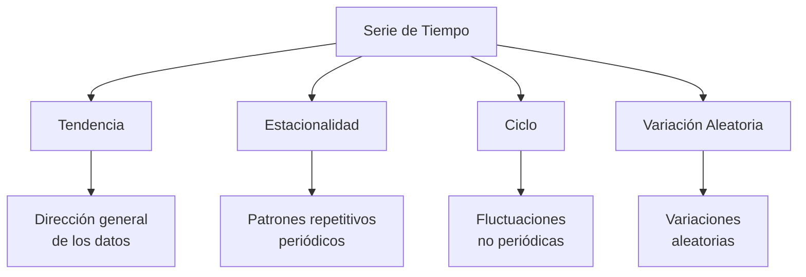

# Clase 5: Pronósticos - Introducción y Regresión Lineal Simple

## 🎯 Introducción

Imagina que eres el capitán de un barco navegando hacia un destino. Para llegar a puerto seguro, necesitas predecir el clima y las condiciones marítimas. Los pronósticos en operaciones funcionan de manera similar: nos ayudan a "navegar" las decisiones empresariales anticipando la demanda futura y otras variables críticas.

### ¿Qué son los pronósticos?

Los pronósticos son estimaciones sistemáticas de eventos futuros, utilizando datos históricos y métodos estadísticos.

- Son aproximaciones, no predicciones exactas
- Se basan en patrones históricos y relaciones causales
- Su precisión disminuye conforme aumenta el horizonte temporal

> 💡 Dato importante: Un buen pronóstico debe incluir no solo la estimación puntual, sino también una medida de su incertidumbre.

## 📊 Conceptos Principales

### Componentes de una Serie de Tiempo

Una serie temporal típicamente contiene cuatro componentes principales:

1. Tendencia: Movimiento a largo plazo
2. Estacionalidad: Patrones que se repiten en intervalos fijos
3. Ciclo: Fluctuaciones de largo plazo
4. Variación aleatoria: Fluctuaciones impredecibles

### Regresión Lineal Simple

La regresión lineal simple es una técnica fundamental para pronósticos que asume una relación lineal entre dos variables.

$$ y = \alpha + \beta x + \epsilon $$

Donde:

- $y$ es la variable dependiente (lo que queremos pronosticar)
- $x$ es la variable independiente (el predictor)
- $\alpha$ es la intersección
- $\beta$ es la pendiente
- $\epsilon$ es el error aleatorio

## 💻 Herramientas y Recursos

- Excel: Para análisis básico de regresión
- R/Python: Para análisis más sofisticados
- Bibliotecas estadísticas: statsmodels, scikit-learn

## 📈 Aplicaciones Prácticas

1. Pronóstico de Ventas Minoristas

   - Uso de datos históricos de ventas
   - Consideración de estacionalidad
   - Incorporación de eventos especiales

2. Planificación de Inventario
   - Estimación de demanda futura
   - Optimización de niveles de stock
   - Reducción de costos de almacenamiento

## 🎓 Ejercicio Práctico

### Pronóstico de Ventas Mensuales

Datos históricos de ventas:
| Mes | Ventas (y) | Publicidad (x) |
|-----|------------|----------------|
| 1 | 100 | 20 |
| 2 | 120 | 25 |
| 3 | 140 | 30 |
| 4 | 160 | 35 |

Calcular regresión lineal:

1. Calcular promedios: $\bar{x}, \bar{y}$
2. Calcular $\beta = \frac{\sum(x_i-\bar{x})(y_i-\bar{y})}{\sum(x_i-\bar{x})^2}$
3. Calcular $\alpha = \bar{y} - \beta\bar{x}$

## 🔑 Consejos Clave

1. Siempre validar los supuestos del modelo
2. Utilizar múltiples métodos de pronóstico
3. Revisar y actualizar pronósticos regularmente
4. Considerar factores externos y cambios en el mercado

## 📝 Conclusión

Al igual que un capitán necesita diferentes instrumentos para navegar, un buen pronosticador utiliza diversas herramientas y métodos. La regresión lineal simple es el primer paso en nuestro viaje hacia pronósticos más sofisticados.

## 📚 Fórmulas Relevantes

### Regresión Lineal Simple

- Modelo: $y = \alpha + \beta x + \epsilon$
- Pendiente: $\beta = \frac{\sum(x_i-\bar{x})(y_i-\bar{y})}{\sum(x_i-\bar{x})^2}$
- Intersección: $\alpha = \bar{y} - \beta\bar{x}$
- Error estándar: $SE = \sqrt{\frac{\sum(y_i-\hat{y}_i)^2}{n-2}}$

### Medidas de Error

- MAD (Desviación Media Absoluta): $MAD = \frac{\sum|y_i-\hat{y}_i|}{n}$
- MSE (Error Cuadrático Medio): $MSE = \frac{\sum(y_i-\hat{y}_i)^2}{n}$
- MAPE (Error Porcentual Absoluto Medio): $MAPE = \frac{100\%}{n}\sum|\frac{y_i-\hat{y}_i}{y_i}|$

## 🔍 Recursos Adicionales

- Libros de texto sobre pronósticos estadísticos
- Software estadístico (R, Python, Excel)
- Bases de datos históricas para práctica
