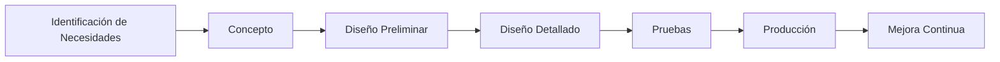

# Clase 7: Diseño de Productos

## 🎯 Introducción

Imagina que eres un arquitecto diseñando una casa. Antes de comenzar la construcción, necesitas considerar las necesidades del cliente, los materiales disponibles, los costos, y cómo cada decisión afectará la funcionalidad final. El diseño de productos es similar: es el proceso de crear soluciones que satisfacen necesidades específicas mientras balancean múltiples restricciones y objetivos.

### ¿Qué es el Diseño de Productos?

El diseño de productos es un proceso sistemático que transforma las necesidades del mercado en soluciones técnica y económicamente viables:

- Integra aspectos técnicos y comerciales
- Considera todo el ciclo de vida del producto
- Balancea funcionalidad, costo y calidad

> 💡 Dato importante: El 80% del costo final de un producto queda determinado en la fase de diseño.

## 📊 Conceptos Principales

### Proceso de Diseño de Productos



### 1. Fases del Diseño

#### Fase Conceptual

- Generación de ideas
- Evaluación de alternativas
- Selección de concepto

#### Fase de Desarrollo

- Diseño técnico
- Prototipos
- Pruebas de concepto

#### Fase de Producción

- Diseño para manufactura
- Optimización de procesos
- Control de calidad

## 💻 Herramientas y Recursos

### Herramientas de Diseño

1. CAD (Computer-Aided Design)
2. Prototipado rápido
3. Simulación virtual
4. QFD (Quality Function Deployment)

### Métodos de Evaluación

1. Análisis de Valor
2. FMEA (Failure Mode and Effects Analysis)
3. Design for X (DFX)

## 📈 Aplicaciones Prácticas

### 1. Industria Automotriz

- Diseño modular
- Integración de sistemas
- Pruebas de seguridad

### 2. Electrónica de Consumo

- Diseño para ensamblaje
- Optimización de componentes
- Gestión de obsolescencia

## 🎓 Ejercicio Práctico

### Casa de la Calidad (QFD)

**Problema:** Diseño de una cafetera automática

1. **Requerimientos del Cliente:**

   - Fácil de usar
   - Rápida preparación
   - Fácil de limpiar
   - Bajo consumo energético

2. **Características Técnicas:**

   - Tiempo de preparación
   - Número de componentes
   - Potencia consumida
   - Temperatura del café

3. **Matriz de Relaciones:**
   ```
   Fuerte relación: ●
   Media relación: ○
   Débil relación: △
   ```

## 🔑 Consejos Clave

1. Involucrar al cliente desde el inicio
2. Considerar todo el ciclo de vida
3. Diseñar para manufacturabilidad
4. Documentar decisiones de diseño

## 📝 Conclusión

El diseño de productos, como la arquitectura, requiere un equilibrio entre creatividad y disciplina técnica. El éxito depende de la capacidad de traducir necesidades en soluciones viables mientras se optimizan todos los aspectos del ciclo de vida del producto.

## 📚 Fórmulas Relevantes

### Costo del Ciclo de Vida

$$ C*{total} = C*{desarrollo} + C*{producción} + C*{operación} + C*{mantenimiento} + C*{disposición} $$

### Tiempo de Desarrollo

$$ T*{desarrollo} = T*{concepto} + T*{diseño} + T*{pruebas} + T\_{ajustes} $$

### Índice de Complejidad

$$ IC = \frac{N*{componentes} \times N*{interfaces}}{N\_{funciones}} $$

### ROI del Diseño

$$ ROI = \frac{(B*{beneficios} - C*{costos})}{C\_{costos}} \times 100\% $$

## 🔍 Recursos Adicionales

1. Software de Diseño:

   - AutoCAD
   - SolidWorks
   - Fusion 360

2. Metodologías:

   - Design Thinking
   - Lean Product Development
   - Design for Six Sigma

3. Referencias:
   - "Product Design and Development" (Ulrich & Eppinger)
   - "The Mechanical Design Process" (Ullman)
   - Bases de datos de patentes
