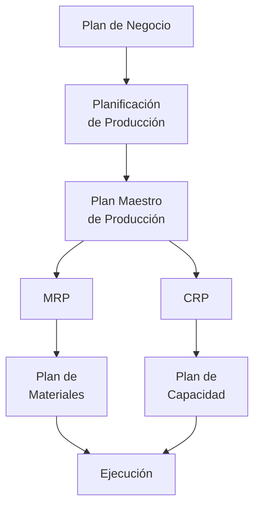

# Clase 8: MRP II y Sistemas Avanzados de Planificación

## 🎯 Introducción

Si en la clase anterior comparamos el MRP con la construcción de una casa, ahora imaginaremos la gestión de una ciudad entera. El MRP II (Manufacturing Resource Planning) expande el concepto original para incluir no solo los materiales, sino todos los recursos necesarios para la manufactura: personal, equipos, capital y más.

### ¿Qué es MRP II?

MRP II es una evolución del MRP que integra la planificación de todos los recursos de manufactura:

- Incluye capacidad de producción
- Considera recursos financieros
- Integra aspectos de recursos humanos
- Incorpora planificación de negocios

> 💡 Dato importante: MRP II cierra el ciclo entre la planificación operativa y financiera.

## 📊 Conceptos Principales

### Estructura del MRP II

### Planificación de Capacidad (CRP)

### Niveles de Planificación

1. Estratégico

   - Plan de negocio
   - Presupuesto anual
   - Planificación de recursos

2. Táctico

   - Plan maestro de producción
   - Planificación de materiales
   - Gestión de capacidad

3. Operativo
   - Programación de taller
   - Control de producción
   - Gestión de inventario

## 💻 Herramientas y Recursos

- Sistemas ERP integrados
- Software de simulación
- Herramientas de análisis financiero
- Sistemas de control de planta

## 📈 Aplicaciones Prácticas

1. Gestión de Planta Manufacturera

   - Coordinación de múltiples líneas
   - Balance de recursos
   - Optimización de capacidad

2. Planificación de Cadena de Suministro
   - Integración con proveedores
   - Gestión de distribución
   - Control de costos

## 🎓 Ejercicio Práctico

### Análisis de Capacidad

Datos:

- Capacidad disponible: 160 horas/semana
- Eficiencia: 85%
- Tiempo de setup: 2 horas/lote

Órdenes planificadas:
| Producto | Cantidad | Tiempo/unidad | Setup |
|----------|----------|---------------|--------|
| A | 100 | 0.5 horas | 2h |
| B | 150 | 0.3 horas | 2h |
| C | 80 | 0.8 horas | 2h |

Calcular:

1. Capacidad efectiva = 160 × 0.85 = 136 horas
2. Tiempo total necesario:
   - A: (100 × 0.5) + 2 = 52 horas
   - B: (150 × 0.3) + 2 = 47 horas
   - C: (80 × 0.8) + 2 = 66 horas
3. Total requerido = 165 horas > Capacidad efectiva

## 🔑 Consejos Clave

1. Integrar todos los niveles de planificación
2. Mantener datos actualizados de capacidad
3. Considerar restricciones financieras
4. Balancear recursos y demanda

## 📝 Conclusión

MRP II representa la evolución natural de la planificación de recursos, integrando todos los aspectos necesarios para una manufactura eficiente. Es como pasar de administrar una casa a gestionar una ciudad completa, donde cada sistema debe funcionar en armonía con los demás.

## 📚 Fórmulas Relevantes

### Planificación de Capacidad

- Capacidad Efectiva = Capacidad Nominal × Eficiencia
- Tiempo Total = Σ(Cantidad × Tiempo/unidad + Tiempo Setup)
- Utilización = (Tiempo Total / Capacidad Efectiva) × 100%

### Costos

- Costo Total = Costos Materiales + Costos Mano de Obra + Costos Indirectos
- ROI = (Beneficio / Inversión) × 100%

### Eficiencia

- OEE = Disponibilidad × Rendimiento × Calidad
- Takt Time = Tiempo Disponible / Demanda

## 🔍 Recursos Adicionales

- Manuales de implementación MRP II
- Software de planificación empresarial
- Casos de éxito en manufactura
- Guías de integración de sistemas
