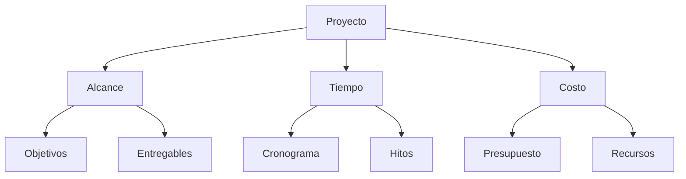
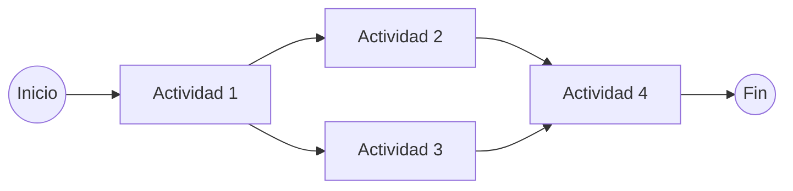

# Clase 9: Proyectos y PERT - Fundamentos

## 🎯 Introducción

Imagina que estás organizando una gran orquesta sinfónica. Cada músico debe tocar su parte en el momento preciso, los instrumentos deben estar afinados, y todo debe coordinarse perfectamente. La gestión de proyectos y el método PERT son como dirigir esta orquesta, donde cada actividad debe ejecutarse en el momento correcto para crear una sinfonía perfecta.

### ¿Qué es la Gestión de Proyectos y PERT?

La gestión de proyectos es el arte y ciencia de coordinar recursos, tiempo y esfuerzos para lograr un objetivo específico. PERT (Program Evaluation and Review Technique) es una herramienta que nos ayuda a planificar y controlar estos proyectos.

- Organiza actividades en secuencia lógica
- Identifica dependencias entre tareas
- Estima tiempos y recursos necesarios
- Determina el camino crítico

> 💡 Dato importante: PERT considera tres estimaciones de tiempo (optimista, más probable y pesimista) para cada actividad.

## 📊 Conceptos Principales

### Elementos de un Proyecto

### Estructura de Red PERT

### Estimación de Tiempos PERT

La fórmula PERT para tiempo esperado:

$$ t_e = \frac{t_o + 4t_m + t_p}{6} $$

Donde:

- $t_e$ = tiempo esperado
- $t_o$ = tiempo optimista
- $t_m$ = tiempo más probable
- $t_p$ = tiempo pesimista

## 💻 Herramientas y Recursos

- Software de gestión de proyectos (MS Project, Primavera)
- Herramientas de diagramación
- Calculadoras PERT/CPM
- Plantillas de documentación

## 📈 Aplicaciones Prácticas

1. Construcción de Edificios

   - Planificación de fases
   - Coordinación de contratistas
   - Control de recursos

2. Desarrollo de Software
   - Definición de sprints
   - Asignación de tareas
   - Seguimiento de progreso

## 🎓 Ejercicio Práctico

### Cálculo de Tiempo Esperado PERT

Actividad: Desarrollo de módulo de software

- Tiempo optimista (to) = 3 días
- Tiempo más probable (tm) = 5 días
- Tiempo pesimista (tp) = 10 días

Calcular:

1. Tiempo esperado = (3 + 4×5 + 10)/6 = 5.5 días
2. Varianza = ((10 - 3)/6)² = 1.36
3. Desviación estándar = √1.36 = 1.17 días

## 🔑 Consejos Clave

1. Definir claramente el alcance
2. Identificar todas las dependencias
3. Mantener márgenes realistas
4. Actualizar el plan según avanza el proyecto

## 📝 Conclusión

Al igual que una orquesta necesita un director que coordine todos los elementos, un proyecto necesita una gestión efectiva y herramientas como PERT para asegurar que todas las "notas" se toquen en el momento preciso.

## 📚 Fórmulas Relevantes

### Tiempo PERT

- Tiempo Esperado: $t_e = \frac{t_o + 4t_m + t_p}{6}$
- Varianza: $\sigma^2 = (\frac{t_p - t_o}{6})^2$
- Desviación Estándar: $\sigma = \sqrt{\sigma^2}$

### Camino Crítico

- Tiempo más temprano: ES = max(EF de predecesoras)
- Tiempo más tardío: LS = min(LS de sucesoras) - duración
- Holgura total: TF = LS - ES
- Holgura libre: FF = ES(siguiente) - EF

### Probabilidades

- Z-score: $Z = \frac{T - \mu}{\sigma}$
- Probabilidad de completar en tiempo T: P(x ≤ T) = Φ(Z)

## 🔍 Recursos Adicionales

- Guías de mejores prácticas en gestión de proyectos
- Plantillas de documentación PERT
- Tutoriales de software de gestión de proyectos
- Casos de estudio de proyectos exitosos
