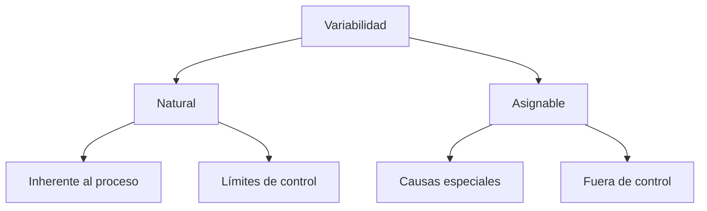
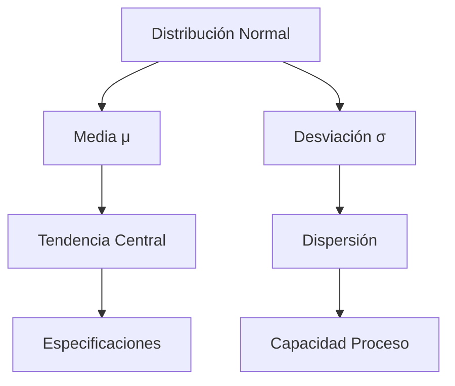

# Clase 10: Variabilidad - Conceptos Fundamentales

## 🎯 Introducción

Imagina una fábrica de chocolate como la de Willy Wonka, donde cada chocolate debe tener exactamente el mismo sabor y apariencia. Sin embargo, en el mundo real, pequeñas variaciones en temperatura, ingredientes o tiempo de procesamiento pueden afectar el resultado final. La variabilidad es como esa "danza" constante entre lo ideal y lo real en los procesos productivos.

### ¿Qué es la Variabilidad?

La variabilidad es la diferencia natural o inherente que existe entre elementos similares dentro de un proceso o sistema.

- Está presente en todo proceso productivo
- Puede ser natural o asignable
- Afecta la calidad y eficiencia
- Requiere gestión y control

> 💡 Dato importante: No toda variabilidad es mala; la variabilidad natural es inevitable y debe ser gestionada, mientras que la variabilidad asignable debe ser eliminada.

## 📊 Conceptos Principales

### Tipos de Variabilidad

### Distribución Normal

### Control Estadístico

## 💻 Herramientas y Recursos

- Software estadístico (Minitab, R)
- Hojas de verificación
- Cartas de control
- Herramientas de medición

## 📈 Aplicaciones Prácticas

1. Control de Calidad en Manufactura

   - Dimensiones de piezas
   - Peso de productos
   - Resistencia de materiales
   - Tiempo de procesamiento

2. Servicios al Cliente
   - Tiempo de espera
   - Duración de servicio
   - Satisfacción del cliente
   - Tasa de errores

## 🎓 Ejercicio Práctico

### Análisis de Capacidad de Proceso

Datos de proceso de llenado de botellas:

- Especificación: 500ml ± 5ml
- Media del proceso: 499ml
- Desviación estándar: 1.5ml

Calcular:

1. Cp = (USL - LSL)/(6σ) = (505 - 495)/(6×1.5) = 1.11
2. Cpk = min[(USL - μ)/(3σ), (μ - LSL)/(3σ)] = 1.33
3. Nivel Sigma = Cpk × 3 = 3.99

## 🔑 Consejos Clave

1. Medir antes de controlar
2. Distinguir causas especiales de comunes
3. No sobrecontrolar procesos estables
4. Enfocarse en prevención

## 📝 Conclusión

La variabilidad es una realidad ineludible en todo proceso, como las pequeñas diferencias entre chocolates de una misma receta. La clave no es eliminarla por completo, sino entenderla, medirla y gestionarla dentro de límites aceptables.

## 📚 Fórmulas Relevantes

### Índices de Capacidad

- Cp = (USL - LSL)/(6σ)
- Cpk = min[(USL - μ)/(3σ), (μ - LSL)/(3σ)]
- Pp = (USL - LSL)/(6s)
- Ppk = min[(USL - X̄)/(3s), (X̄ - LSL)/(3s)]

### Análisis Estadístico

- Media: $\bar{x} = \frac{\sum x_i}{n}$
- Desviación estándar: $s = \sqrt{\frac{\sum(x_i-\bar{x})^2}{n-1}}$
- Rango: R = Xmax - Xmin

### Límites de Control

- UCL = X̄ + A₂R̄
- LCL = X̄ - A₂R̄
- UCLR = D₄R̄
- LCLR = D₃R̄

## 🔍 Recursos Adicionales

- Manuales de control estadístico
- Guías de implementación SPC
- Videos de casos prácticos
- Ejercicios de capacidad de proceso
