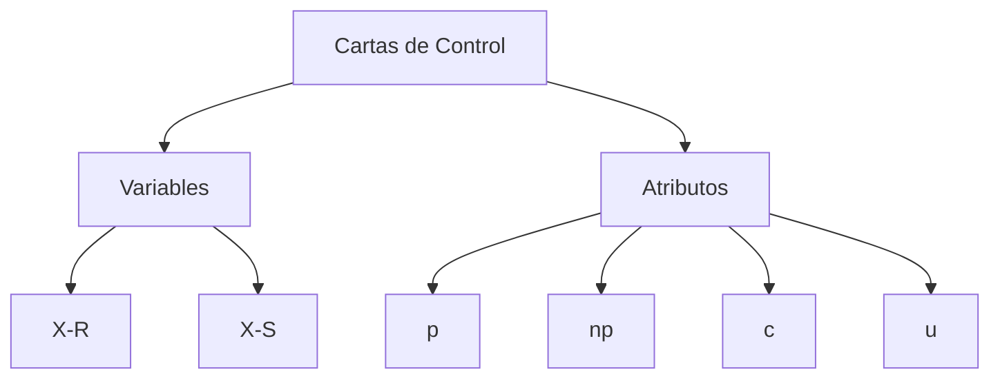
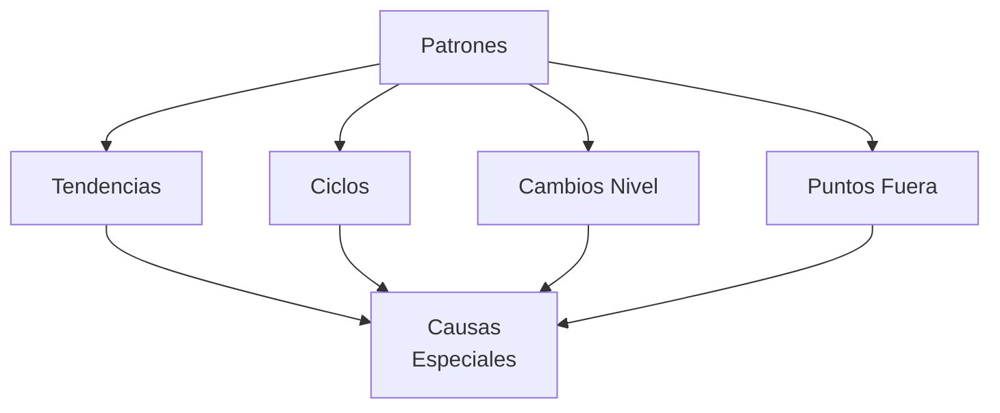
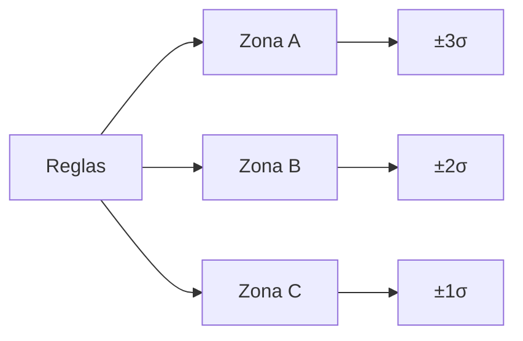

# Clase 10: Variabilidad - Cartas de Control y SPC

## 🎯 Introducción

Siguiendo con nuestra analogía de la fábrica de chocolate, ahora nos centraremos en las herramientas que nos permiten "monitorear la receta". Las cartas de control son como el termómetro y la báscula de precisión que nos ayudan a mantener el proceso bajo control, asegurando que cada chocolate mantenga la calidad deseada.

### ¿Qué son las Cartas de Control?

Las cartas de control son herramientas gráficas que permiten distinguir entre variación natural y especial en un proceso, monitoreando su comportamiento a lo largo del tiempo.

- Visualizan tendencias y patrones
- Identifican causas especiales
- Documentan el desempeño del proceso
- Facilitan la toma de decisiones

> 💡 Dato importante: Las cartas de control fueron desarrolladas por Walter Shewhart y son fundamentales en el Control Estadístico de Procesos (SPC).

## 📊 Conceptos Principales

### Tipos de Cartas de Control



### Patrones en Cartas de Control



### Reglas de Western Electric



## 💻 Herramientas y Recursos

- Software SPC especializado
- Calculadoras de límites de control
- Plantillas de cartas de control
- Herramientas de análisis estadístico

## 📈 Aplicaciones Prácticas

1. Control de Proceso de Manufactura

   - Dimensiones críticas
   - Temperaturas
   - Presiones
   - Tiempos de ciclo

2. Control de Calidad de Servicio
   - Tiempos de respuesta
   - Tasas de error
   - Satisfacción del cliente
   - Cumplimiento de estándares

## 🎓 Ejercicio Práctico

### Construcción de Carta X-R

Datos de proceso:

```
Subgrupo | X1 | X2 | X3 | X4 | X̄ | R
1        | 10 | 12 | 11 | 13 | 11.5 | 3
2        | 11 | 13 | 12 | 10 | 11.5 | 3
3        | 12 | 11 | 13 | 12 | 12.0 | 2
4        | 11 | 12 | 10 | 11 | 11.0 | 2
```

Calcular:

1. X̄̄ = (11.5 + 11.5 + 12.0 + 11.0)/4 = 11.5
2. R̄ = (3 + 3 + 2 + 2)/4 = 2.5
3. UCLx = X̄̄ + A₂R̄ = 11.5 + (0.729 × 2.5) = 13.32
4. LCLx = X̄̄ - A₂R̄ = 11.5 - (0.729 × 2.5) = 9.68

## 🔑 Consejos Clave

1. Seleccionar la carta apropiada
2. Mantener muestras representativas
3. Actuar sobre causas especiales
4. Documentar cambios y acciones

## 📝 Conclusión

Las cartas de control son como el panel de control de nuestra fábrica de chocolate, permitiéndonos detectar cuando algo se sale de lo normal y tomar acciones correctivas oportunas para mantener la calidad del producto.

## 📚 Fórmulas Relevantes

### Cartas X-R

- UCLx = X̄̄ + A₂R̄
- LCLx = X̄̄ - A₂R̄
- UCLR = D₄R̄
- LCLR = D₃R̄

### Cartas X-S

- UCLx = X̄̄ + A₃S̄
- LCLx = X̄̄ - A₃S̄
- UCLs = B₄S̄
- LCLs = B₃S̄

### Cartas de Atributos

- Carta p: UCL = p̄ + 3√(p̄(1-p̄)/n)
- Carta np: UCL = np̄ + 3√(np̄(1-p̄))
- Carta c: UCL = c̄ + 3√c̄
- Carta u: UCL = ū + 3√(ū/n)

### Capacidad del Proceso

- Cp = (USL - LSL)/(6σ)
- Cpk = min[(USL - μ)/(3σ), (μ - LSL)/(3σ)]
- Pp = (USL - LSL)/(6s)
- Ppk = min[(USL - X̄)/(3s), (X̄ - LSL)/(3s)]

## 🔍 Recursos Adicionales

- Manual de cartas de control
- Tablas de constantes
- Ejemplos resueltos
- Guías de interpretación
