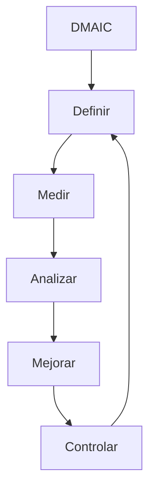
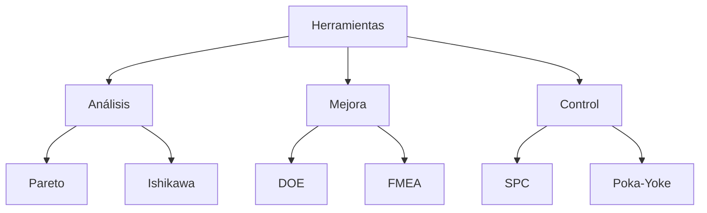
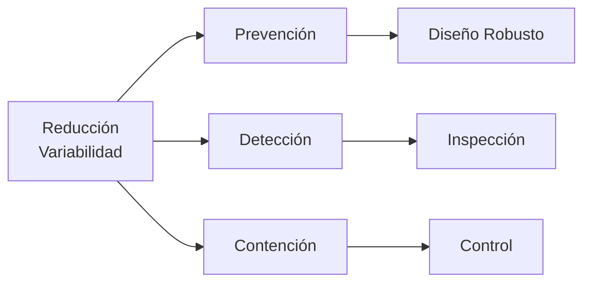

# Clase 10: Variabilidad - Mejora de Procesos y Reducción de Variabilidad

## 🎯 Introducción

Continuando con nuestra analogía de la fábrica de chocolate, ahora nos enfocaremos en cómo "perfeccionar la receta". Si bien ya sabemos medir y monitorear la variabilidad, el siguiente paso es mejorar sistemáticamente nuestros procesos para reducir la variación no deseada y aumentar la consistencia.

### ¿Qué es la Mejora de Procesos?

La mejora de procesos es un enfoque sistemático para identificar, analizar y mejorar los procesos existentes para optimizar el rendimiento y reducir la variabilidad.

- Reduce la variación innecesaria
- Mejora la calidad del producto
- Aumenta la eficiencia
- Disminuye los costos

> 💡 Dato importante: La reducción de variabilidad debe enfocarse primero en las causas especiales y luego en las causas comunes de variación.

## 📊 Conceptos Principales

### Ciclo de Mejora

### Herramientas de Mejora

### Estrategias de Reducción

## 💻 Herramientas y Recursos

- Software de análisis estadístico
- Herramientas de diseño de experimentos
- Sistemas de gestión de calidad
- Simuladores de procesos

## 📈 Aplicaciones Prácticas

1. Optimización de Proceso de Manufactura

   - Reducción de defectos
   - Mejora de capacidad
   - Estabilización de proceso
   - Reducción de desperdicios

2. Mejora de Servicios
   - Reducción de tiempos de espera
   - Estandarización de procedimientos
   - Mejora de satisfacción
   - Reducción de errores

## 🎓 Ejercicio Práctico

### Análisis de Mejora de Proceso

Situación inicial:

- Cpk = 1.0
- Defectos = 2700 PPM
- σ = 2.0

Plan de mejora:

1. Identificar causas principales (Pareto)
2. Implementar controles
3. Reducir variación

Resultados esperados:

- Cpk objetivo = 1.33
- Defectos objetivo = 63 PPM
- σ objetivo = 1.5

Calcular mejora:

1. Reducción de defectos = 97.7%
2. Mejora en capacidad = 33%
3. ROI = (Ahorro/Inversión) × 100%

## 🔑 Consejos Clave

1. Enfocarse en causas raíz
2. Implementar soluciones sostenibles
3. Medir resultados consistentemente
4. Involucrar al equipo operativo

## 📝 Conclusión

La mejora de procesos y reducción de variabilidad es como perfeccionar una receta hasta lograr que cada chocolate sea indistinguible del anterior. Requiere un enfoque sistemático, herramientas adecuadas y, sobre todo, persistencia en la búsqueda de la excelencia.

## 📚 Fórmulas Relevantes

### Mejora de Capacidad

- ΔCp = (Cp_nuevo - Cp_actual)/Cp_actual × 100%
- ΔCpk = (Cpk_nuevo - Cpk_actual)/Cpk_actual × 100%
- Nivel Sigma = Cpk × 3

### Análisis de Mejora

- DPMO = Defectos × 1,000,000/Oportunidades
- Yield = (1 - DPMO/1,000,000) × 100%
- RTY = Y₁ × Y₂ × ... × Yₙ

### Análisis Económico

- Costo de Calidad = Prevención + Evaluación + Fallas
- ROI = (Beneficios - Costos)/Costos × 100%
- Payback = Inversión/Ahorro Anual

### Análisis de Varianza

- R² = 1 - (SSE/SST)
- ANOVA: F = MSB/MSW
- Error Estándar = s/√n

## 🔍 Recursos Adicionales

- Guías de Six Sigma
- Casos de éxito en mejora
- Herramientas de análisis
- Plantillas de documentación
