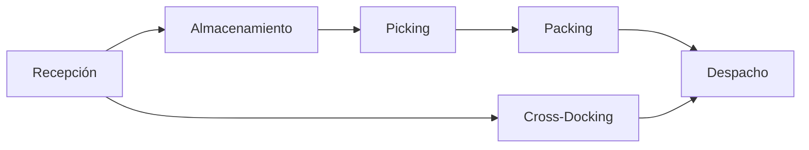

# Clase 11: Centros de Distribución

## 🎯 Introducción

Imagina una biblioteca central que sirve a múltiples sucursales. Los libros deben ser recibidos, clasificados, almacenados y distribuidos eficientemente a cada sucursal según su demanda. Un Centro de Distribución (CD) funciona de manera similar: es el punto neurálgico donde los productos se reciben, procesan y envían a sus destinos finales de manera organizada y eficiente.

### ¿Qué son los Centros de Distribución?

Los Centros de Distribución son instalaciones logísticas especializadas que:

- Reciben productos de múltiples proveedores
- Procesan y almacenan inventario
- Preparan y envían pedidos
- Optimizan la distribución

> 💡 Dato importante: Un CD bien diseñado puede reducir hasta un 30% los costos logísticos mediante la optimización de operaciones y flujos.

## 📊 Conceptos Principales

### Procesos en un CD



### 1. Áreas Funcionales

#### Recepción

- Descarga
- Verificación
- Registro

#### Almacenamiento

- Ubicación
- Sistemas de almacenaje
- Gestión de espacios

#### Preparación de Pedidos

- Picking
- Consolidación
- Verificación

## 💻 Herramientas y Recursos

### Sistemas de Gestión

1. WMS (Warehouse Management System)
2. TMS (Transportation Management System)
3. RFID y códigos de barras
4. Voice picking

## 📈 Aplicaciones Prácticas

### 1. Retail

- Gestión de inventario multicanal
- Cross-docking
- Preparación de pedidos e-commerce

### 2. Industria

- Gestión de materias primas
- Distribución a plantas
- Control de calidad

## 🎓 Ejercicio Práctico

### Diseño de Layout de CD

**Datos:**

- Área total: 5000 m²
- SKUs: 1000
- Rotación mensual: 200,000 unidades
- Picking diario: 1000 líneas

**Solución:**

1. Zonificación:

   - Recepción: 20% (1000 m²)
   - Almacenamiento: 50% (2500 m²)
   - Picking: 20% (1000 m²)
   - Despacho: 10% (500 m²)

2. Cálculo de posiciones:
   ```
   Posiciones = (Inventario promedio × Factor de seguridad)
                ÷ Unidades por posición
   ```

## 🔑 Consejos Clave

1. Optimizar flujos de materiales
2. Mantener trazabilidad
3. Balancear capacidad y demanda
4. Implementar sistemas de control

## 📝 Conclusión

Un Centro de Distribución eficiente actúa como el corazón de la cadena logística, bombeando productos de manera ordenada y precisa a través del sistema. Su éxito depende de la integración efectiva de procesos, tecnología y personas.

## 📚 Fórmulas Relevantes

### Capacidad de Almacenamiento

$$ C*{total} = \frac{A*{útil} \times H \times F*u}{V*{unitario}} $$
Donde:

- $A_{útil}$ = Área útil
- $H$ = Altura útil
- $F_u$ = Factor de utilización
- $V_{unitario}$ = Volumen unitario

### Tiempo de Ciclo

$$ T*{ciclo} = T*{recepción} + T*{almacenaje} + T*{picking} + T\_{despacho} $$

### Productividad de Picking

$$ P\_{picking} = \frac{\text{Líneas picking}}{\text{Horas hombre}} $$

### Rotación de Inventario

$$ R = \frac{\text{Ventas anuales}}{\text{Inventario promedio}} $$

## 🔍 Recursos Adicionales

1. Tecnologías:

   - WMS comerciales
   - Sistemas de automatización
   - Equipos de manipulación

2. Metodologías:

   - Lean Warehousing
   - 5S en almacenes
   - ABC de inventarios

3. Referencias:

   - "Warehouse Management" (Gwynne Richards)
   - "The Warehouse Management Handbook" (Tompkins)
   - Guías de diseño de CD

4. KPIs Importantes:
   - Fill rate
   - Order accuracy
   - Inventory turnover
   - Perfect order rate
