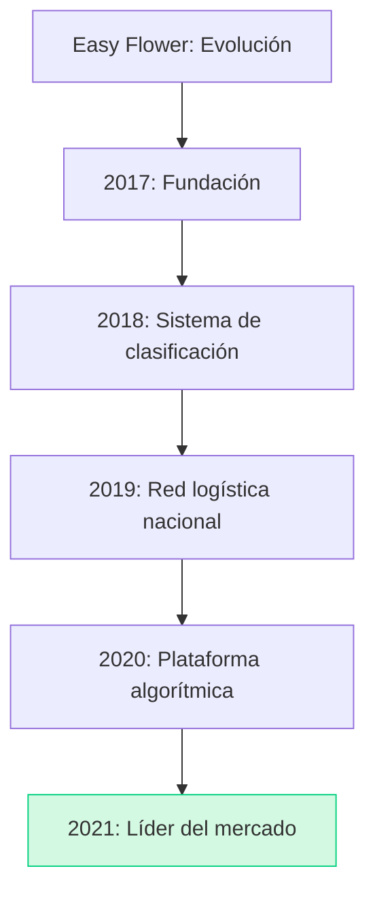
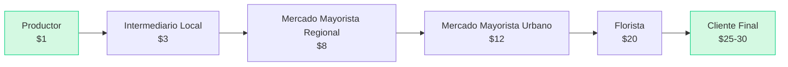
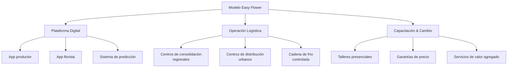
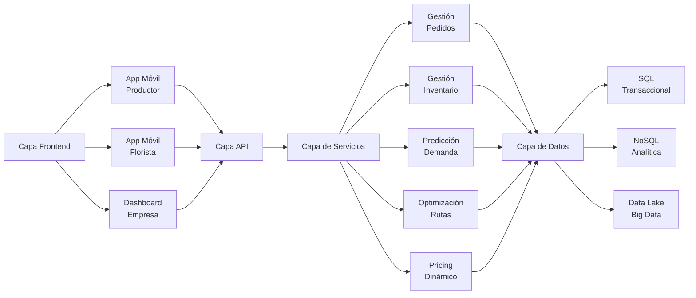
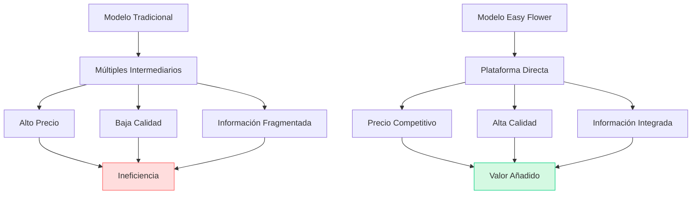
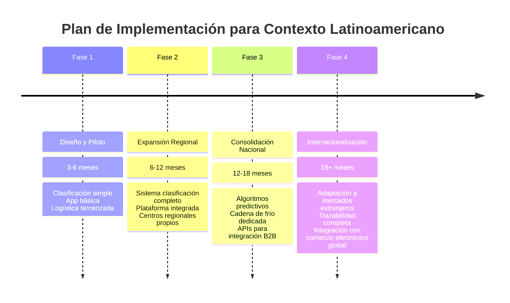

# Caso Easy Flower: Revolución Tecnológica en la Cadena de Suministro Floral

## 📊 Resumen Ejecutivo

Easy Flower es una empresa tecnológica china que revolucionó la industria de las flores mediante la creación de una cadena de suministro eficiente apoyada en tecnología digital y análisis de datos. La empresa:

1. Transformó el modelo tradicional de distribución de flores conectando directamente a productores con floristas
2. Implementó un sistema de clasificación estandarizado para las flores (más de 15,000 variedades categorizadas)
3. Desarrolló una infraestructura logística con cadena de frío que redujo el desperdicio del 35% al 5%
4. Creó un sistema algorítmico para optimizar la gestión de inventario y pronósticos con precisión del 92%

En 4 años, la empresa logró convertirse en el principal proveedor B2B de la industria floral en China, con una facturación anual de 1 billón de RMB (aproximadamente $150 millones) y un crecimiento anual sostenido del 215%.



## 🔍 Problemática Principal y Análisis de la Industria

### Ineficiencia en la Cadena Tradicional



| Métrica                | Cadena Tradicional | Easy Flower | Mejora |
| ---------------------- | ------------------ | ----------- | ------ |
| **Tiempo de entrega**  | 5-7 días           | 24-36 horas | -80%   |
| **Desperdicio**        | 35%                | 5%          | -85%   |
| **Margen productor**   | 10-15%             | 40-55%      | +267%  |
| **Diferencial precio** | 20-30x             | 4-5x        | -80%   |
| **Vida útil restante** | 3-5 días           | 7-10 días   | +100%  |

### Barreras Tecnológicas y Culturales

- **Perfil del productor típico**:

  - Edad media: 52 años
  - Educación formal: primaria o secundaria
  - Adopción tecnológica: baja
  - Acceso a internet: limitado (68% en áreas rurales)

- **Resistencia al cambio**:
  - 78% desconfiaba inicialmente de pagos digitales
  - 65% prefería tratar directamente con intermediarios conocidos
  - 82% carecía de conocimientos para clasificar flores según estándares

### Desafíos Logísticos Específicos

- **Mapa de temperaturas óptimas por variedad**:

  - Rosas: 1-3°C
  - Orquídeas: 7-10°C
  - Tulipanes: 0-2°C
  - Girasoles: 4-7°C

- **Complejidad geográfica china**:
  - Distancia promedio productor-consumidor: 1,200 km
  - Diferencias de altitud: 0-4000 m
  - Zonas climáticas: 5 distintas

## 💡 Solución Integral: El Modelo Easy Flower



### Arquitectura Tecnológica



## 📋 Conceptos Avanzados de GOP Aplicados

### 1. Gestión de la Cadena de Suministro Integrada

- **Modelo de descentralización controlada**:

  - 25 centros regionales de consolidación
  - 125 centros urbanos de distribución
  - Más de 2,000 puntos de recolección local

- **Sistema Pull modificado**:

  - Reabastecimiento basado en predicciones algorítmicas
  - Ciclos de pedido de 24 horas
  - Asignación dinámica de inventario

- **Optimización de transporte multimodal**:
  - Primera milla: Vehículos pequeños refrigerados
  - Transporte troncal: Camiones y trenes refrigerados
  - Última milla: Motocicletas con contenedores especiales

### 2. Sistemas de Planificación Avanzada

#### Algoritmo de Predicción Multi-nivel

```python
# Pseudocódigo del algoritmo de predicción utilizado por Easy Flower
def predecir_demanda(datos_historicos, festivos, clima, tendencias_sociales):
    # Análisis de series temporales
    tendencia_base = calcular_tendencia_ARIMA(datos_historicos)

    # Ajustes estacionales
    factores_estacionales = calcular_factores_estacionales(datos_historicos)

    # Factores exógenos
    impacto_festivos = modelar_impacto(festivos)
    impacto_clima = modelar_impacto(clima)
    impacto_tendencias = analizar_redes_sociales(tendencias_sociales)

    # Modelo predictivo final
    demanda_predicha = aplicar_modelo_ensemble(
        tendencia_base,
        factores_estacionales,
        impacto_festivos,
        impacto_clima,
        impacto_tendencias
    )

    # Ajuste por nivel de servicio objetivo
    demanda_ajustada = ajustar_por_nivel_servicio(demanda_predicha, 0.95)

    return demanda_ajustada
```

#### Sistema de Clasificación Estandarizado

| Nivel         | Criterios        | Variables                             | Subcategorías                     |
| ------------- | ---------------- | ------------------------------------- | --------------------------------- |
| **Tipo**      | Especie          | 150+ tipos                            | Rosa, Tulipán, Orquídea, etc.     |
| **Calidad**   | Escala 1-10      | Longitud tallo, tamaño flor, defectos | Premium, Estándar, Económica      |
| **Color**     | Codificación RGB | 800+ tonalidades                      | Rojo intenso, Blanco puro, etc.   |
| **Estado**    | Frescura         | % de apertura, vida restante          | Botón, Semi-abierta, Abierta      |
| **Propósito** | Uso final        | Ocasión y uso                         | Boda, Funeraria, Decoración, etc. |

### 3. Gestión del Rendimiento

#### KPIs Críticos Monitorizados

| KPI                   | Métrica Base         | Objetivo  | Real Alcanzado |
| --------------------- | -------------------- | --------- | -------------- |
| **Frescura**          | Días vida restante   | >7 días   | 8.5 días       |
| **Fill Rate**         | % pedidos completos  | >95%      | 97.3%          |
| **Tiempo de entrega** | Horas desde pedido   | <36 horas | 28 horas       |
| **Desperdicio**       | % producto perdido   | <8%       | 5.2%           |
| **Satisfacción**      | NPS                  | >70       | 82             |
| **Margen productor**  | % sobre precio final | >40%      | 53%            |

## 🌟 Lecciones Estratégicas

### 1. Reducción de Intermediarios con Valor Añadido



Lección: **La desintermediación efectiva no elimina funciones sino que las optimiza y agrega valor.**

### 2. La Tecnología como Facilitador, No como Fin

Easy Flower inicialmente fracasó al intentar que los floricultores usaran aplicaciones sofisticadas. El éxito llegó cuando:

- Simplificaron la interfaz a 3-4 botones principales
- Implementaron reconocimiento visual para la clasificación
- Añadieron soporte telefónico con agricultores locales como agentes
- Ofrecieron pagos inmediatos como incentivo para la adopción

Lección: **La tecnología debe adaptarse al usuario, no al contrario.**

### 3. El Poder de la Estandarización

La creación de su propio sistema de clasificación permitió:

- Reducir tiempos de inspección en 85%
- Disminuir disputas sobre calidad en 92%
- Implementar precios dinámicos basados en atributos objetivos
- Crear una predicción de demanda altamente precisa

Lección: **La estandarización es el fundamento de la escalabilidad.**

## 📈 Aplicación al Contexto Latinoamericano

### Oportunidades de Implementación en Chile

| Sector        | Similitudes                              | Oportunidad    | Adaptaciones Necesarias                           |
| ------------- | ---------------------------------------- | -------------- | ------------------------------------------------- |
| **Flores**    | Producción fragmentada similar           | Alto potencial | Escala menor, más énfasis en exportación          |
| **Frutas**    | Producto perecedero, calidad variable    | Muy alto       | Añadir trazabilidad para exportación              |
| **Pesca**     | Cadena de frío, clasificación compleja   | Alto           | Regulaciones adicionales, sostenibilidad          |
| **Vino**      | Productores pequeños y medianos          | Medio          | Adaptar a producto no perecedero                  |
| **Artesanía** | Productores fragmentados, sin estándares | Alto           | Enfoque en fotografía y descripción estandarizada |

### Modelo de Implementación Gradual



## 🔄 Preguntas para Discusión

1. ¿Cómo podría adaptarse el modelo Easy Flower a la industria vitivinícola chilena?
2. ¿Qué desafíos específicos enfrentaría la implementación de un sistema similar para productos agrícolas en Chile considerando la geografía del país?
3. ¿Cómo balancear la estandarización necesaria con la diferenciación que buscan los pequeños productores artesanales?
4. ¿Qué estrategias de gestión del cambio serían más efectivas en el contexto cultural latinoamericano?
5. ¿Cómo podría la implementación de blockchain mejorar aún más la trazabilidad y confianza en un modelo similar?

> 💡 **Reflexión final**: El caso Easy Flower demuestra que la verdadera innovación en la cadena de suministro no radica en la tecnología por sí misma, sino en cómo ésta se implementa para resolver fricciones fundamentales del mercado.
