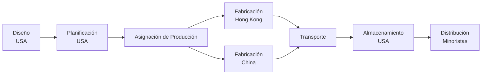
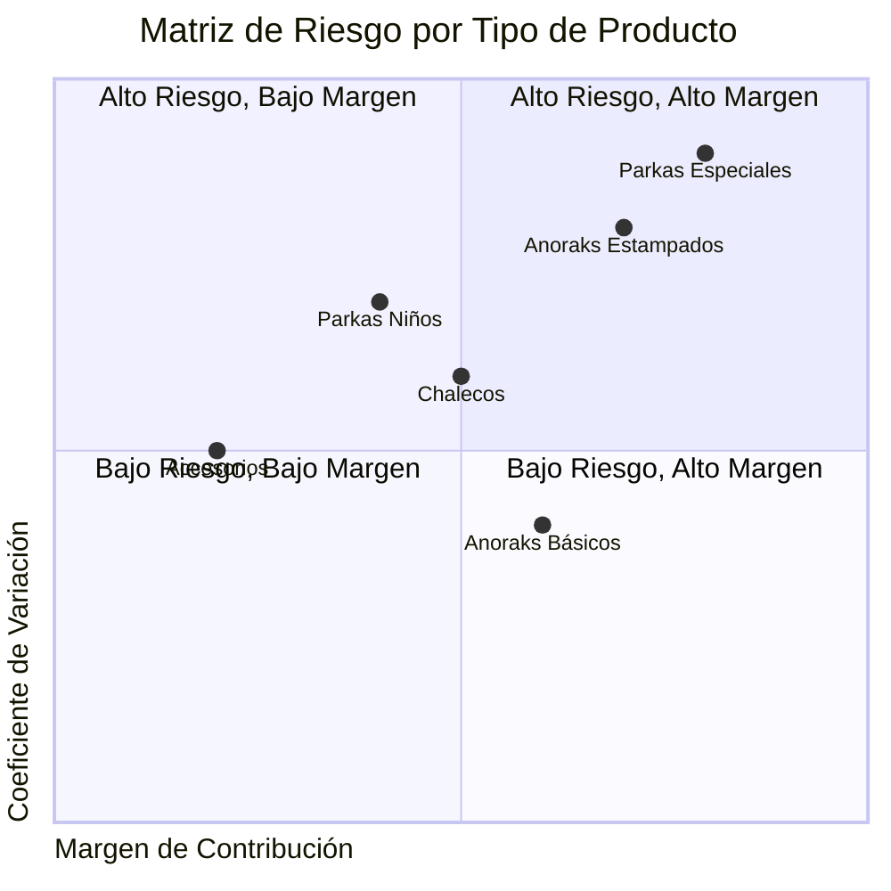
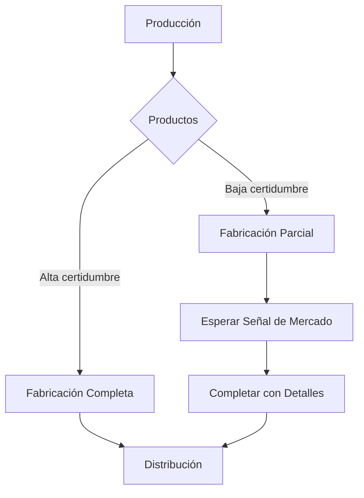
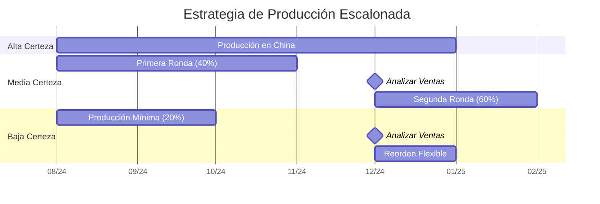

# Caso Sport Obermeyer: Gestión de Incertidumbre en la Cadena de Suministro

## 📊 Contexto de la Industria y la Empresa

Sport Obermeyer es un fabricante premium de ropa de esquí que opera en un mercado altamente competitivo y volátil. Fundada por Klaus Obermeyer, la compañía ha establecido un nicho en el segmento de alta calidad del mercado de indumentaria para deportes de invierno, con ventas anuales aproximadas de $32.8 millones USD.

**Perfil de la empresa:**

- **Fundación:** 1947 en Aspen, Colorado
- **Segmento:** Ropa de esquí de alta gama
- **Volumen:** ~200,000 anoraks anuales
- **Canales:** Tiendas especializadas y minoristas deportivos selectos
- **Competidores principales:** Columbia, The North Face, Patagonia

## 🔍 Problemática Estratégica

### Desafío Central

Sport Obermeyer enfrenta el "problema del vendedor de periódicos" a escala global: determinar cantidades de producción para productos de moda altamente variables antes de conocer la demanda real, bajo restricciones significativas de capacidad y tiempo.

### Factores Críticos

1. **Ciclo de Diseño-Venta Extendido:**

   - 18-24 meses desde concepto hasta venta al consumidor
   - Decisiones de producción tomadas hasta un año antes de la temporada

2. **Alta Variabilidad en la Demanda:**

   - Coeficientes de variación (CV) entre 0.4 y 1.0 por estilo
   - Errores históricos de pronóstico de hasta ±200%

3. **Estructura Dual de Producción:**

   - **Hong Kong:** Mayor costo (+30%), alta flexibilidad, pedidos pequeños
   - **China Continental:** Menor costo, baja flexibilidad, mínimos altos

4. **Impacto Financiero Asimétrico:**
   - Costo de subproducción: $11 por unidad (margen perdido)
   - Costo de sobreproducción: $7 por unidad (descuentos necesarios)

## 📈 Análisis Cuantitativo

### 1. Análisis de Riesgo por Producto

### 2. Modelo de Producción Óptima

Para cada estilo de producto, el Nivel de Producción Óptimo (CSL - Critical Service Level) se puede calcular como:

$$CSL = \frac{C_u}{C_u + C_o} = \frac{11}{11 + 7} = 0.611$$

Donde:

- $C_u$ = Costo de subproducción ($11)
- $C_o$ = Costo de sobreproducción ($7)

Esto significa que la cantidad óptima a producir debe satisfacer aproximadamente el 61.1% de la demanda potencial.

### 3. Análisis de Asignación

| Criterio         | Hong Kong        | China                |
| ---------------- | ---------------- | -------------------- |
| **Costo/unidad** | $13.72           | $10.53               |
| **Lote mínimo**  | 600 unidades     | 1,200 unidades       |
| **Lead time**    | 1.5 meses        | 3 meses              |
| **Flexibilidad** | Alta (reordenes) | Baja (sin reordenes) |
| **Calidad**      | Superior         | Adecuada             |

### 4. Análisis de Escenarios

| Escenario     | Descripción         | Impacto Financiero              |
| ------------- | ------------------- | ------------------------------- |
| **Base**      | Pronóstico estándar | $0                              |
| **Optimista** | +20% demanda        | +$450,000 (oportunidad perdida) |
| **Pesimista** | -20% demanda        | -$280,000 (descuentos)          |

## 🛠️ Herramientas y Modelos Aplicados

### 1. Modelo de Inventario de Múltiples Períodos

Aplicando el modelo de inventario con demanda incierta:

$$Q^* = F^{-1}\left(\frac{p-c}{p-s}\right)$$

Donde:

- $F^{-1}$ = Función inversa de distribución acumulativa
- $p$ = Precio de venta ($113)
- $c$ = Costo de producción (variable según localización)
- $s$ = Valor residual ($40)

### 2. Método Delphi Modificado

Sport Obermeyer implementa un enfoque único para mejorar pronósticos:

1. **Comité de Expertos:** 10 miembros con experiencia en diseño, ventas y merchandising
2. **Proceso Iterativo:** Múltiples rondas de predicción con retroalimentación
3. **Agregación Estadística:** Uso de mediana para reducir el impacto de valores extremos
4. **Ponderación de Confianza:** Asignación de pesos basados en la confianza de cada experto

### 3. Estrategia de Postponement

## 📋 Lecciones Estratégicas

### 1. La Paradoja de la Información

> "La información más valiosa llega precisamente cuando ya no tienes flexibilidad para actuar sobre ella."

Este concepto fundamental explica por qué Sport Obermeyer debe:

- Invertir en obtener señales tempranas del mercado
- Diseñar flexibilidad en su cadena de suministro
- Implementar estrategias de producción escalonada

### 2. Segmentación por Incertidumbre

La estrategia óptima consiste en clasificar productos por nivel de incertidumbre:

| Categoría                              | Estrategia de Producción              | Asignación |
| -------------------------------------- | ------------------------------------- | ---------- |
| **Alta certidumbre** (CV < 0.4)        | Producción temprana, volumen completo | China      |
| **Media certidumbre** (0.4 ≤ CV ≤ 0.8) | Producción escalonada                 | Mixta      |
| **Baja certidumbre** (CV > 0.8)        | Mínimo inicial + reorden              | Hong Kong  |

### 3. El Valor de la Flexibilidad

Cuantificación del valor de la flexibilidad:

$$Valor_{flexibilidad} = Costo_{premium} \times Probabilidad_{reorden} \times Beneficio_{reorden}$$

Para Sport Obermeyer:

- Premium de costo Hong Kong: ~30%
- Probabilidad de reorden beneficiosa: ~40%
- Beneficio neto de reorden: ~25% margen adicional

### 4. Modelo de Producción Escalonada

## 💡 Recomendaciones Implementables

### 1. Estrategia de Asignación de Producción

**Recomendación:** Implementar un modelo de "fabricación bimodal" basado en:

- **Índice de Incertidumbre (UI):** $UI = CV \times Margen \times Volumen$
- **Regla de Asignación:** Si UI > 0.6, producir en Hong Kong. Si UI < 0.4, producir en China. Si 0.4 ≤ UI ≤ 0.6, evaluar caso por caso.

**Beneficio Estimado:** Reducción del 15% en agotados y del 20% en sobrestocks.

### 2. Sistema de Señales Tempranas

**Recomendación:** Implementar un "programa de compradores beta" con:

- Presentaciones anticipadas a minoristas clave (6 meses antes de la temporada)
- Descuentos por pre-órdenes comprometidas (5-8%)
- Panel de tendencias con minoristas seleccionados

**Beneficio Estimado:** Mejora del 25% en la precisión de pronósticos para productos nuevos.

### 3. Rediseño del Proceso de Planificación

**Recomendación:** Reestructurar el proceso de planificación en tres fases:

1. **Planificación Preliminar:** Basada en datos históricos y tendencias (12 meses antes)
2. **Planificación Intermedia:** Con input de minoristas beta (8 meses antes)
3. **Planificación Final:** Con datos de ventas iniciales (5 meses antes)

**Beneficio Estimado:** Reducción de errores de pronóstico del 40%.

### 4. Diversificación de la Base de Proveedores

**Recomendación:** Desarrollar base de proveedores en tres niveles:

- **Core:** China (volumen, costo)
- **Flexible:** Hong Kong (velocidad, calidad)
- **Emergente:** Vietnam (balance costo-flexibilidad)

**Beneficio Estimado:** Reducción de costos del 7-10% manteniendo flexibilidad.

## 🔄 Aplicación en Contexto Chileno

Este caso ofrece lecciones valiosas para empresas chilenas que operan en:

1. **Industria Vitivinícola:**

   - Pronóstico de demanda internacional bajo alta variabilidad
   - Producción anticipada (18-24 meses) para cosechas anuales
   - Balance entre mercados premium (alta incertidumbre) y masivos

2. **Industria del Salmón:**

   - Ciclos largos de producción (12-18 meses)
   - Variabilidad de precios internacionales
   - Necesidad de estrategias de producción escalonada

3. **Retail de Moda Nacional:**
   - Cadenas como Falabella, Ripley que enfrentan dilemas similares
   - Decisiones de importación vs. producción local
   - Estrategias de postponement adaptadas al mercado latinoamericano

## 📚 Recursos Complementarios

- **Lecturas Recomendadas:**
  - "Matching Supply with Demand" - Cachon & Terwiesch
  - "The New Science of Retailing" - Fisher & Raman
- **Herramientas:**
  - Plantilla Excel para cálculo de CSL (Critical Service Level)
  - Simulador Monte Carlo para análisis de escenarios
- **Casos Relacionados:**
  - Zara: Modelo de respuesta rápida
  - Toyota: Postponement y producción flexible
  - Amazon: Gestión de inventario bajo incertidumbre

> 💡 **Reflexión Final:** El caso Sport Obermeyer ilustra cómo la gestión estratégica de operaciones puede transformar la incertidumbre de una amenaza a una ventaja competitiva cuando se aborda con las herramientas analíticas y los procesos adecuados.
