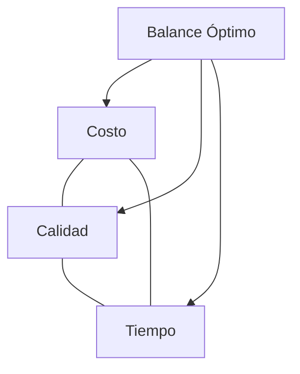

# Clase 01: Introducción a la Gestión de Operaciones

## 🎯 Introducción

Imagina que eres el director de orquesta de una gran sinfonía. Cada músico representa un departamento en una empresa, y tu trabajo es asegurarte de que todos toquen en armonía para crear una experiencia perfecta. La Gestión de Operaciones es precisamente eso: coordinar todos los recursos y procesos para entregar valor al cliente final. En esta clase, exploraremos cómo las decisiones estratégicas en operaciones pueden marcar la diferencia entre el éxito y el fracaso de una empresa.

### ¿Qué es la Gestión de Operaciones?

Es el arte y la ciencia de diseñar, planificar y controlar los sistemas que producen bienes y servicios. Va más allá de la simple producción; es sobre crear valor a través de la transformación eficiente de recursos.

#### Pilares Fundamentales:

- **Eficiencia**: Maximizar el output minimizando el input
- **Calidad**: Cumplir o exceder expectativas del cliente
- **Flexibilidad**: Adaptarse a cambios en la demanda
- **Velocidad**: Reducir tiempos de entrega y respuesta
- **Confiabilidad**: Mantener consistencia en las operaciones

### Impacto en el Mundo Real

- **Tesla**: Revolucionó la producción de autos eléctricos con su Gigafactory
- **Amazon**: Redefinió la logística con centros robotizados
- **Starbucks**: Estandarizó la experiencia del café a nivel global

> 💡 **Insight**: El 70% de los costos en una empresa típica están relacionados con operaciones

## 📊 La Triple Restricción en Operaciones

### Optimización Multi-objetivo

1. **Costo**: Eficiencia en recursos
2. **Calidad**: Satisfacción del cliente
3. **Tiempo**: Velocidad de respuesta

## 🌟 Tendencias Actuales

### 1. Industria 4.0

- IoT en manufactura
- Analítica predictiva
- Automatización inteligente

### 2. Sostenibilidad

- Economía circular
- Reducción de desperdicios
- Energías renovables

### 3. Cadenas de Suministro Resilientes

- Diversificación de proveedores
- Near-shoring
- Inventarios estratégicos

## 💼 Casos de Estudio Chilenos

### 1. CCU

- Gestión de demanda estacional
- Optimización de rutas de distribución
- Control de calidad en múltiples plantas

### 2. CMPC

- Integración vertical
- Gestión forestal sostenible
- Optimización de producción de celulosa

## 📈 KPIs Fundamentales

1. **Eficiencia Operacional**:
   $$\text{OEE} = \text{Disponibilidad} \times \text{Rendimiento} \times \text{Calidad}$$

2. **Rotación de Inventario**:
   $$\text{Rotación} = \frac{\text{Ventas Anuales}}{\text{Inventario Promedio}}$$

3. **Tiempo de Ciclo**:
   $$\text{Cycle Time} = \text{Processing Time} + \text{Setup Time} + \text{Wait Time}$$

## 🎓 Caso Práctico Extendido

### Panadería "El Amasijo"

**Situación Actual**:

- Producción: 200 baguettes/día
- Costo unitario: $1
- Desperdicio: 10%
- Ventas perdidas: 5% por falta de stock

**Análisis**:

1. Pérdidas por desperdicio:
   $$200 \times 0.10 \times \$1 = \$20/\text{día}$$

2. Pérdidas por ventas perdidas:
   $$200 \times 0.05 \times (\$2-\$1) = \$10/\text{día}$$

**Solución Propuesta**:

1. Implementar control de calidad: reduce desperdicio a 5%
2. Mejorar pronósticos: reduce ventas perdidas a 2%

**ROI Anual**:
$$((\$20-\$10) + (\$10-\$4)) \times 365 = \$5,840$$

## 🔄 El Ciclo PDCA en Operaciones

1. **Plan**: Establecer objetivos y procesos
2. **Do**: Implementar procesos
3. **Check**: Medir resultados
4. **Act**: Tomar acciones correctivas

## 📚 Recursos Adicionales

- **Libros**:
  - "La Meta" de Goldratt
  - "Toyota Way" de Jeffrey Liker
- **Videos**:

  - "How Amazon's Robots Work" (YouTube)
  - "Tesla Gigafactory Tour" (YouTube)

- **Software**:
  - SAP S/4HANA (ERP)
  - Simio (Simulación)
  - Power BI (Analytics)

## 🎯 Preparación para Próximas Clases

1. Revisar conceptos de procesos
2. Familiarizarse con diagramas de flujo
3. Explorar casos de estudio en Canvas

> 💡 **Consejo**: Mantén un diario de "observaciones operacionales" - identifica problemas y soluciones en operaciones en tu vida diaria.
