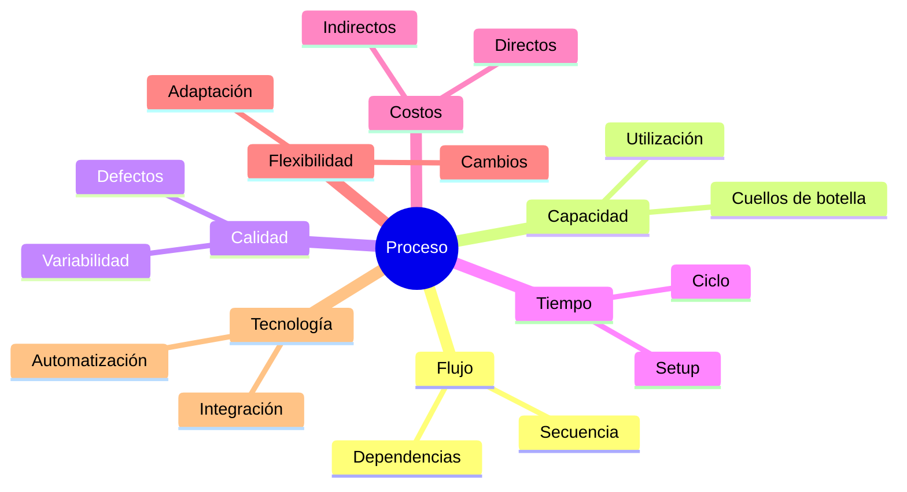
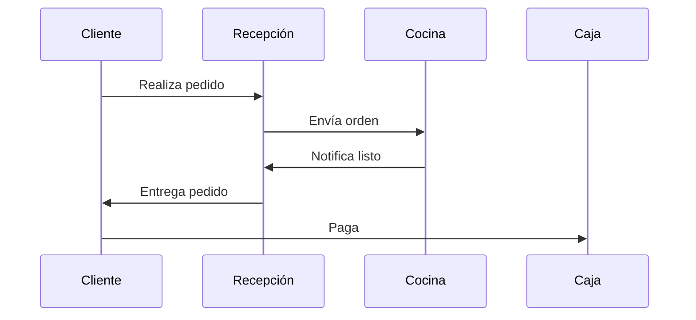

# Clase 02: Análisis de Procesos y Capacidad

## 🎯 Introducción

En el corazón de toda operación exitosa yace la comprensión profunda de sus procesos. Imagina dirigir una orquesta donde cada músico (proceso) debe tocar en el momento exacto y con la intensidad precisa. El Análisis de Procesos nos permite "afinar" cada componente del sistema para crear una sinfonía perfecta de operaciones.

### ¿Por qué es Crucial el Análisis de Procesos?

1. **Eficiencia Operacional**: Identificar y eliminar desperdicios
2. **Calidad**: Reducir variabilidad y errores
3. **Innovación**: Base para la mejora continua
4. **Competitividad**: Optimizar costos y tiempos de respuesta

> 💡 **Dato clave**: Según McKinsey, las empresas que implementan análisis avanzado de procesos logran reducir sus costos operativos entre un 15% y 30%.

## 📊 Framework de Análisis

### 1. Las 7 Dimensiones de un Proceso

### 2. Herramientas de Modelado

#### 2.1 BPMN 2.0 (Business Process Model and Notation)

#### 2.2 Value Stream Mapping (VSM)

Herramienta Lean para visualizar el flujo de valor:

- 🟢 Actividades que agregan valor
- 🟡 Actividades necesarias sin valor
- 🔴 Desperdicios puros

## 💻 Análisis Cuantitativo

### 1. Métricas Fundamentales

#### Capacidad Efectiva

$$\text{Capacidad Efectiva} = \text{Capacidad Teórica} \times \text{OEE}$$
$$\text{OEE} = \text{Disponibilidad} \times \text{Rendimiento} \times \text{Calidad}$$

#### Tiempo de Ciclo

$$\text{Tiempo de Ciclo} = \max(\text{tiempos individuales}) + \text{tiempo setup}$$

#### Takt Time

$$\text{Takt Time} = \frac{\text{Tiempo disponible}}{\text{Demanda del cliente}}$$

### 2. Teoría de Restricciones (TOC)

#### Los 5 Pasos de Goldratt

1. **IDENTIFICAR** el cuello de botella
2. **EXPLOTAR** la restricción
3. **SUBORDINAR** todo al cuello
4. **ELEVAR** la restricción
5. **REPETIR** el proceso

## 🏭 Casos de Estudio Chilenos

### 1. Viña Concha y Toro

**Desafío**: Optimizar proceso de vendimia y vinificación

- Restricción: Capacidad de fermentación
- Solución: Sistema predictivo de llegada de uva
- Resultado: +20% en utilización de cubas

### 2. Latam Airlines

**Desafío**: Reducir tiempo de turn-around

- Análisis: VSM del proceso completo
- Mejoras: Parallelización de actividades
- Impacto: -15% en tiempo entre vuelos

## 🛠️ Herramientas Modernas

### 1. Process Mining

- **Celonis**: Descubre cuellos de botella automáticamente
- **UiPath Process Mining**: Mapea procesos desde logs
- **IBM Process Mining**: Análisis predictivo

### 2. Simulación Digital

- **AnyLogic**: Simulación multiparadigma
- **Simio**: Simulación 3D de procesos
- **FlexSim**: Análisis de escenarios

## 📈 Ejercicio Práctico Avanzado

### Caso: Centro de Distribución

**Situación**:

- 3 estaciones de picking
- 2 estaciones de empaque
- 1 zona de consolidación

**Datos**:

- Picking: 5 min/pedido
- Empaque: 8 min/pedido
- Consolidación: 3 min/pedido
- Demanda: 100 pedidos/día
- Tiempo disponible: 8 horas

**Análisis**:

1. **Capacidad por estación**:

   - Picking: (480 min)/(5 min) × 3 estaciones = 288 pedidos
   - Empaque: (480 min)/(8 min) × 2 estaciones = 120 pedidos
   - Consolidación: (480 min)/(3 min) = 160 pedidos

2. **Cuello de botella**: Empaque (120 pedidos/día)

3. **Propuestas de mejora**:
   a) Agregar una estación de empaque (+60 pedidos)
   b) Reducir tiempo de empaque con automatización
   c) Balancear cargas entre estaciones

## 🎯 Aplicación Práctica

### Template de Análisis

1. **Mapeo inicial**

   - Usar BPMN o VSM
   - Identificar inputs/outputs
   - Documentar recursos

2. **Medición**

   - Tiempos por actividad
   - Tasas de error
   - Utilización de recursos

3. **Análisis**

   - Identificar restricciones
   - Calcular capacidades
   - Evaluar flexibilidad

4. **Mejora**
   - Proponer soluciones
   - Simular impacto
   - Priorizar acciones

## 📚 Recursos Adicionales

- **Software**:

  - Bizagi Modeler (BPMN)
  - ProcessMaker (BPM)
  - Power Automate (Automatización)

- **Lecturas**:
  - "The Goal" - E. Goldratt
  - "Process Mining" - W. van der Aalst
  - "Toyota Kata" - M. Rother

> 💡 **Tip Final**: "No puedes mejorar lo que no puedes medir, y no puedes medir lo que no entiendes"
