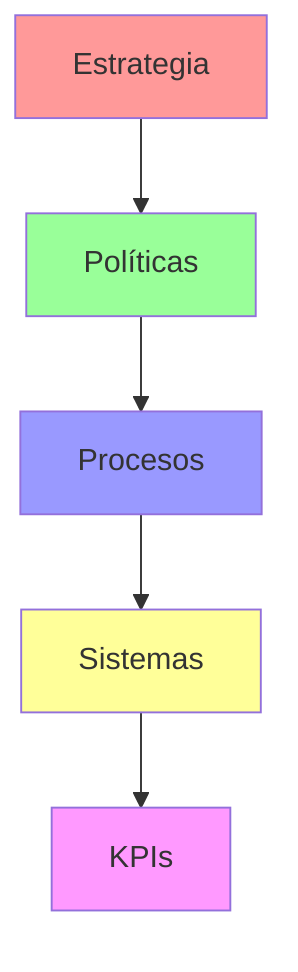
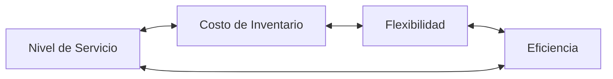
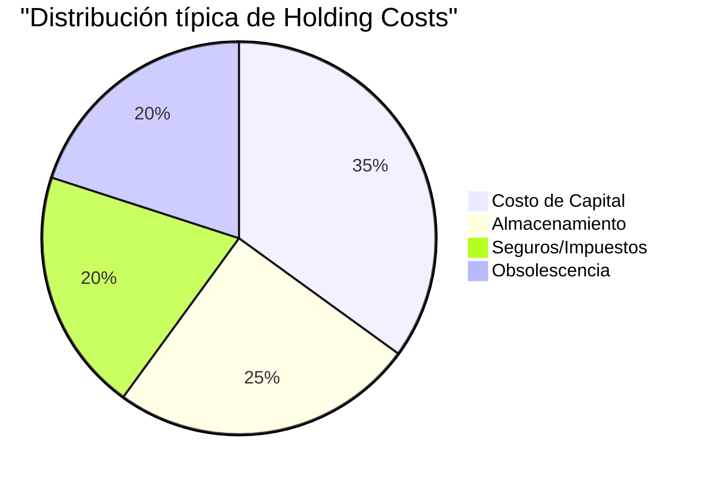

# Clase 04: Gestión de Inventarios Determinísticos

## 📌 Introducción a la Gestión de Inventarios

El inventario es mucho más que productos en una bodega; es un componente estratégico que puede hacer o deshacer una operación. Tesla, por ejemplo, mantuvo su producción durante la crisis de semiconductores de 2021 gracias a una gestión estratégica de inventarios, mientras otros fabricantes tuvieron que detener sus líneas.

> 💡 **Dato clave**: Las empresas Fortune 500 pierden en promedio $157 millones al año por exceso o falta de inventario.

## 📊 Framework de Gestión de Inventarios

### 1. La Pirámide del Inventario



### 2. Trade-offs Fundamentales



## 💰 Costos del Inventario

### 1. Estructura de Costos

#### 1.1 Costos de Mantener (Holding Costs)

- Costo de Capital (WACC × Valor Inventario)
- Seguros y Impuestos
- Obsolescencia
- Manipulación y Almacenamiento



#### 1.2 Costos de Ordenar

- Procesamiento de órdenes
- Transporte
- Recepción e Inspección
- Setup costs

## 📐 Modelos Matemáticos

### 1. Modelo EOQ (Economic Order Quantity)

#### 1.1 Fórmula Básica

$$Q^* = \sqrt{\frac{2DS}{H}}$$

Donde:

- D = Demanda anual
- S = Costo de ordenar
- H = Costo de mantener (% del valor del item)

#### 1.2 Costos Totales

$$TC = \frac{D}{Q}S + \frac{Q}{2}H$$

### 2. Modelo POQ (Production Order Quantity)

Para items producidos internamente:
$$Q^* = \sqrt{\frac{2DS}{H(1-d/p)}}$$

Donde:

- d = tasa de demanda
- p = tasa de producción

## 🏭 Casos de Estudio Chilenos

### 1. Sodimac

**Desafío**: Gestionar +80,000 SKUs en múltiples tiendas

**Solución**:

- Clasificación ABC multicriterio
- Sistema VMI con proveedores clave
- Cross-docking para items de alta rotación

**Resultados**:

- -25% en días de inventario
- +15% en fill rate

### 2. CCU

**Challenge**: Inventarios estacionales de cerveza

**Estrategia**:

- Producción contra inventario en baja temporada
- Contratos flexibles con proveedores
- Almacenes satélite temporales

## 🔧 Herramientas Modernas

### 1. Software de Gestión

| Herramienta  | Uso Principal        | Ventajas             |
| ------------ | -------------------- | -------------------- |
| SAP EWM      | Gestión de almacenes | Integración total    |
| Manhattan    | Optimización         | Algoritmos avanzados |
| Demand Works | Planificación        | Fácil de usar        |

### 2. Tecnologías Emergentes

- **IoT**: Sensores de nivel en tiempo real
- **Machine Learning**: Pronósticos avanzados
- **Blockchain**: Trazabilidad end-to-end

## 📈 Ejercicio Práctico Avanzado

### Caso: Distribuidor de Electrodomésticos

**Datos**:

- Demanda anual (D) = 12,000 unidades
- Costo por orden (S) = $200
- Valor unitario (v) = $500
- Tasa de mantener (i) = 20%
- Lead time = 2 semanas
- Capacidad de bodega = 1,000 unidades

**Análisis**:

1. **EOQ Base**:

   ```python
   H = i * v = 0.20 * $500 = $100
   Q* = sqrt(2*12000*200/100) = 219 unidades
   ```

2. **Restricción de Capacidad**:

   - EOQ < Capacidad ✓ (219 < 1,000)
   - Solución factible

3. **Costos Totales**:

   ```python
   TC = (12000/219)*200 + (219/2)*100
   TC = $21,900
   ```

4. **Punto de Reorden**:
   ```python
   ROP = (2/52)*12000 = 462 unidades
   ```

## 🎯 Políticas de Inventario

### 1. Sistema (s,Q)

- Ordenar Q cuando nivel ≤ s
- Mejor para demanda estable
- Ejemplo: Materias primas

### 2. Sistema (S,s)

- Ordenar hasta S cuando nivel ≤ s
- Mejor para items costosos
- Ejemplo: Repuestos críticos

### 3. Sistema (R,S)

- Revisar cada R períodos
- Ordenar hasta S
- Ejemplo: Consumibles

## 📱 Apps y Herramientas

1. **Excel Add-in: Inventory Toolkit**

   - Calculadora EOQ
   - Optimizador multi-item
   - Análisis de sensibilidad

2. **Python Script: ABC Analysis**
   ```python
   def abc_analysis(data):
       total = sum(data.values())
       sorted_items = sorted(data.items(),
                           key=lambda x: x[1],
                           reverse=True)
       cumsum = 0
       for item, value in sorted_items:
           cumsum += value/total
           if cumsum <= 0.8:
               print(f"{item}: A")
           elif cumsum <= 0.95:
               print(f"{item}: B")
           else:
               print(f"{item}: C")
   ```

## 🎓 Competencia Clave

1. **Hard Skills**:

   - Análisis cuantitativo
   - Modelamiento en Excel/Python
   - Gestión de ERP

2. **Soft Skills**:
   - Negociación con proveedores
   - Trabajo bajo presión
   - Toma de decisiones

> 💡 **Tip Final**: "El mejor inventario no es necesariamente el más bajo, sino el que mejor sirve a tu estrategia de negocio"

## 📚 Recursos Adicionales

- **Libros**:
  - "Inventory Management and Production Planning and Scheduling"
  - "Lean Inventory Management"
- **Cursos Online**:

  - edX: Supply Chain Analytics
  - Coursera: Operations Analytics

- **Software**:
  - Demo SAP EWM
  - RightStock (versión estudiante)
  - Python + Pandas para análisis
