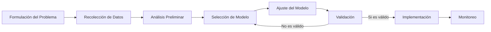
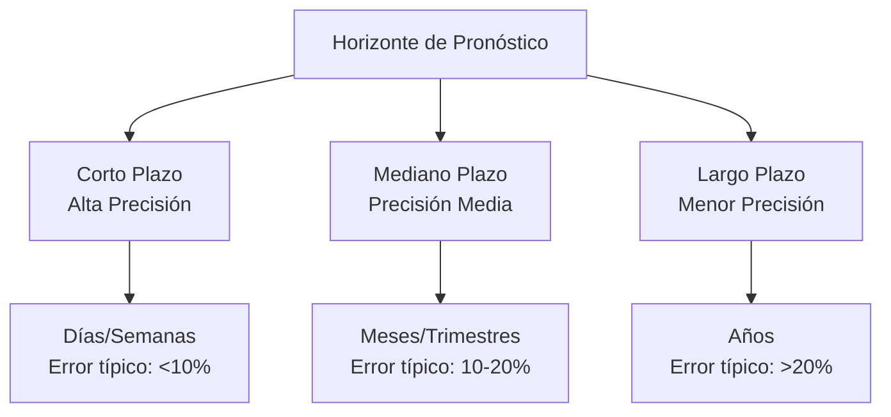
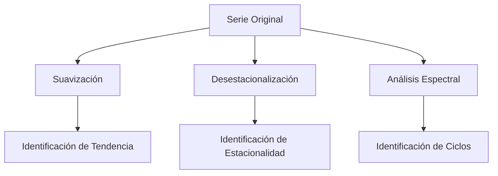
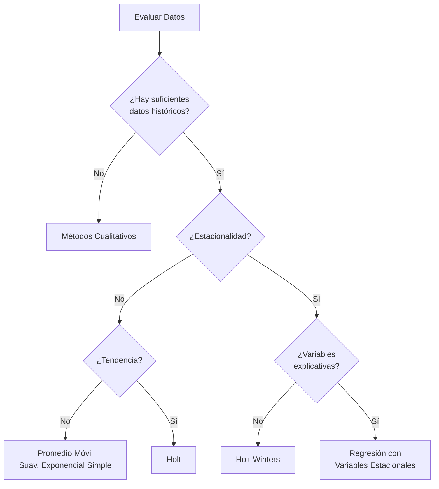

# Clase 5: Pronósticos - Fundamentos y Métodos Cuantitativos

## 🎯 Introducción

Imagina que eres el capitán de un barco navegando hacia un destino desconocido. Para llegar a puerto seguro, necesitas anticipar las condiciones futuras. Los pronósticos en operaciones cumplen exactamente este rol crítico: nos permiten navegar la incertidumbre empresarial con datos y ciencia, transformando la intuición en decisiones informadas.

### El Valor Estratégico de los Pronósticos

Los pronósticos son mucho más que simples predicciones; son la columna vertebral de la planificación operativa:

- **Base para decisiones de capacidad**: ¿Cuánto producir?
- **Driver para la gestión de inventarios**: ¿Cuánto stock mantener?
- **Fundamento para la planificación financiera**: ¿Qué recursos necesitaremos?
- **Guía para estrategias de marketing**: ¿Dónde enfocar esfuerzos promocionales?

> 💡 **Dato crucial**: Según McKinsey, las empresas que utilizan pronósticos avanzados reducen sus errores de inventario en un 20-30% y aumentan sus márgenes en un 3-5%.

## 🔍 Framework de Pronósticos

### El Proceso Integral



### La Jerarquía de Precisión



## 📊 Métodos de Pronóstico

### 1. Métodos Cualitativos

| Método                       | Descripción                     | Mejor uso                                |
| ---------------------------- | ------------------------------- | ---------------------------------------- |
| **Delphi**                   | Consenso iterativo de expertos  | Productos nuevos, tecnologías emergentes |
| **Jurado de Opinión**        | Panel de ejecutivos             | Decisiones estratégicas                  |
| **Analogía Histórica**       | Comparación con casos similares | Lanzamiento de productos                 |
| **Investigación de Mercado** | Encuestas y estudios            | Entrada a nuevos mercados                |

### 2. Análisis de Series Temporales

#### 2.1 Descomposición de Series

Una serie temporal puede descomponerse en:

$$Y_t = T_t \times S_t \times C_t \times I_t$$

Donde:

- $T_t$ = Tendencia
- $S_t$ = Estacionalidad
- $C_t$ = Ciclo
- $I_t$ = Irregularidad



#### 2.2 Métodos de Suavización

| Método                       | Fórmula                                    | Ventajas                 |
| ---------------------------- | ------------------------------------------ | ------------------------ |
| **Promedio Móvil Simple**    | $F_t = \frac{\sum_{i=t-n+1}^{t} A_i}{n}$   | Simple, intuitivo        |
| **Promedio Móvil Ponderado** | $F_t = \sum_{i=t-n+1}^{t} w_i A_i$         | Enfatiza datos recientes |
| **Suavización Exponencial**  | $F_t = \alpha A_{t-1} + (1-\alpha)F_{t-1}$ | Adaptativo               |

#### 2.3 Suavización Exponencial Triple (Holt-Winters)

Para series con tendencia y estacionalidad:

$$
\begin{align*}
L_t &= \alpha \frac{Y_t}{S_{t-s}} + (1-\alpha)(L_{t-1} + T_{t-1}) \\
T_t &= \beta(L_t - L_{t-1}) + (1-\beta)T_{t-1} \\
S_t &= \gamma \frac{Y_t}{L_t} + (1-\gamma)S_{t-s} \\
F_{t+m} &= (L_t + mT_t)S_{t-s+m}
\end{align*}
$$

### 3. Modelos Causales

#### 3.1 Regresión Lineal Simple

$$Y = \alpha + \beta X + \varepsilon$$

La estimación de parámetros se realiza con:

$$\beta = \frac{\sum(X_i - \bar{X})(Y_i - \bar{Y})}{\sum(X_i - \bar{X})^2}$$
$$\alpha = \bar{Y} - \beta\bar{X}$$

#### 3.2 Regresión Múltiple

$$Y = \beta_0 + \beta_1 X_1 + \beta_2 X_2 + ... + \beta_k X_k + \varepsilon$$

#### 3.3 Evaluación del Modelo

| Métrica            | Fórmula                                        | Interpretación            |
| ------------------ | ---------------------------------------------- | ------------------------- |
| **R²**             | $1 - \frac{SSE}{SST}$                          | % de varianza explicada   |
| **Error Estándar** | $\sqrt{\frac{\sum(Y_i - \hat{Y}_i)^2}{n-k-1}}$ | Precisión de estimaciones |
| **Valor p**        | Basado en distribución t                       | Significancia estadística |

## 🎓 Métodos Avanzados

### 1. Series Temporales Box-Jenkins (ARIMA)

**A**utorregresivo **I**ntegrado de **M**edias **M**óviles:

$$ARIMA(p,d,q): (1-\phi_1B-...-\phi_pB^p)(1-B)^d X_t = (1+\theta_1B+...+\theta_qB^q)\varepsilon_t$$

### 2. Machine Learning

| Técnica              | Ventajas              | Consideraciones       |
| -------------------- | --------------------- | --------------------- |
| **Random Forest**    | Captura no-linealidad | Requiere más datos    |
| **Redes Neuronales** | Patrones complejos    | "Caja negra"          |
| **XGBoost**          | Alta precisión        | Riesgo de sobreajuste |

```python
# Ejemplo de pronóstico con XGBoost
import xgboost as xgb
from sklearn.model_selection import train_test_split

X_train, X_test, y_train, y_test = train_test_split(X, y, test_size=0.2)
model = xgb.XGBRegressor(objective='reg:squarederror')
model.fit(X_train, y_train)
predictions = model.predict(X_test)
```

## 💼 Casos Chilenos

### 1. Falabella Retail

**Desafío**: Pronóstico de demanda de 100,000+ SKUs en múltiples tiendas

**Solución**:

- Segmentación ABC-XYZ por patrón de demanda
- Modelos jerárquicos por categoría → subcategoría → producto
- Incorporación de variables exógenas (clima, eventos)

**Resultados**:

- -25% en error de pronóstico (MAPE)
- +$3.2M en ahorro anual por menor obsolescencia

### 2. CCU (Compañía de Cervecerías Unidas)

**Desafío**: Alta estacionalidad en consumo de bebidas

**Enfoque**:

- Modelos Holt-Winters para capturar estacionalidad múltiple
- Variables externas: temperatura, eventos deportivos
- Pronósticos colaborativos con clientes clave

**Impacto**:

- Mejora del 18% en precisión
- Reducción de 22% en quiebres de stock

## 📏 Evaluación de Pronósticos

### Métricas de Error

| Métrica  | Fórmula                                        | Ventaja                  |
| -------- | ---------------------------------------------- | ------------------------ |
| **MAD**  | $\frac{1}{n}\sum\|A_t - F_t\|$                 | Fácil interpretación     |
| **MSE**  | $\frac{1}{n}\sum(A_t - F_t)^2$                 | Penaliza errores grandes |
| **MAPE** | $\frac{100\%}{n}\sum\|\frac{A_t - F_t}{A_t}\|$ | Porcentual, comparable   |
| **RMSE** | $\sqrt{\frac{1}{n}\sum(A_t - F_t)^2}$          | Misma unidad que datos   |

### Framework de Selección de Método



## 🔬 Taller Práctico

### Caso: Distribuidora de Bebidas

**Datos**:

- Ventas mensuales por 3 años
- Variables externas: temperatura, eventos
- Objetivo: Pronosticar próximos 6 meses

### Enfoque por Etapas:

1. **Análisis Exploratorio**:

   ```python
   import pandas as pd
   import matplotlib.pyplot as plt
   import seaborn as sns

   # Visualizar serie temporal
   plt.figure(figsize=(12,6))
   plt.plot(df['fecha'], df['ventas'])
   plt.title('Ventas Mensuales')

   # Descomposición
   from statsmodels.tsa.seasonal import seasonal_decompose
   result = seasonal_decompose(df['ventas'], model='multiplicative')
   result.plot()
   ```

2. **Aplicación de Métodos Múltiples**:

   - Holt-Winters
   - ARIMA
   - XGBoost con variables externas

3. **Evaluación y Selección**:

   ```python
   # Comparación de métodos
   metodos = ['Holt-Winters', 'ARIMA', 'XGBoost']
   errores = [12.5, 15.2, 10.8]

   plt.bar(metodos, errores)
   plt.title('MAPE por Método')
   plt.ylabel('% Error')
   ```

## 🚀 Implementación Exitosa

### Claves para la Adopción:

1. **Integración con Sistemas Existentes** (ERP, CRM)
2. **Visualización Efectiva** (Dashboards, excepciones)
3. **Proceso S&OP** (Sales & Operations Planning)
4. **Revisión y Ajuste Constante**

### Herramientas Recomendadas:

- **Python**: Pandas, Prophet, Statsmodels
- **R**: forecast, tseries
- **Software**: SAP IBP, Forecast Pro, Oracle Demantra

## 📝 Conclusión

Los pronósticos son arte y ciencia; combinan métodos estadísticos sólidos con juicio experto. El verdadero valor no está en la perfección (imposible de lograr), sino en la mejora continua y en el soporte estructurado para decisiones críticas.

> 💡 **Consejo final**: "El mejor pronóstico no es necesariamente el más preciso, sino el que mejor ayuda a tomar decisiones correctas."

## 📚 Recursos Extendidos

- **Libros**:
  - "Forecasting: Principles and Practice" - Hyndman & Athanasopoulos
  - "Business Forecasting" - Hanke & Wichern
- **MOOCs**:

  - Coursera: "Practical Time Series Analysis"
  - edX: "Demand Planning: Statistical Forecasting"

- **Herramientas**:
  - FBProphet (Facebook/Meta)
  - Forecast Pro (Student Edition)
  - Python Notebook Template (disponible en Canvas)
