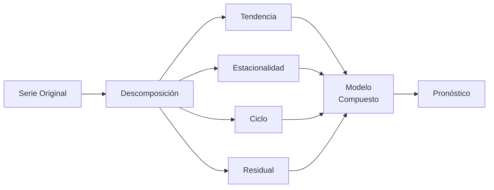
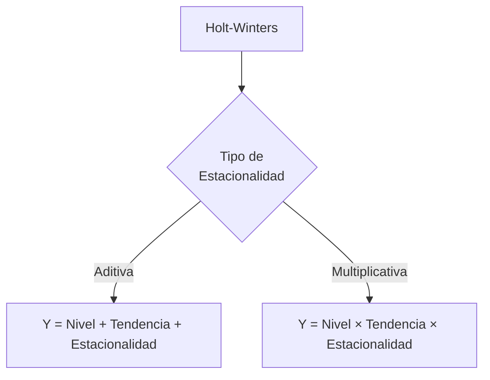
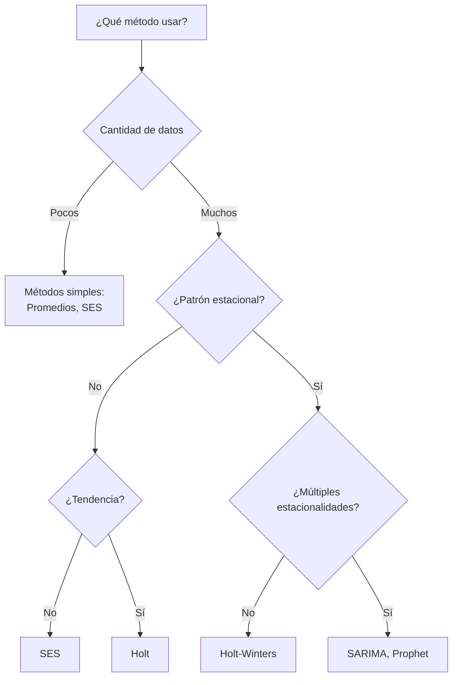

# Clase 5: Pronósticos - Métodos Avanzados y Series Temporales

## 🌊 Profundizando en Pronósticos

Si en la sesión anterior establecimos las bases conceptuales y exploramos la regresión lineal simple, ahora nos sumergiremos en técnicas más sofisticadas que nos permitirán capturar patrones complejos en los datos. Estas técnicas son esenciales cuando enfrentamos series temporales con estacionalidad, tendencias no lineales o múltiples variables predictoras.

> 💡 **Insight clave**: Los métodos avanzados pueden reducir el error de pronóstico entre un 20-40% comparado con métodos simples cuando los datos presentan patrones complejos.

## 🧮 Series Temporales y sus Componentes

Una serie temporal puede descomponerse en componentes fundamentales que nos ayudan a entender su comportamiento:



### Patrones de Series Temporales en Contextos Empresariales

| Patrón         | Ejemplo Empresarial                             | Método Recomendado |
| -------------- | ----------------------------------------------- | ------------------ |
| **Estacional** | Ventas de helados en verano                     | Winters, SARIMA    |
| **Tendencia**  | Crecimiento continuo de e-commerce              | Holt, Regresión    |
| **Cíclico**    | Ventas de materiales construcción               | ARIMA, Prophet     |
| **Combinado**  | Ventas minoristas (↑ tendencia + pico navideño) | Holt-Winters       |
| **Irregular**  | Venta de artículos de lujo                      | Medias móviles     |

## 🔬 Métodos Avanzados en Detalle

### 1. Regresión Múltiple en Contexto

La regresión múltiple va más allá de una simple relación lineal, permitiendo modelar efectos combinados.

```python
# Ejemplo en Python
import statsmodels.api as sm

# Variables explicativas: precio, publicidad, índice económico
X = df[['precio', 'publicidad', 'indice_economico']]
X = sm.add_constant(X)  # Añadir término constante
y = df['ventas']

# Ajustar modelo
model = sm.OLS(y, X).fit()
print(model.summary())

# Predicción para nuevos valores
nuevos_datos = [[1, 120, 3500, 102]]  # Constante, precio, publicidad, índice
prediccion = model.predict(nuevos_datos)
```

#### Interpretación de Coeficientes

| Variable             | Coeficiente | Interpretación                                        |
| -------------------- | ----------- | ----------------------------------------------------- |
| **Precio**           | -2.5        | Por cada $1 de aumento, ventas bajan en 2.5 unidades  |
| **Publicidad**       | 0.03        | Por cada $1 invertido, ventas suben 0.03 unidades     |
| **Índice Económico** | 12.6        | Por cada punto del índice, ventas suben 12.6 unidades |

### 2. Métodos de Suavización Exponencial

#### 2.1 Suavización Exponencial Simple (SES)

Ideal para series **sin tendencia ni estacionalidad** pero con fluctuaciones.

$$F_{t+1} = \alpha Y_t + (1-\alpha)F_t$$

```R
# Ejemplo en R
library(forecast)
modelo_ses <- ets(serie_datos, model="ANN")  # A=aditivo, N=sin tendencia, N=sin estacionalidad
pronostico <- forecast(modelo_ses, h=12)  # 12 períodos adelante
plot(pronostico)
```

**Selección de α**:

- α cercano a 1: Alta respuesta a cambios recientes
- α cercano a 0: Mayor estabilidad, menor respuesta

#### 2.2 Método de Holt

Para series **con tendencia pero sin estacionalidad**.

$$
\begin{align}
L_t &= \alpha Y_t + (1-\alpha)(L_{t-1} + T_{t-1}) \\
T_t &= \beta(L_t - L_{t-1}) + (1-\beta)T_{t-1} \\
F_{t+h} &= L_t + h \times T_t
\end{align}
$$

**Parámetros clave**:

- α: Peso del nivel actual
- β: Peso de la tendencia

#### 2.3 Método Holt-Winters

Para series **con tendencia y estacionalidad**.



**Ecuaciones Multiplicativas**:

$$
\begin{align}
L_t &= \alpha \frac{Y_t}{S_{t-s}} + (1-\alpha)(L_{t-1} + T_{t-1}) \\
T_t &= \beta(L_t - L_{t-1}) + (1-\beta)T_{t-1} \\
S_t &= \gamma \frac{Y_t}{L_t} + (1-\gamma)S_{t-s} \\
F_{t+h} &= (L_t + h \times T_t) \times S_{t-s+h\bmod s}
\end{align}
$$

Donde:

- s = longitud del ciclo estacional
- γ = parámetro de suavización estacional

## 🔄 Modelos ARIMA

### Componentes Fundamentales

- **AR (Autorregresivo)**: La observación actual es función de observaciones pasadas
- **I (Integrado)**: Diferenciación para estabilizar la serie
- **MA (Medias Móviles)**: La observación actual es función de errores de predicción pasados

```mermaid
graph LR
    A[ARIMA] --> B[p: Orden AR]
    A --> C[d: Grado de diferenciación]
    A --> D[q: Orden MA]
    A --> E[ARIMA(p,d,q)]
```

### Metodología Box-Jenkins

1. **Identificación**: Análisis de ACF/PACF, tests de estacionariedad
2. **Estimación**: Ajuste de parámetros
3. **Diagnóstico**: Análisis de residuos
4. **Pronóstico**: Generación de predicciones

```python
# Ejemplo con SARIMA en Python (estacional)
from statsmodels.tsa.statespace.sarimax import SARIMAX

# SARIMA(1,1,1)x(1,1,1,12) - orden estacional para datos mensuales
model = SARIMAX(data, order=(1,1,1), seasonal_order=(1,1,1,12))
results = model.fit()
forecast = results.forecast(steps=24)  # pronóstico para 24 períodos
```

## 📱 Modelos Modernos

### 1. Prophet (Meta/Facebook)

Especialmente diseñado para:

- Series con múltiples estacionalidades
- Datos faltantes
- Cambios en tendencias
- Efectos de días festivos

```python
# Implementación en Python
from prophet import Prophet

# Preparar datos en formato correcto
df = pd.DataFrame({'ds': fechas, 'y': valores})

# Ajustar modelo
model = Prophet(
    seasonality_mode='multiplicative',
    changepoint_prior_scale=0.05
)
model.add_country_holidays(country_name='Chile')
model.fit(df)

# Generar pronóstico
future = model.make_future_dataframe(periods=90)
forecast = model.predict(future)

# Visualizar componentes
fig = model.plot_components(forecast)
```

### 2. Redes Neuronales LSTM

Ideales para:

- Patrones no lineales complejos
- Series muy largas con dependencias temporales extensas
- Incorporación de variables exógenas

## 🎮 Caso Práctico: Demanda Estacional

### Escenario: Cadena Retail

**Datos**:

- Ventas mensuales históricas (3 años)
- Estacionalidad marcada (peak navideño)
- Tendencia creciente

### Enfoque Paso a Paso:

1. **Visualización y Descomposición**:

   ```python
   from statsmodels.tsa.seasonal import seasonal_decompose

   result = seasonal_decompose(df['ventas'], model='multiplicative')
   result.plot()
   ```

2. **Evaluación de Métodos**:

   | Método       | MAE   | MAPE  | Mejor uso                         |
   | ------------ | ----- | ----- | --------------------------------- |
   | SES          | 5,420 | 18.5% | Corto plazo, baja complejidad     |
   | Holt         | 4,230 | 14.8% | Corto plazo con tendencia         |
   | Holt-Winters | 2,850 | 9.7%  | Mediano plazo con estacionalidad  |
   | SARIMA       | 2,710 | 9.2%  | Mediano plazo, patrones complejos |
   | Prophet      | 2,380 | 8.1%  | Largo plazo, múltiples patrones   |

3. **Implementación de Holt-Winters**:

   ```R
   # En R
   library(forecast)

   modelo_hw <- ets(ventas, model="MAM")  # Multiplicativo, Aditivo, Multiplicativo
   pronostico <- forecast(modelo_hw, h=12)

   # Intervalos de predicción
   plot(pronostico)
   ```

4. **Validación Cruzada Temporal**:

   ```python
   from sklearn.model_selection import TimeSeriesSplit

   tscv = TimeSeriesSplit(n_splits=5)
   for train_index, test_index in tscv.split(data):
       # Entrenar modelo con train_index
       # Evaluar en test_index
   ```

## 🌐 Aplicaciones Sectoriales

### 1. Retail

- **Desafío**: Múltiples productos con diferentes patrones
- **Enfoque**: Agrupamiento y jerarquización de pronósticos
- **Método**: Combinación de métodos bottom-up y top-down

### 2. Servicios Financieros

- **Desafío**: Alta volatilidad y eventos externos
- **Enfoque**: Modelos ARCH/GARCH para volatilidad
- **Método**: Incorporación de variables macroeconómicas

### 3. Energía

- **Desafío**: Patrones diarios, semanales y estacionales
- **Enfoque**: Pronóstico a múltiples horizontes
- **Método**: Redes neuronales con variables meteorológicas

## 🎯 Criterios de Selección de Método



## 📊 Evaluación Avanzada de Pronósticos

Más allá de las métricas básicas como MAE y MAPE:

| Métrica          | Fórmula                                                                               | Ventaja                                    |
| ---------------- | ------------------------------------------------------------------------------------- | ------------------------------------------ |
| **RMSSE**        | $\sqrt{\frac{\sum(y_t - \hat{y}_t)^2 / n}{\sum(y_t - y_{t-1})^2 / (n-1)}}$            | Escala invariante, comparable entre series |
| **MASE**         | $\frac{1}{n}\sum\|\frac{y_t - \hat{y}_t}{\frac{1}{n-1}\sum\|y_t - y_{t-1}\|}\|$       | Robusta a outliers                         |
| **Pinball Loss** | $\sum_{\tau \in Q} \tau \cdot \max(y-\hat{y}, 0) + (1-\tau) \cdot \max(\hat{y}-y, 0)$ | Para pronósticos por cuantiles             |

## 🤝 Integración con Sistemas Empresariales

### 1. Workflow de Pronósticos en la Organización


### 2. Del Pronóstico a la Acción

| Área            | Uso del Pronóstico          | Impacto Empresarial          |
| --------------- | --------------------------- | ---------------------------- |
| **Operaciones** | Planificación de capacidad  | -15% costos operativos       |
| **Compras**     | Optimización de inventarios | +20% rotación inventario     |
| **Finanzas**    | Proyección de flujo de caja | +5% precisión presupuestaria |
| **Marketing**   | Evaluación de campañas      | +12% ROI publicitario        |

## 📝 Reflexiones para el Examen

1. **Aspectos críticos**:

   - La precisión no es el único criterio (considera interpretabilidad, mantenibilidad)
   - Los pronósticos deben revisarse y ajustarse periódicamente
   - El juicio experto sigue siendo valioso incluso con métodos sofisticados

2. **Preguntas típicas**:
   - Selección del método adecuado según características de la serie
   - Interpretación de parámetros (α, β, γ en métodos de suavización)
   - Análisis de impacto de decisiones basadas en pronósticos

> 💡 **Consejo práctico**: "Un buen pronóstico no es el que intenta predecir exactamente el futuro, sino el que proporciona la información necesaria para tomar mejores decisiones hoy"
