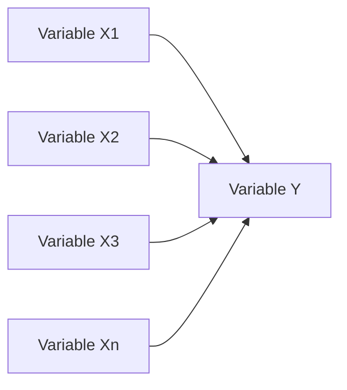
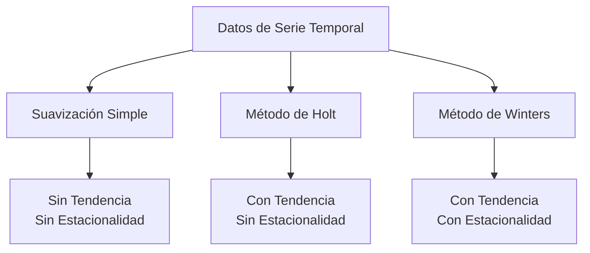

# Clase 5: Pronósticos - Métodos Avanzados y Series de Tiempo

## 🎯 Introducción

Continuando con nuestra analogía del capitán del barco, ahora nos adentramos en aguas más profundas. Si en la sesión anterior aprendimos a usar una brújula básica (regresión simple), ahora exploraremos el uso de instrumentos más sofisticados como el radar y los sistemas de navegación satelital (métodos avanzados de pronóstico).

### ¿Qué son los métodos avanzados de pronóstico?

Son técnicas más sofisticadas que consideran múltiples variables y patrones complejos para generar predicciones más precisas.

- Manejan múltiples variables simultáneamente
- Incorporan patrones estacionales y tendencias
- Utilizan técnicas estadísticas más robustas

> 💡 Dato importante: Los métodos avanzados son más precisos pero requieren más datos y comprensión técnica.

## 📊 Conceptos Principales

### Regresión Múltiple

La regresión múltiple expande el modelo simple para incluir múltiples variables predictoras:

$$ y = \alpha + \beta_1x_1 + \beta_2x_2 + ... + \beta_nx_n + \epsilon $$

### Métodos de Suavización

#### Suavización Exponencial Simple

$$ F\_{t+1} = \alpha Y_t + (1-\alpha)F_t $$

#### Suavización Exponencial con Tendencia (Holt)

$$ L*t = \alpha Y_t + (1-\alpha)(L*{t-1} + T*{t-1}) $$
$$ T_t = \beta(L_t - L*{t-1}) + (1-\beta)T\_{t-1} $$

#### Suavización Exponencial con Tendencia y Estacionalidad (Winters)

$$ L*t = \alpha\frac{Y_t}{S*{t-s}} + (1-\alpha)(L*{t-1} + T*{t-1}) $$
$$ T*t = \beta(L_t - L*{t-1}) + (1-\beta)T*{t-1} $$
$$ S_t = \gamma\frac{Y_t}{L_t} + (1-\gamma)S*{t-s} $$

## 💻 Herramientas y Recursos

- Software especializado: SPSS, SAS
- Paquetes avanzados en R: forecast, prophet
- Bibliotecas de Python: statsmodels, pmdarima

## 📈 Aplicaciones Prácticas

1. Pronóstico de Demanda Estacional

   - Ventas navideñas
   - Consumo de energía
   - Ocupación hotelera

2. Análisis de Múltiples Factores
   - Ventas considerando precio, publicidad y competencia
   - Demanda considerando clima, eventos y economía
   - Producción considerando materias primas y mano de obra

## 🎓 Ejercicio Práctico

### Pronóstico con Suavización Exponencial

Datos trimestrales de ventas:
| Trimestre | Ventas |
|-----------|--------|
| 1 | 100 |
| 2 | 120 |
| 3 | 90 |
| 4 | 140 |

Para α = 0.2:

1. F₁ = Y₁ = 100
2. F₂ = 0.2(120) + 0.8(100) = 104
3. F₃ = 0.2(90) + 0.8(104) = 101.2
4. F₄ = 0.2(140) + 0.8(101.2) = 108.96

## 🔑 Consejos Clave

1. Seleccionar el método según el patrón de los datos
2. Validar el modelo con datos de prueba
3. Mantener el equilibrio entre complejidad y precisión
4. Considerar el costo-beneficio del método elegido

## 📝 Conclusión

Los métodos avanzados de pronóstico son como un conjunto completo de instrumentos de navegación: cada uno tiene su propósito específico y, cuando se usan en conjunto, proporcionan una visión más completa y precisa del futuro.

## 📚 Fórmulas Relevantes

### Regresión Múltiple

- Modelo: $y = \alpha + \beta_1x_1 + \beta_2x_2 + ... + \beta_nx_n + \epsilon$
- R² ajustado: $R^2_{adj} = 1 - \frac{(1-R^2)(n-1)}{n-k-1}$

### Suavización Exponencial

- Simple: $F_{t+1} = \alpha Y_t + (1-\alpha)F_t$
- Holt:
  - Nivel: $L_t = \alpha Y_t + (1-\alpha)(L_{t-1} + T_{t-1})$
  - Tendencia: $T_t = \beta(L_t - L_{t-1}) + (1-\beta)T_{t-1}$
- Winters:
  - Nivel: $L_t = \alpha\frac{Y_t}{S_{t-s}} + (1-\alpha)(L_{t-1} + T_{t-1})$
  - Tendencia: $T_t = \beta(L_t - L_{t-1}) + (1-\beta)T_{t-1}$
  - Estacionalidad: $S_t = \gamma\frac{Y_t}{L_t} + (1-\gamma)S_{t-s}$

### Medidas de Precisión

- R² múltiple: $R^2 = 1 - \frac{SSE}{SST}$
- AIC: $AIC = 2k - 2\ln(L)$
- BIC: $BIC = \ln(n)k - 2\ln(L)$

## 🔍 Recursos Adicionales

- Artículos académicos sobre pronósticos avanzados
- Casos de estudio de implementaciones exitosas
- Tutoriales de software especializado
