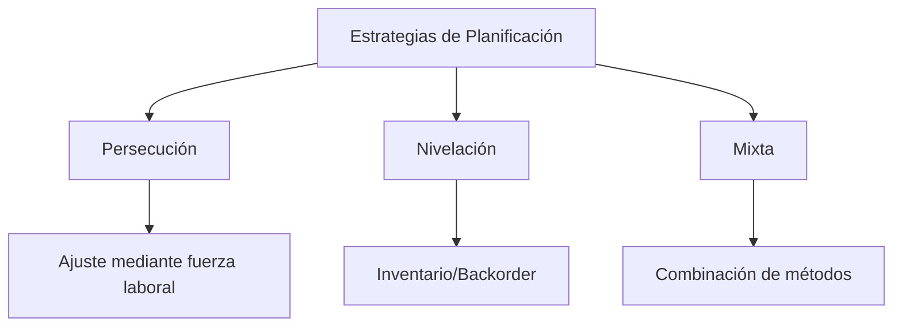

# Clase 6: Planificación Agregada

## 🎯 Introducción

Imagina que eres el director de una orquesta sinfónica. No solo debes coordinar diferentes instrumentos, sino también gestionar ensayos, músicos y recursos a lo largo de una temporada. La planificación agregada en operaciones es similar: busca armonizar la capacidad de producción con la demanda prevista, considerando múltiples recursos y restricciones.

### ¿Qué es la Planificación Agregada?

La planificación agregada es un proceso que determina los niveles de producción, inventario y recursos humanos necesarios para satisfacer la demanda en un horizonte de tiempo medio (6-18 meses):

- Equilibra capacidad con demanda
- Optimiza el uso de recursos
- Minimiza costos operacionales

> 💡 Dato importante: La palabra "agregada" se refiere a que la planificación se realiza a nivel de familias de productos, no productos individuales.

## 📊 Conceptos Principales

### Estrategias de Planificación

#### 1. Estrategia de Persecución

- Ajusta la capacidad a la demanda
- Utiliza contratación/despido
- Horas extras/tiempo parcial

#### 2. Estrategia de Nivelación

- Mantiene nivel de producción constante
- Utiliza inventario como buffer
- Acepta backorders si es necesario

#### 3. Estrategia Mixta

- Combina elementos de ambas estrategias
- Busca balance óptimo
- Más flexible y realista

## 💻 Herramientas y Recursos

### Métodos de Planificación

1. Programación Lineal
2. Métodos de Transporte
3. Hojas de cálculo especializadas

## 📈 Aplicaciones Prácticas

### 1. Industria Manufacturera

- Planificación de personal y equipos
- Gestión de inventarios estacionales
- Coordinación con proveedores

### 2. Servicios

- Programación de personal en retail
- Gestión de capacidad en hospitales
- Planificación de recursos en aerolíneas

## 🎓 Ejercicio Práctico

### Problema de Planificación Agregada

**Datos:**

- Demanda mensual: 1000 unidades
- Costo de mantener inventario: $2/unidad/mes
- Costo de contratación: $300/trabajador
- Costo de despido: $500/trabajador
- Producción por trabajador: 100 unidades/mes

**Solución Paso a Paso:**

1. Calcular trabajadores necesarios:
   $$ \text{Trabajadores} = \frac{\text{Demanda}}{\text{Producción por trabajador}} = \frac{1000}{100} = 10 $$

2. Evaluar costos de estrategias:
   - Persecución: Ajustar trabajadores mensualmente
   - Nivelación: Mantener 10 trabajadores constantes

## 🔑 Consejos Clave

1. Considerar todos los costos relevantes
2. Mantener flexibilidad en la planificación
3. Evaluar impacto en la fuerza laboral
4. Coordinar con otras áreas de la empresa

## 📝 Conclusión

La planificación agregada, como dirigir una orquesta, requiere equilibrar múltiples factores para crear una "sinfonía" operacional armoniosa. El éxito depende de elegir la estrategia adecuada según el contexto y mantener la flexibilidad necesaria para adaptarse a cambios.

## 📚 Fórmulas Relevantes

### Capacidad de Producción

$$ \text{Capacidad} = \text{Trabajadores} \times \text{Productividad} \times \text{Horas} $$

### Costo Total

$$ CT = C_p \times X_t + C_h \times I_t + C_s \times S_t + C_o \times O_t $$
Donde:

- $C_p$ = Costo de producción regular
- $X_t$ = Unidades producidas en período t
- $C_h$ = Costo de mantener inventario
- $I_t$ = Inventario en período t
- $C_s$ = Costo de shortage/backorder
- $S_t$ = Unidades en shortage
- $C_o$ = Costo de overtime
- $O_t$ = Horas overtime

### Balance de Inventario

$$ I*t = I*{t-1} + X_t - D_t $$
Donde:

- $I_t$ = Inventario al final del período t
- $X_t$ = Producción en período t
- $D_t$ = Demanda en período t

## 🔍 Recursos Adicionales

- Software de planificación: SAP APO, Oracle ASCP
- Plantillas Excel para planificación agregada
- Simuladores de planificación de producción
