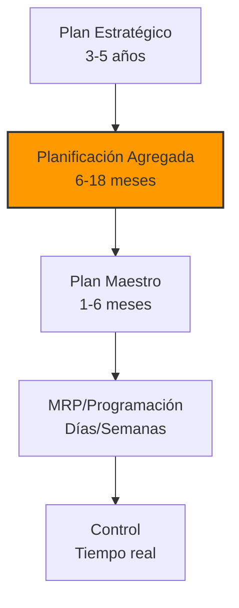
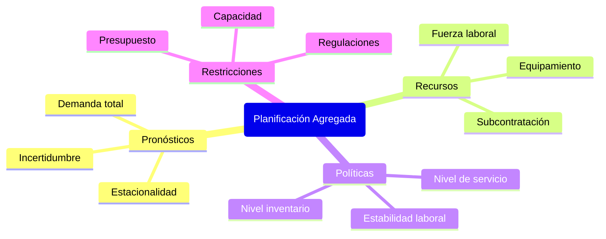
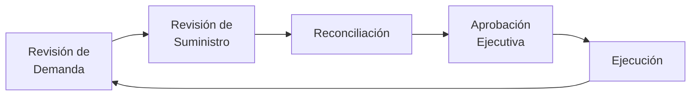

# Clase 6: Planificación Agregada - El Puente entre Estrategia y Ejecución

## 🎯 Introducción

Imagina que eres el director de una orquesta sinfónica preparando una temporada completa. No solo debes coordinar diferentes instrumentos, sino también gestionar ensayos, músicos y recursos a lo largo del año. La planificación agregada en operaciones es precisamente eso: el arte de orquestar recursos para satisfacer la demanda de forma óptima.

### El Rol Estratégico de la Planificación Agregada

La planificación agregada ocupa un lugar crítico en la jerarquía de decisiones operacionales:



> 💡 **Insight clave**: La planificación agregada es el "traductor" que convierte las decisiones estratégicas en planes tácticos ejecutables.

## 📊 Framework Conceptual

### 1. Inputs Críticos



### 2. Estrategias Fundamentales

| Estrategia      | Descripción                  | Costos Principales      | Mejor uso                           |
| --------------- | ---------------------------- | ----------------------- | ----------------------------------- |
| **Persecución** | Adaptar capacidad a demanda  | Contratación/Despido    | Productos con alto costo inventario |
| **Nivelación**  | Mantener capacidad constante | Inventario/Backorders   | Estabilidad laboral crítica         |
| **Mixta**       | Combinación flexible         | Optimización balanceada | Mayoría de industrias               |

## 🧮 Modelamiento Matemático

### 1. Formulación en Programación Lineal

**Función objetivo**: Minimizar costo total

$$\min Z = \sum_{t=1}^{T} (C_r W_t + C_o O_t + C_s S_t + C_h I_t + C_{sh} B_t + C_h H_t + C_f F_t)$$

Donde:

- $C_r$ = Costo regular por hora
- $W_t$ = Horas regulares en período t
- $C_o$ = Costo hora extra
- $O_t$ = Horas extra en período t
- $C_s$ = Costo subcontratación
- $S_t$ = Unidades subcontratadas
- $C_h$ = Costo mantener inventario
- $I_t$ = Inventario al final de período t
- $C_{sh}$ = Costo backorder
- $B_t$ = Backorders en período t
- $C_h$ = Costo contratación
- $H_t$ = Trabajadores contratados
- $C_f$ = Costo despido
- $F_t$ = Trabajadores despedidos

**Restricciones**:

1. **Balance de inventario**: $I_{t-1} - B_{t-1} + W_t + O_t + S_t - D_t = I_t - B_t$
2. **Capacidad regular**: $W_t \leq M \cdot N_t$
3. **Capacidad horas extra**: $O_t \leq \alpha \cdot W_t$
4. **Balance de trabajadores**: $N_{t-1} + H_t - F_t = N_t$

### 2. Métodos de Resolución

#### 2.1 Método de Transporte

Representación como tabla de transporte:

| Fuente    | Per 1 | Per 2 | Per 3 | ... | Capacidad |
| --------- | ----- | ----- | ----- | --- | --------- |
| Per 1 Reg | C11   | C12   | C13   | ... | Cap1r     |
| Per 1 OT  | C11o  | C12o  | C13o  | ... | Cap1o     |
| Per 2 Reg | -     | C22   | C23   | ... | Cap2r     |
| ...       | ...   | ...   | ...   | ... | ...       |
| Demanda   | D1    | D2    | D3    | ... |           |

#### 2.2 Método de Coeficientes de Gestión

$$
\begin{align*}
TC_{\text{nivelación}} &= \sum_{t=1}^{T} C_h \cdot \max(0, I_t) + C_{sh} \cdot \max(0, -I_t) \\
TC_{\text{persecución}} &= \sum_{t=1}^{T} C_h \cdot (H_t + F_t) \\
\end{align*}
$$

## 💼 Casos de Estudio Chilenos

### 1. Viña Concha y Toro

**Desafío**: Planificar producción con alta estacionalidad en cosechas y demanda global

**Enfoque**:

- Estrategia mixta:
  - Planificación anticipada de vendimia
  - Personal temporal para cosecha
  - Inventario estratificado por añadas
  - Capacidad de embotellado nivelada

**Resultados**:

- -15% en costos operacionales
- +8% en nivel de servicio
- Estabilidad para trabajadores permanentes

### 2. CMPC Tissue (Productos Elite)

**Desafío**: Balancear múltiples SKUs y plantas con demanda variable

**Solución**:

- Modelo de optimización multi-planta
- Enfoque de nivelación con buffer de inventario
- Asignación dinámica entre plantas según costos

**Impacto**:

- -12% en costos de transporte
- -20% en transferencias entre plantas
- +5% en utilización de máquinas papeleras

## 🔧 Herramientas Prácticas

### 1. Modelos en Excel Solver

```
# Modelo básico para Solver
# Variables de decisión: Producción regular, horas extra, subcontratación
# Función objetivo: Minimizar costos totales
# Restricciones: Satisfacer demanda, límites de capacidad
```

### 2. Python con PuLP

```python
# Ejemplo de código Python para planificación agregada
import pulp

# Crear problema
model = pulp.LpProblem("Aggregate_Planning", pulp.LpMinimize)

# Periodos
periods = range(1, 13)  # 12 meses

# Variables de decisión
reg_prod = {t: pulp.LpVariable(f"Regular_Production_{t}", lowBound=0) for t in periods}
overtime = {t: pulp.LpVariable(f"Overtime_{t}", lowBound=0) for t in periods}
workers = {t: pulp.LpVariable(f"Workers_{t}", lowBound=0, cat=pulp.LpInteger) for t in periods}
hiring = {t: pulp.LpVariable(f"Hiring_{t}", lowBound=0, cat=pulp.LpInteger) for t in periods}
firing = {t: pulp.LpVariable(f"Firing_{t}", lowBound=0, cat=pulp.LpInteger) for t in periods}
inventory = {t: pulp.LpVariable(f"Inventory_{t}", lowBound=0) for t in periods}

# Función objetivo
model += pulp.lpSum([
    reg_cost * reg_prod[t] +
    ot_cost * overtime[t] +
    holding_cost * inventory[t] +
    hiring_cost * hiring[t] +
    firing_cost * firing[t]
    for t in periods
])

# Restricciones
# ...añadir restricciones...

# Resolver
model.solve()
```

### 3. ERP y Sistemas Avanzados

- **SAP APO/IBP**: Módulo específico para planificación
- **Oracle ASCP**: Advanced Supply Chain Planning
- **Kinaxis RapidResponse**: Planeación de escenarios

## 📈 Aplicaciones Sectoriales

### 1. Manufactura Discreta

- **Planificación de ensamblaje**: Modelo de persecución adaptativo
- **Ejemplo**: Planta automotriz con variaciones estacionales en demanda

### 2. Proceso Continuo

- **Estrategia de nivelación**: Mantener utilización alta y constante
- **Ejemplo**: Planta química con altos costos de arranque/parada

### 3. Servicios

- **Personal flexible**: Part-time, multi-habilidades
- **Ejemplo**: Call centers con picos horarios y estacionales

### 4. Retail

- **Inventario anticipativo**: Para promociones y temporadas
- **Ejemplo**: Planificación para Navidad, Back-to-School

## 🎓 Taller Aplicado

### Caso: Empresa Metalúrgica

**Datos**:

- Horizonte: 6 meses
- Demanda (unids): [800, 1000, 1200, 1500, 1300, 900]
- Capacidad regular: 5 unids/trabajador/mes
- Trabajadores iniciales: 150
- Costos:
  - Trabajador regular: $1,200/mes
  - Contratación: $500/trabajador
  - Despido: $800/trabajador
  - Inventario: $30/unidad/mes
  - Subcontratación: $300/unidad

**Análisis**:

1. **Estrategia de Persecución Pura**:

   - Trabajadores necesarios: [160, 200, 240, 300, 260, 180]
   - Cambios netos: [+10, +40, +40, +60, -40, -80]
   - Costo contratación: $75,000
   - Costo despido: $96,000
   - Total: $171,000 + costos regulares

2. **Estrategia de Nivelación (240 trabajadores)**:

   - Producción mensual: 1200 unidades
   - Inventario final: [400, 600, 600, 300, 200, 500]
   - Costo inventario: $78,000
   - Contratación inicial: 90 × $500 = $45,000
   - Total: $123,000 + costos regulares

3. **Estrategia Mixta Optimizada**:
   - Nivelación parcial: 220 trabajadores
   - Horas extra para picos altos
   - Subcontratación limitada
   - Total: $110,000 + costos regulares

## 🔍 Evaluación y Mejora Continua

### 1. KPIs Críticos

| KPI                        | Fórmula                                                                  | Objetivo    |
| -------------------------- | ------------------------------------------------------------------------ | ----------- |
| **Adherencia al Plan**     | $\frac{Producción Real}{Producción Planeada} \times 100\%$               | >95%        |
| **Variación de Costos**    | $\frac{Costo Real - Costo Planeado}{Costo Planeado} \times 100\%$        | <5%         |
| **Rotación de Inventario** | $\frac{COGS}{Inventario Promedio}$                                       | Incrementar |
| **Fill Rate**              | $\frac{Unidades Entregadas a Tiempo}{Unidades Solicitadas} \times 100\%$ | >98%        |

### 2. Sales & Operations Planning (S&OP)



## 📚 Recursos Avanzados

- **Literatura Especializada**:

  - "Administración de Operaciones" - Krajewski & Ritzman
  - "Operations Management" - Slack, Brandon-Jones & Johnston
  - "Factory Physics" - Hopp & Spearman

- **Software**:
  - Plantilla Excel avanzada (disponible en Canvas)
  - Demo Python (repositorio GitHub del curso)
  - Simulador de S&OP online

## 🔑 Consideraciones Finales

1. **Integrar con pronósticos robustos**
2. **Evaluar múltiples escenarios** (optimista, pesimista, más probable)
3. **Revisar y ajustar mensualmente**
4. **Comunicar claramente a stakeholders**

> 💡 **Consejo profesional**: "La planificación agregada no es solo un ejercicio técnico, sino un proceso de comunicación y alineamiento organizacional"
