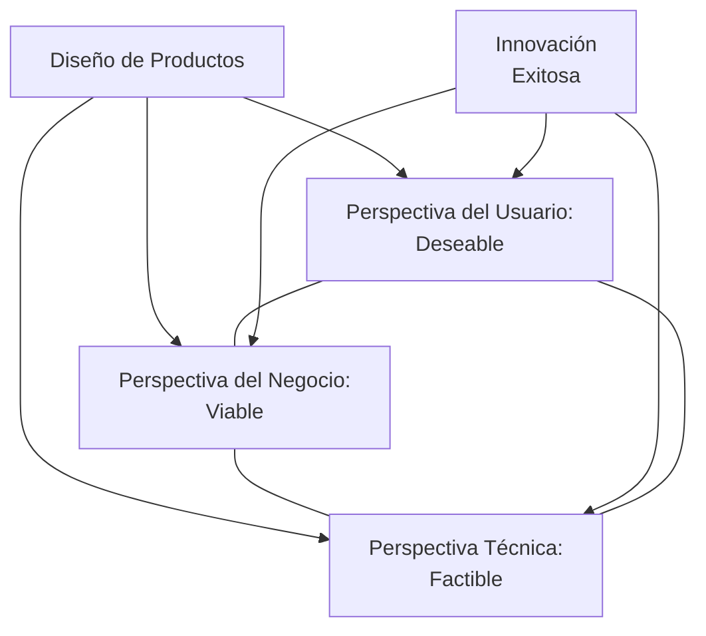
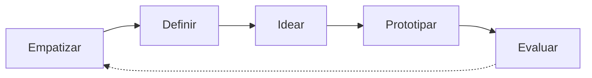
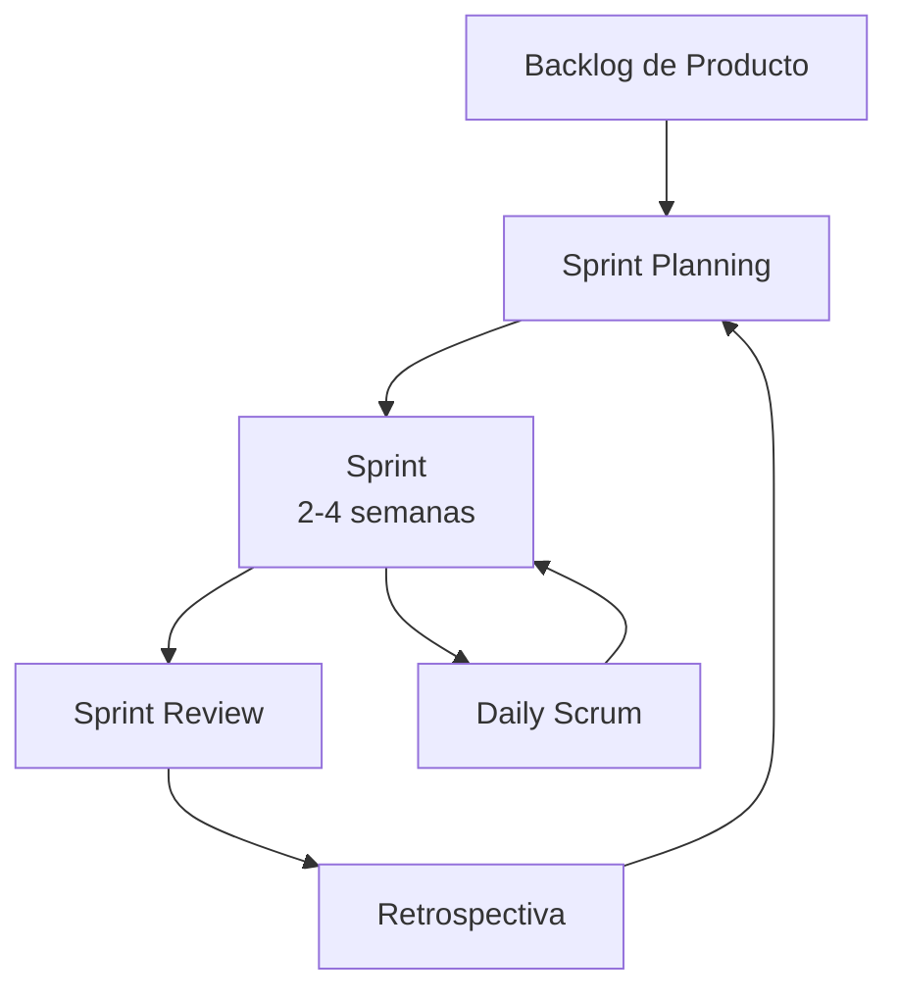
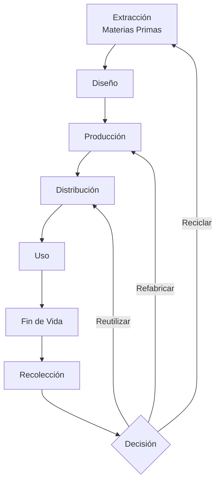
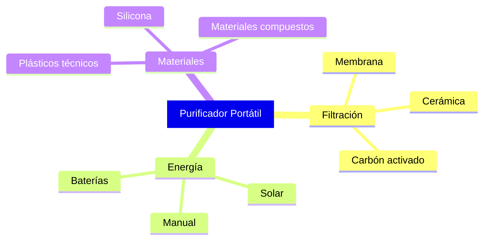

# Clase 7: Diseño de Productos y Gestión de la Innovación

## 🎯 Introducción al Diseño de Productos

El diseño de productos es como la creación de un organismo vivo: debe ser funcional, adaptarse a su entorno, satisfacer necesidades específicas y evolucionar con el tiempo. No se trata solo de estética, sino de una intrincada combinación de forma y función que determina el éxito o fracaso en el mercado.

> 💡 **Estadística clave**: Según McKinsey, las empresas con mejor desempeño en diseño de productos superan en ingresos a sus competidores en un 32% y en retorno total para accionistas en un 56%.

### Triple Perspectiva del Diseño



## 📋 Framework para el Diseño de Productos

### 1. Etapas del Proceso de Diseño

```mermaid
flowchart LR
    A[Investigación] --> B[Ideación]
    B --> C[Conceptualización]
    C --> D[Prototipado]
    D --> E[Pruebas]
    E --> F[Refinamiento]
    F --> G[Producción]
    G --> H[Seguimiento]

    style A fill:#ffcccc,stroke:#333,stroke-width:1px
    style B fill:#ccffcc,stroke:#333,stroke-width:1px
    style C fill:#ccffcc,stroke:#333,stroke-width:1px
    style D fill:#ccccff,stroke:#333,stroke-width:1px
    style E fill:#ccccff,stroke:#333,stroke-width:1px
    style F fill:#ccccff,stroke:#333,stroke-width:1px
    style G fill:#ffffcc,stroke:#333,stroke-width:1px
    style H fill:#ffffcc,stroke:#333,stroke-width:1px
```



### 2. Matrices de Decisión

| Fase                  | Herramientas            | Entregables            |
| --------------------- | ----------------------- | ---------------------- |
| **Investigación**     | Etnografía, Benchmark   | Insights de usuario    |
| **Ideación**          | Brainstorming, SCAMPER  | Conceptos preliminares |
| **Conceptualización** | QFD, Pugh Matrix        | Especificaciones       |
| **Prototipado**       | CAD, Impresión 3D       | Modelos funcionales    |
| **Pruebas**           | FMEA, Usability Testing | Informes de validación |
| **Refinamiento**      | DFM/DFA                 | Diseño final           |
| **Producción**        | SPC, Lean               | Producto terminado     |
| **Seguimiento**       | NPS, Analytics          | Métricas de desempeño  |

## 🔍 Metodologías Modernas de Diseño

### 1. Design Thinking



**Caso de éxito**: LATAM Airlines rediseñó su experiencia de check-in utilizando Design Thinking, reduciendo el tiempo promedio de proceso en un 40% y aumentando la satisfacción del cliente en un 35%.

### 2. Lean Product Development

Principios clave:

- **Eliminar desperdicios**: Reducción de actividades sin valor
- **Amplificar aprendizaje**: Ciclos cortos de feedback
- **Decidir lo más tarde posible**: Mantener opciones abiertas
- **Entregar lo más rápido posible**: Reducir tiempo al mercado
- **Empoderar al equipo**: Decisiones descentralizadas
- **Integridad incorporada**: Calidad desde el diseño
- **Optimizar el conjunto**: Visión holística del producto

### 3. Desarrollo Ágil de Productos Físicos



**Aplicaciones**:

- Productos modulares
- Hardware con componentes de software significativos
- Productos con iteraciones frecuentes

## 🔧 Herramientas Avanzadas

### 1. Quality Function Deployment (QFD) - Casa de la Calidad

```
┌───────────────────────────┐
│     Correlaciones        │
│                           │
├─────────┬─────────────────┤
│         │                 │
│         │                 │
│         │                 │
│Requisitos│   Relaciones   │
│  del    │                 │
│ Cliente │                 │
│         │                 │
│         │                 │
├─────────┼─────────────────┤
│Evaluación│   Evaluación   │
│Competitiva│   Técnica     │
└─────────┴─────────────────┘
```

**Ejemplo práctico**: En el diseño de un smartphone:

1. **Voz del cliente**:

   - "Quiero que la batería dure todo el día"
   - "Necesito una cámara que tome buenas fotos en poca luz"
   - "Debe ser resistente a caídas"

2. **Características técnicas**:

   - Capacidad de batería (mAh)
   - Tamaño del sensor de la cámara
   - Apertura de lente
   - Material de construcción
   - Grosor del dispositivo

3. **Relaciones**:
   - Fuerte relación entre "batería dure todo el día" y "capacidad de batería"
   - Compromiso entre "resistente a caídas" y "grosor del dispositivo"

### 2. Análisis FMEA (Failure Mode and Effects Analysis)

| Componente | Modo de Falla      | Efecto           | Severidad | Ocurrencia | Detección | RPN | Acción                   |
| ---------- | ------------------ | ---------------- | --------- | ---------- | --------- | --- | ------------------------ |
| Batería    | Sobrecalentamiento | Incendio         | 9         | 3          | 4         | 108 | Añadir sensores térmicos |
| Pantalla   | Rotura             | Inutilizable     | 8         | 6          | 1         | 48  | Reforzar bordes          |
| Software   | Crash              | Pérdida de datos | 7         | 5          | 2         | 70  | Mejorar pruebas          |

### 3. Design for X (DFX)

| Enfoque                  | Objetivo                | Técnicas                                      |
| ------------------------ | ----------------------- | --------------------------------------------- |
| **DFM** (Manufactura)    | Facilitar producción    | Reducir componentes, estandarizar             |
| **DFA** (Ensamblaje)     | Simplificar montaje     | Diseño modular, snap-fits                     |
| **DFR** (Confiabilidad)  | Aumentar durabilidad    | Redundancia, componentes probados             |
| **DFE** (Medio Ambiente) | Reducir impacto         | Materiales reciclables, eficiencia energética |
| **DFT** (Testabilidad)   | Facilitar pruebas       | Puntos de prueba, diagnósticos                |
| **DFS** (Servicio)       | Facilitar mantenimiento | Accesibilidad, modularidad                    |

## 🌍 Diseño Sostenible

### 1. Economía Circular en el Diseño



### 2. Estrategias de Eco-diseño

| Estrategia                    | Descripción               | Ejemplo                      |
| ----------------------------- | ------------------------- | ---------------------------- |
| **Reducción de materiales**   | Minimizar uso de recursos | Smartphones más delgados     |
| **Extensión de vida útil**    | Productos más durables    | Electrodomésticos reparables |
| **Optimización producción**   | Procesos más eficientes   | Manufactura aditiva          |
| **Optimización distribución** | Logística eficiente       | Empaques compactos           |
| **Optimización uso**          | Menor consumo energético  | Sensores de presencia        |
| **Optimización fin de vida**  | Facilitar reciclaje       | Marcado de plásticos         |

**Caso chileno**: Algramo desarrolló un sistema de envases reutilizables y recargables que ha reducido más de 100 toneladas de residuos plásticos.

## 💼 Casos de Estudio

### 1. Falabella Tech: Rediseño App Móvil

**Desafío**: Alta tasa de abandono en proceso de compra

**Enfoque**:

- Design Thinking para entender puntos de dolor
- A/B Testing de prototipos
- Desarrollo iterativo con sprints de 2 semanas

**Resultados**:

- -30% en tasa de abandono
- +25% en conversión
- +15% en ticket promedio

### 2. Empresa Manufacturera Chilena: Nuevo Electrodoméstico

**Desafío**: Crear producto competitivo con recursos limitados

**Metodología**:

- Análisis QFD para priorizar características
- Design for Manufacturing desde fase inicial
- Prototipado rápido con impresión 3D

**Beneficios**:

- Tiempo de desarrollo reducido en 40%
- Costos de manufactura 20% menores
- 85% de componentes estandarizados

## 🧪 Taller Aplicado: Diseño de un Producto Innovador

### Problema: Sistema Portátil de Purificación de Agua

**1. Investigación de Usuario**:

- Entrevistas con excursionistas y comunidades rurales
- Análisis de productos existentes
- Identificación de necesidades insatisfechas

**2. Definición de Especificaciones**:

| Requisito     | Valor Objetivo   | Importancia |
| ------------- | ---------------- | ----------- |
| Capacidad     | 2 litros/hora    | Alta        |
| Peso          | < 500g           | Media       |
| Filtración    | 99.9% bacterias  | Alta        |
| Durabilidad   | 1,000 litros     | Alta        |
| Precio        | < $50 USD        | Media       |
| Mantenimiento | Sin herramientas | Baja        |

**3. Conceptos Alternativos**:



**4. Matriz de Pugh para Selección**:

| Criterio         | Peso | Concepto A | Concepto B | Concepto C |
| ---------------- | ---- | ---------- | ---------- | ---------- |
| Eficacia         | 5    | 0          | +1         | +1         |
| Portabilidad     | 4    | 0          | -1         | +1         |
| Costo            | 3    | 0          | +1         | -1         |
| Durabilidad      | 4    | 0          | -1         | +1         |
| Facilidad de uso | 3    | 0          | +1         | 0          |
| **TOTAL**        |      | **0**      | **+1**     | **+6**     |

## 📊 Indicadores de Éxito en Diseño

### KPIs para Gestión de Diseño

| Etapa                 | Métrica                    | Objetivo |
| --------------------- | -------------------------- | -------- |
| **Investigación**     | % insights validados       | >80%     |
| **Ideación**          | Ideas/sesión               | >20      |
| **Conceptualización** | % requerimientos cubiertos | >95%     |
| **Prototipado**       | Iteraciones/feature        | <3       |
| **Pruebas**           | % de problemas resueltos   | >90%     |
| **Refinamiento**      | % reducción de costo       | >15%     |
| **Producción**        | Defectos/millón            | <50      |
| **Seguimiento**       | NPS                        | >40      |

### Framework ROI de Diseño

$$ROI_{diseño} = \frac{(Ingresos_{post} - Ingresos_{pre}) - Costo_{diseño}}{Costo_{diseño}} \times 100\%$$

## 📚 Recursos Avanzados

- **Libros**:
  - "The Design of Everyday Things" - Don Norman
  - "Hooked: How to Build Habit-Forming Products" - Nir Eyal
  - "Cradle to Cradle" - McDonough & Braungart
- **Herramientas**:

  - Figma (Prototipado)
  - Fusion 360 (CAD)
  - SolidWorks (Simulación)
  - Miro (Colaboración)

- **Certificaciones**:
  - Product Design Certification - IDSA
  - Certified DFM Engineer

> 💡 **Reflexión final**: "El buen diseño no es solo lo que se ve y se siente. El buen diseño es cómo funciona." - Steve Jobs
