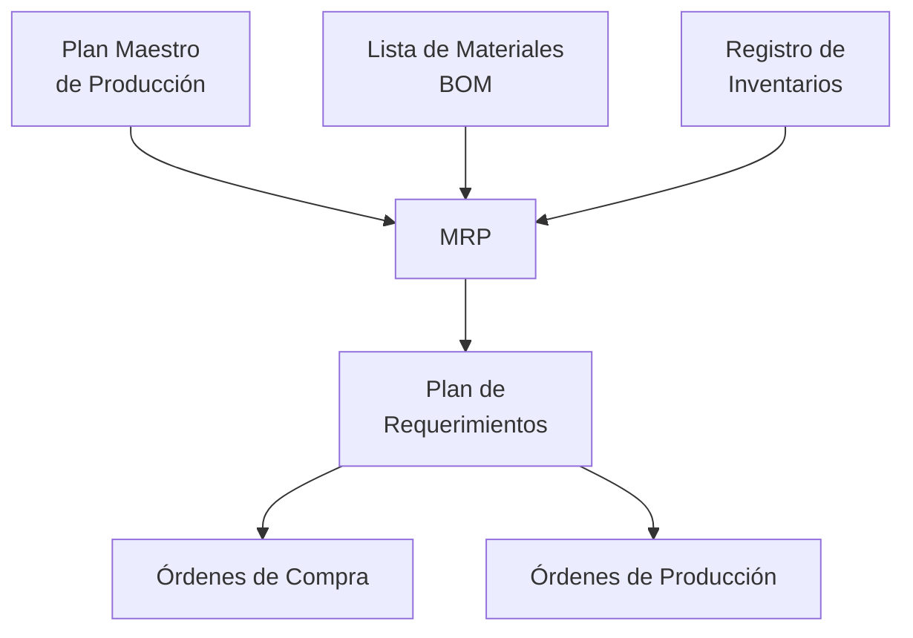
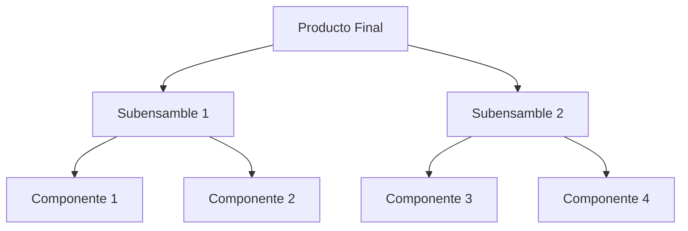

# Clase 8: MRP y Planificación de la Producción

## 🎯 Introducción

Imagina que estás construyendo una casa. No solo necesitas saber cuántos ladrillos, ventanas y puertas necesitas, sino también cuándo los necesitas y en qué orden. El MRP (Material Requirements Planning) funciona de manera similar: es como un plano detallado que nos dice qué materiales necesitamos, cuándo los necesitamos y en qué cantidades.

### ¿Qué es MRP?

El MRP es un sistema de planificación y administración que ayuda a gestionar los procesos de manufactura determinando qué, cuánto y cuándo se necesitan los materiales.

- Coordina la demanda con el suministro de materiales
- Mantiene niveles apropiados de inventario
- Planifica actividades de compra y producción

> 💡 Dato importante: El MRP transforma el Plan Maestro de Producción en requerimientos detallados de materiales y componentes.

## 📊 Conceptos Principales

### Estructura del MRP

### Lista de Materiales (BOM)

La BOM es la receta que muestra la estructura jerárquica de los componentes:

### Explosión de Materiales

El proceso de calcular los requerimientos netos considerando:

- Demanda bruta
- Inventario disponible
- Recepciones programadas
- Lead times

## 💻 Herramientas y Recursos

- Software ERP con módulos MRP
- Hojas de cálculo para BOM
- Sistemas de gestión de inventario

## 📈 Aplicaciones Prácticas

1. Planificación de Producción Automotriz

   - Gestión de miles de componentes
   - Coordinación con proveedores
   - Secuenciación de ensamblaje

2. Fabricación de Electrodomésticos
   - Control de inventarios
   - Programación de producción
   - Gestión de la cadena de suministro

## 🎓 Ejercicio Práctico

### Cálculo de Requerimientos MRP

Producto: Mesa de escritorio

- Demanda: 100 unidades
- Lead time: 1 semana
- Inventario actual: 20 unidades
- Tamaño de lote: 50 unidades

BOM por unidad:

- 4 patas
- 1 tablero
- 8 tornillos
- 4 soportes

Calcular requerimientos netos:

1. Demanda neta = Demanda bruta - Inventario = 80 unidades
2. Lotes a producir = ⌈80/50⌉ = 2 lotes
3. Cantidad a producir = 100 unidades
4. Requerimientos de materiales:
   - Patas: 400 unidades
   - Tableros: 100 unidades
   - Tornillos: 800 unidades
   - Soportes: 400 unidades

## 🔑 Consejos Clave

1. Mantener datos precisos de inventario
2. Actualizar la BOM regularmente
3. Considerar lead times realistas
4. Mantener comunicación con proveedores

## 📝 Conclusión

El MRP es como el director de orquesta de la producción, asegurando que cada instrumento (material) esté disponible en el momento preciso para crear la sinfonía perfecta (producto final).

## 📚 Fórmulas Relevantes

### Cálculo de Requerimientos

- Requerimientos Netos = Requerimientos Brutos - Inventario Disponible - Recepciones Programadas
- Cantidad de Lotes = ⌈Requerimientos Netos/Tamaño de Lote⌉

### Tiempos

- Fecha Necesidad = Fecha Requerida - Lead Time
- Lead Time Total = Σ Lead Times de cada nivel

### Inventario

- Inventario Proyectado = Inventario Inicial + Recepciones Programadas - Requerimientos Brutos
- Stock de Seguridad = z × σ × √LT

## 🔍 Recursos Adicionales

- Guías de implementación MRP
- Software de planificación de producción
- Casos de estudio de implementación exitosa
