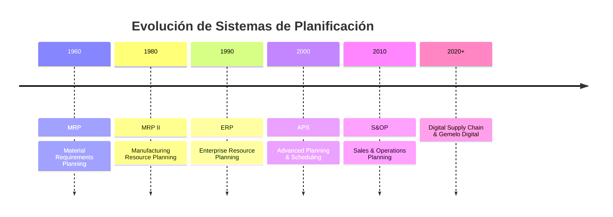
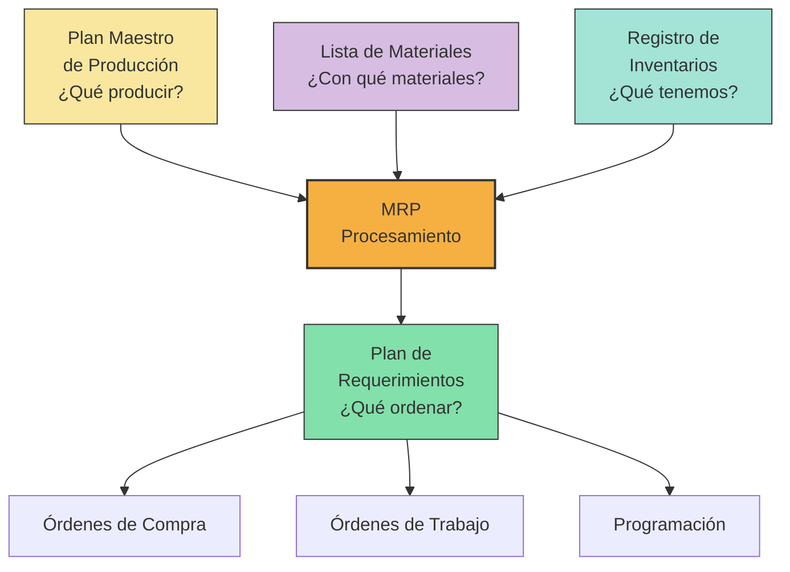
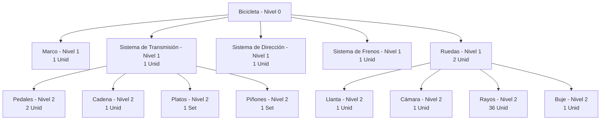
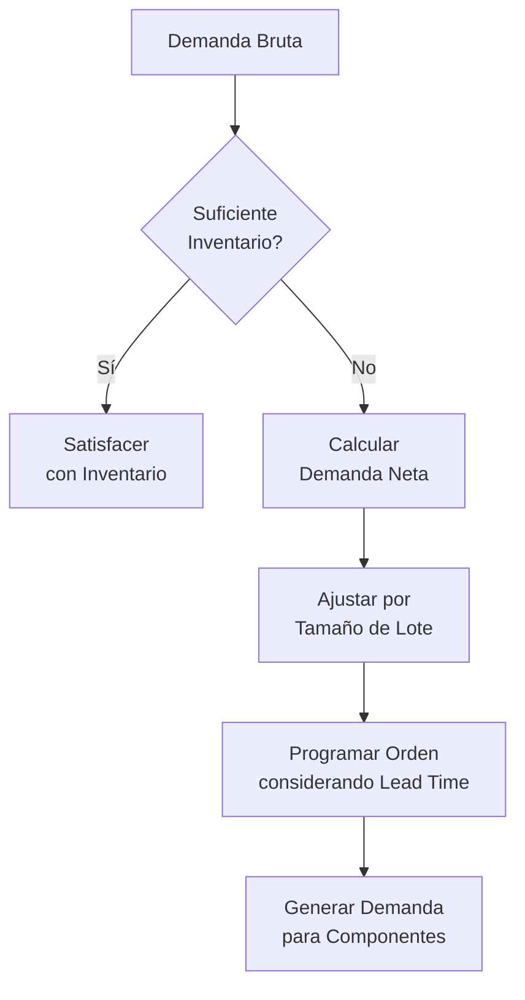
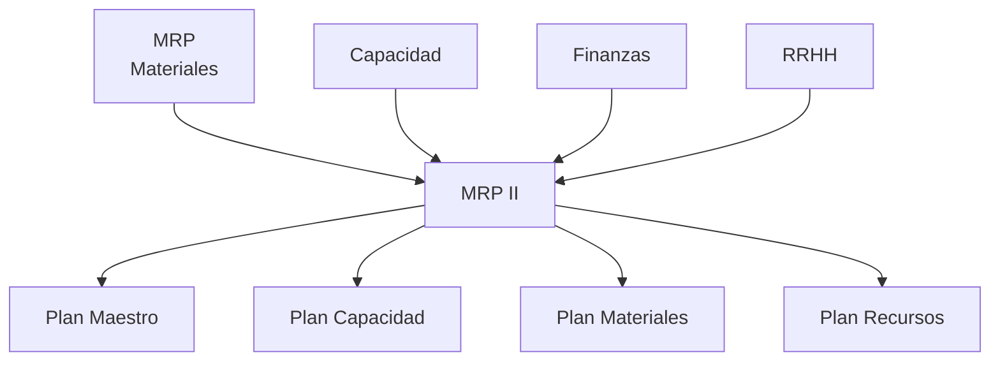
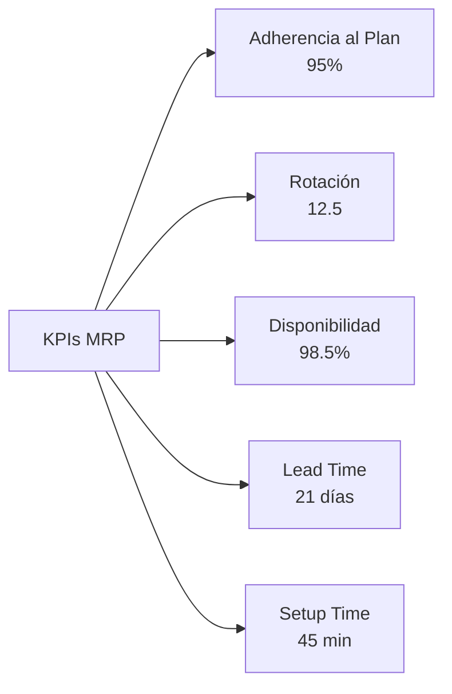

# Clase 8: MRP y Planificación Avanzada de Materiales

## 🎯 Introducción

Imagina dirigir una orquesta donde cada instrumento debe entrar exactamente en el momento preciso. Así funciona la planificación de materiales en manufactura: cada componente debe llegar en la cantidad exacta y en el momento justo para que la "sinfonía productiva" suene perfecta. El MRP (Material Requirements Planning) es el director de esta orquesta logística.

### La Evolución de la Planificación de Materiales



> 💡 **Dato clave**: Un estudio de Gartner muestra que las empresas con sistemas MRP avanzados reducen su inventario en un 25-30% mientras mejoran el nivel de servicio en un 15-20%.

## 📊 Framework Conceptual

### 1. Los Tres Pilares del MRP



### 2. Estructura BOM (Bill of Materials)

#### Tipos de BOM

| Tipo de BOM       | Uso                     | Características               |
| ----------------- | ----------------------- | ----------------------------- |
| **Ingeniería**    | Diseño y documentación  | Enfocada en componentes       |
| **Manufactura**   | Producción              | Incluye procesos y secuencias |
| **Planificación** | MRP                     | Simplificada para cálculos    |
| **Modular**       | Productos configurables | Estructura por módulos        |

#### Representación Gráfica



### 3. Cálculo MRP



## 🧮 Procesamiento Matemático del MRP

### 1. Fórmulas Fundamentales

$$Demanda\ Neta_t = \max(0, Demanda\ Bruta_t - Inventario_{t-1} - Recepciones\ Programadas_t)$$

$$Inventario_t = Inventario_{t-1} + Recepciones\ Programadas_t + Órdenes\ Planificadas_t - Demanda\ Bruta_t$$

$$Material\ Requerido = \sum_{i=1}^{n} Cantidad\ Padre_i \times Coeficiente\ Uso_{i,j}$$

### 2. Técnicas de Dimensionamiento de Lote

| Técnica                  | Descripción                        | Mejor Uso                                  |
| ------------------------ | ---------------------------------- | ------------------------------------------ |
| **Lote por Lote**        | Ordena exactamente la demanda neta | Items caros o perecederos                  |
| **EOQ**                  | Lote económico fijo                | Demanda estable                            |
| **POQ**                  | Períodos fijos, cantidad variable  | Balance entre setups y almacenamiento      |
| **Cobertura de Período** | Ordena para cubrir N períodos      | Items con patrón estacional                |
| **Wagner-Whitin**        | Optimización dinámica              | Cuando el costo computacional lo justifica |

## 🏭 Casos de Implementación Chilenos

### 1. MASISA (Industria Maderera)

**Desafío**: Gestionar +3,000 SKUs en múltiples plantas y mercados

**Solución MRP**:

- BOM multinivel para diferentes líneas de tableros
- Integración con pronósticos colaborativos de retail
- Sistema de priorización dinámica ABC-XYZ

**Resultados**:

- -35% en roturas de stock
- -18% en inventario de materias primas
- +12% en cumplimiento de plan de producción

### 2. Laboratorio Chile (Farmacéutica)

**Desafío**: Planificación compleja con fechas de caducidad y estrictas regulaciones

**Enfoque**:

- MRP integrado con trazabilidad completa
- Planificación inversa desde fechas de expiración
- Gestión de restricciones GMP (Good Manufacturing Practices)

**Impacto**:

- -25% en pérdidas por caducidad
- +20% en utilización de equipos críticos
- Cumplimiento regulatorio 100%

## 💻 Implementación Técnica

### 1. Tabla MRP Avanzada

| Semana                      | 1   | 2   | 3   | 4   | 5   | 6   |
| --------------------------- | --- | --- | --- | --- | --- | --- |
| **Demanda Bruta**           | 0   | 100 | 50  | 150 | 100 | 50  |
| **Recepciones Programadas** | 50  | 0   | 0   | 0   | 0   | 0   |
| **Inventario Proyectado**   | 150 | 50  | 0   | 0   | 0   | 0   |
| **Demanda Neta**            | 0   | 0   | 0   | 150 | 100 | 50  |
| **Plan de Órdenes**         | 0   | 0   | 150 | 100 | 50  | 0   |
| **Liberación de Órdenes**   | 150 | 100 | 50  | 0   | 0   | 0   |

### 2. Código Python para Procesamiento MRP

```python
import pandas as pd
import numpy as np

def calcular_mrp(demanda_bruta, inv_inicial, recepciones_programadas,
                 tamano_lote, lead_time, stock_seguridad=0):
    """
    Calcula tabla MRP para un ítem
    """
    periodos = len(demanda_bruta)

    # Crear DataFrame para resultados
    mrp = pd.DataFrame(index=range(1, periodos+1))
    mrp['Demanda_Bruta'] = demanda_bruta
    mrp['Recepciones_Programadas'] = recepciones_programadas

    # Inventario proyectado y demanda neta
    inv_proyectado = [0] * periodos
    demanda_neta = [0] * periodos
    plan_ordenes = [0] * periodos
    liberacion_ordenes = [0] * periodos

    # Primer período
    inv_proyectado[0] = max(0, inv_inicial + recepciones_programadas[0] - demanda_bruta[0])
    demanda_neta[0] = max(0, demanda_bruta[0] - inv_inicial - recepciones_programadas[0] + stock_seguridad)

    if demanda_neta[0] > 0:
        # Redondear al tamaño de lote superior
        plan_ordenes[0] = np.ceil(demanda_neta[0] / tamano_lote) * tamano_lote

    # Períodos restantes
    for i in range(1, periodos):
        inv_proyectado[i] = max(0, inv_proyectado[i-1] + recepciones_programadas[i] +
                              plan_ordenes[i-lead_time] if i-lead_time >= 0 else 0 -
                              demanda_bruta[i])

        demanda_neta[i] = max(0, demanda_bruta[i] - inv_proyectado[i-1] -
                             recepciones_programadas[i] + stock_seguridad)

        if demanda_neta[i] > 0:
            plan_ordenes[i] = np.ceil(demanda_neta[i] / tamano_lote) * tamano_lote

        # Liberación de órdenes considerando lead time
        if i + lead_time < periodos:
            liberacion_ordenes[i] = plan_ordenes[i + lead_time]

    # Completar DataFrame
    mrp['Inventario_Proyectado'] = inv_proyectado
    mrp['Demanda_Neta'] = demanda_neta
    mrp['Plan_Ordenes'] = plan_ordenes
    mrp['Liberacion_Ordenes'] = liberacion_ordenes

    return mrp
```

### 3. Sistemas ERP con Funcionalidades MRP

| Sistema                    | Características                     | Industria Objetivo       |
| -------------------------- | ----------------------------------- | ------------------------ |
| **SAP S/4HANA**            | Planificación multinivel avanzada   | Grandes empresas         |
| **Oracle NetSuite**        | MRP en la nube                      | Medianas empresas        |
| **Microsoft Dynamics 365** | Integración con Power BI            | Manufactura discreta     |
| **Odoo**                   | Open source, modular                | PyMEs                    |
| **TOTVS Protheus**         | Adaptado al mercado latinoamericano | Industrial y manufactura |

## 🔄 MRP II y Planificación Avanzada

### 1. Del MRP al MRP II



### 2. Planificación Avanzada APS

**Características**:

- Optimización multi-objetivo
- Planificación basada en restricciones
- Simulación de escenarios
- Algoritmos avanzados (heurísticas, programación matemática)

## 📋 Taller Práctico: Bicicleta Mountain Bike

### 1. BOM Simplificada

- **Nivel 0**: Bicicleta MTB (1 unidad)
  - **Nivel 1**: Marco (1), Horquilla (1), Manillar (1), Grupo Transmisión (1), Juego Ruedas (1)
    - **Nivel 2**: (De Grupo Transmisión) Cassette (1), Platos (1), Cadena (1), Cambios (2)
    - **Nivel 2**: (De Juego Ruedas) Rueda Delantera (1), Rueda Trasera (1)
      - **Nivel 3**: (De cada Rueda) Llanta (1), Buje (1), Rayos (36), Neumático (1)

### 2. Plan Maestro

- Plan de producción: 500 bicicletas/mes
- Distribución semanal: [100, 150, 150, 100]

### 3. Cálculo de Necesidades

**Para Cuadros**:

- Tiempo de entrega: 4 semanas
- Stock inicial: 200 unidades
- Tamaño de lote: 300 unidades

**Tabla MRP resultante**:

- Semana 1: Liberación de orden de 300 cuadros
- Semana 5: Recepción de 300 cuadros

## 📊 Dashboard MRP

### KPIs Clave



## 🔍 Buenas Prácticas y Lecciones Aprendidas

1. **Calidad de Datos**

   - Precisión de BOM >99%
   - Exactitud de inventario >98%
   - Lead times actualizados mensualmente

2. **Organización**

   - Equipo cross-funcional para parametrización
   - Responsabilidades claras para mantenimiento
   - Ciclo formalizado de actualización de datos

3. **Tecnología**
   - Integración con códigos de barras/RFID
   - Alertas automatizadas por excepción
   - Visualización en tiempo real

## 📚 Recursos Ampliados

- **Libros**:
  - "Factory Physics" por Hopp & Spearman
  - "MRP & Beyond" por Carol Ptak
- **Herramientas**:
  - MRPeasy (versión estudiante)
  - SAP Demo System con módulo MM/PP
  - Plantilla Excel avanzada con Visual Basic (disponible en Canvas)

## 🔑 Claves para el Examen

1. **Conceptos Críticos**:

   - Explosión de materiales
   - Órdenes planificadas vs. programadas
   - Offset por lead time
   - Niveles BOM

2. **Ejercicios Típicos**:
   - Cálculo completo de MRP
   - Dimensionamiento de lotes
   - Análisis de impacto de cambios en BOM
   - Detección de problemas en datos de entrada

> 💡 **Consejo final**: "El MRP es como un GPS para la producción: su éxito depende tanto de la calidad de los datos de entrada como del algoritmo que use para calcular la ruta"
