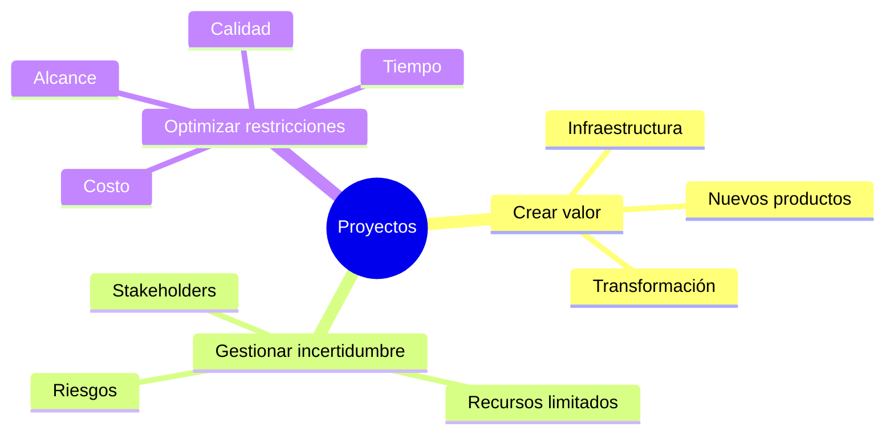
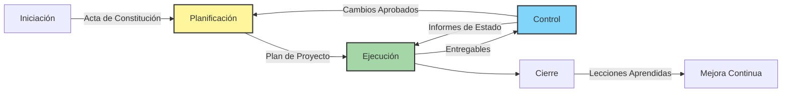
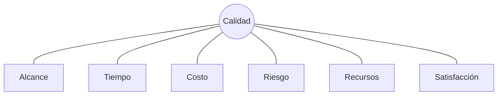
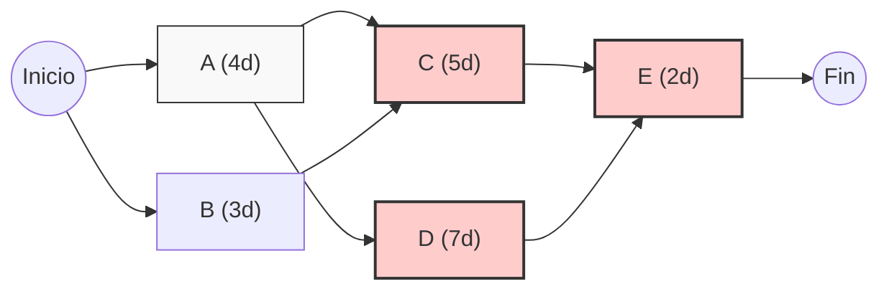
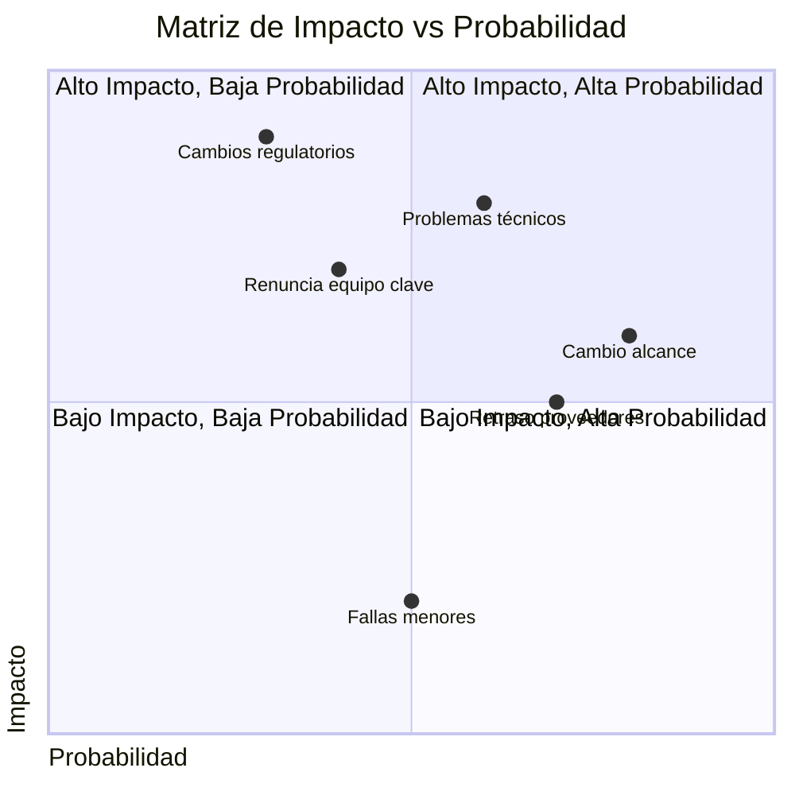
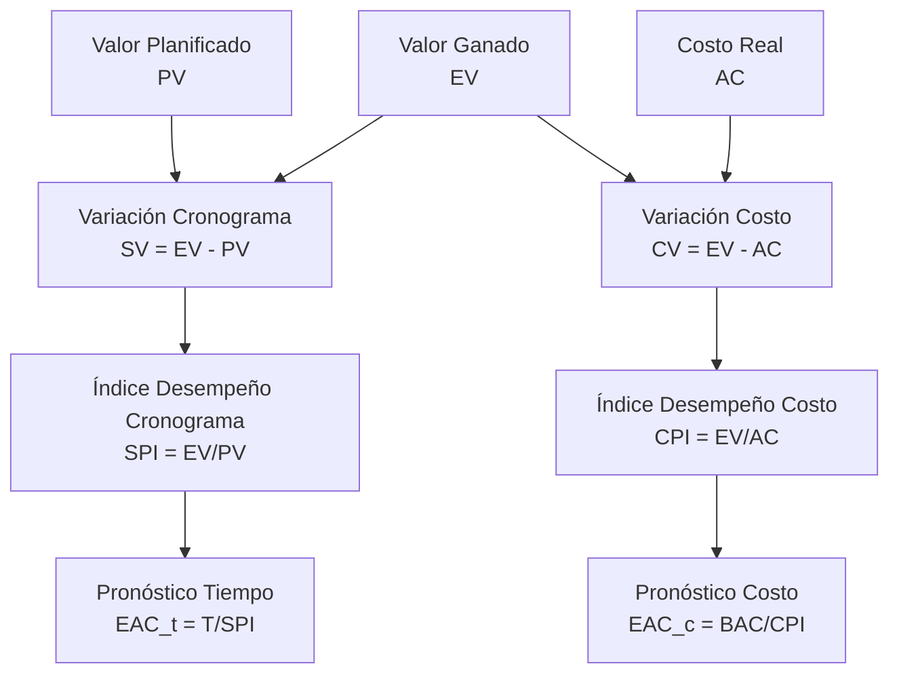

# Clase 9: Gestión de Proyectos - PERT/CPM y Análisis de Riesgo

## 🎯 Introducción

Imagine construir el metro de Santiago: miles de tareas interconectadas, múltiples equipos trabajando en paralelo, presupuestos millonarios y plazos críticos. La gestión de proyectos proporciona el "mapa y la brújula" para navegar esta complejidad, mientras que las técnicas PERT/CPM actúan como el "GPS" que calcula la mejor ruta y anticipa los obstáculos.

### La Importancia Estratégica de la Gestión de Proyectos



> 💡 **Dato crucial**: Según el Project Management Institute, por cada $1 billón invertido en proyectos, $100-$150 millones se pierden debido a deficiente gestión de proyectos. Las organizaciones que maduran sus prácticas de gestión de proyectos tienen un 28% más de probabilidades de completarlos exitosamente.

## 📊 Marco Conceptual

### 1. Ciclo de Vida del Proyecto



### 2. La Triple Restricción Ampliada



## 🧮 Técnicas PERT/CPM

### 1. Diferencias y Similitudes

| Característica                | PERT                             | CPM                              |
| ----------------------------- | -------------------------------- | -------------------------------- |
| **Enfoque**                   | Orientado a eventos              | Orientado a actividades          |
| **Estimación temporal**       | Probabilística (3 estimaciones)  | Determinística                   |
| **Análisis de incertidumbre** | Explícito                        | Implícito (holguras)             |
| **Mejor uso**                 | Proyectos con alta incertidumbre | Proyectos con experiencia previa |
| **Común**                     | Ambos calculan camino crítico    | Ambos permiten optimización      |

### 2. Fórmulas Fundamentales

#### 2.1 Tiempo Esperado (PERT)

$$t_e = \frac{t_o + 4t_m + t_p}{6}$$

Donde:

- $t_e$ = Tiempo esperado
- $t_o$ = Tiempo optimista
- $t_m$ = Tiempo más probable
- $t_p$ = Tiempo pesimista

#### 2.2 Varianza del Tiempo

$$\sigma^2 = \left(\frac{t_p - t_o}{6}\right)^2$$

#### 2.3 Probabilidad de Finalización

Para una fecha objetivo $T$:

$$Z = \frac{T - \sum t_e \text{ (camino crítico)}}{\sqrt{\sum \sigma^2 \text{ (camino crítico)}}}$$

Luego consultamos tabla normal estándar para $P(Z)$.

### 3. Diagrama de Red Avanzado



### 4. Técnicas de Compresión de Cronograma

| Técnica                  | Descripción                      | Impacto                      |
| ------------------------ | -------------------------------- | ---------------------------- |
| **Fast Tracking**        | Paralelizar actividades          | Mayor riesgo, menor duración |
| **Crashing**             | Añadir recursos                  | Mayor costo, menor duración  |
| **Sustitución**          | Cambiar enfoque/tecnología       | Variable (costo vs. tiempo)  |
| **Reducción de Alcance** | Eliminar entregables secundarios | Menor valor, menor duración  |

## 💼 Casos de Estudio Chilenos

### 1. Costanera Center

**Desafío**: Construcción del edificio más alto de Latinoamérica

**Aplicación de PERT/CPM**:

- Programación de obras civiles complejas
- Gestión de proveedores internacionales
- Mitigación de impactos sísmicos

**Resultados**:

- Optimización de ruta crítica en fundaciones
- Reducción de 8 meses en cronograma
- Coordinación de más de 120 contratistas

### 2. Proyecto Minero Caserones

**Desafío**: Construcción en alta montaña con condiciones extremas

**Enfoque**:

- PERT para actividades sensibles a condiciones climáticas
- Análisis Monte Carlo para simulación de escenarios
- Gestión de buffer en actividades críticas

**Lecciones**:

- Importancia de buffer climático específico
- Valor de integración de modelos predictivos
- Necesidad de planes de contingencia detallados

## 🔧 Herramientas Avanzadas

### 1. Software Especializado

| Herramienta           | Fortalezas                        | Limitaciones             |
| --------------------- | --------------------------------- | ------------------------ |
| **Microsoft Project** | Integración Office, recursos      | Colaboración limitada    |
| **Oracle Primavera**  | Alto volumen de actividades       | Complejidad, costo       |
| **Jira + BigPicture** | Ágil + tradicional                | Personalización compleja |
| **Monday.com**        | Facilidad de uso, visualización   | Menos robusto en PERT    |
| **ProjectLibre**      | Open source, similar a MS Project | Menos funcionalidades    |

### 2. Implementación en Python

```python
import numpy as np
import networkx as nx
import matplotlib.pyplot as plt

# Definir actividades: (predecesoras, (to, tm, tp))
activities = {
    'A': ([], (2, 4, 6)),
    'B': ([], (1, 3, 5)),
    'C': (['A', 'B'], (3, 5, 7)),
    'D': (['A'], (4, 7, 10)),
    'E': (['C', 'D'], (1, 2, 3))
}

# Calcular tiempos esperados
expected_times = {}
variances = {}

for act, data in activities.items():
    to, tm, tp = data[1]
    te = (to + 4*tm + tp) / 6
    var = ((tp - to) / 6) ** 2
    expected_times[act] = te
    variances[act] = var

# Crear grafo de red
G = nx.DiGraph()
for act, data in activities.items():
    for pred in data[0]:
        G.add_edge(pred, act, weight=expected_times[pred])

# Calcular camino crítico (simplificado)
critical_path = nx.dag_longest_path(G)
critical_path_length = nx.dag_longest_path_length(G)

print(f"Camino crítico: {' -> '.join(critical_path)}")
print(f"Duración total esperada: {critical_path_length:.2f} días")
```

### 3. Análisis Monte Carlo

```python
# Simulación Monte Carlo (ejemplo conceptual)
import numpy as np

def simulate_project(iterations=1000):
    results = []

    for _ in range(iterations):
        # Simular duración de cada actividad según distribución beta
        durations = {}
        for act, data in activities.items():
            to, tm, tp = data[1]
            # Usar distribución triangular como aproximación
            duration = np.random.triangular(to, tm, tp)
            durations[act] = duration

        # Calcular duración total (simplificado)
        total = max_path_duration(durations)  # Función que calcularía la duración máxima
        results.append(total)

    # Análisis estadístico
    mean_duration = np.mean(results)
    std_dev = np.std(results)
    p90 = np.percentile(results, 90)  # Duración con 90% de confianza

    return mean_duration, std_dev, p90
```

## 📋 Estudio de Caso: Desarrollo de Nuevo Producto

### Contexto

Empresa de electrónica desarrollando un nuevo dispositivo IoT para agricultura de precisión.

### Datos PERT

| Actividad | Descripción         | Predecesoras | to (sem) | tm (sem) | tp (sem) |
| --------- | ------------------- | ------------ | -------- | -------- | -------- |
| A         | Diseño conceptual   | -            | 3        | 4        | 6        |
| B         | Prototipo HW        | A            | 2        | 4        | 8        |
| C         | Desarrollo FW       | A            | 4        | 6        | 10       |
| D         | Testing componentes | B            | 1        | 2        | 3        |
| E         | Integración         | C, D         | 2        | 3        | 5        |
| F         | Pruebas campo       | E            | 3        | 4        | 8        |
| G         | Certificaciones     | F            | 2        | 4        | 10       |
| H         | Documentación       | E            | 2        | 3        | 4        |
| I         | Lanzamiento         | G, H         | 1        | 2        | 3        |

### Análisis

1. **Camino crítico**: A → C → E → F → G → I
2. **Duración esperada**: 23.5 semanas
3. **Varianza total**: 3.36
4. **Probabilidad de finalizar en 25 semanas**:
   ```
   Z = (25 - 23.5) / √3.36 = 0.82
   P(Z≤0.82) ≈ 79.4%
   ```
5. **Actividad más riesgosa**: G (Certificaciones) con mayor varianza

### Recomendaciones

1. Iniciar certificaciones en paralelo cuando sea posible
2. Mantener buffer específico para actividades del camino crítico
3. Plan de compresión para firmware si se detectan retrasos

## 🎲 Gestión de Riesgos en Proyectos

### 1. Matriz de Riesgos



### 2. Estrategias de Respuesta

| Estrategia     | Descripción                  | Ejemplo              |
| -------------- | ---------------------------- | -------------------- |
| **Evitar**     | Eliminar amenaza             | Cambiar tecnología   |
| **Transferir** | Asignar a tercero            | Contratar seguro     |
| **Mitigar**    | Reducir probabilidad/impacto | Plan de contingencia |
| **Aceptar**    | Asumir consecuencias         | Crear reserva        |
| **Explotar**   | Aprovechar oportunidad       | Implementar mejora   |

## 📈 Valor Ganado (Earned Value Management)

### 1. Métricas Fundamentales



### 2. Análisis de Tendencias

| SPI  | CPI  | Interpretación                            |
| ---- | ---- | ----------------------------------------- |
| >1.0 | >1.0 | Proyecto adelantado y bajo presupuesto ✅ |
| >1.0 | <1.0 | Adelantado pero sobre presupuesto ⚠️      |
| <1.0 | >1.0 | Retrasado pero bajo presupuesto ⚠️        |
| <1.0 | <1.0 | Retrasado y sobre presupuesto ❌          |

## 📝 Recomendaciones para el Examen

1. **Conceptos clave**:

   - Camino crítico y holgura
   - Distribución beta para tiempos PERT
   - Identificación de dependencias

2. **Cálculos críticos**:

   - Tiempo esperado y varianza
   - Probabilidad de finalización
   - Valor ganado (EV, CV, SPI)

3. **Metodología de solución**:
   - Dibujar siempre el diagrama de red
   - Identificar camino crítico visual y matemáticamente
   - Calcular holguras para priorización

## 📚 Recursos Ampliados

- **Literatura especializada**:
  - "Project Management Body of Knowledge" (PMBOK)
  - "Critical Chain" de Goldratt
- **Software y plantillas**:

  - Template Excel PERT/CPM (disponible en Canvas)
  - Microsoft Project (licencia estudiante)
  - ProjectLibre (open source)

- **Recursos online**:
  - PM Learning Library - projectmanagement.com
  - Simuladores interactivos - pmsimulator.com

> 💡 **Consejo profesional**: "La precisión en los datos de entrada es tan importante como la sofisticación de la técnica. PERT/CPM son tan buenos como las estimaciones que reciben."
