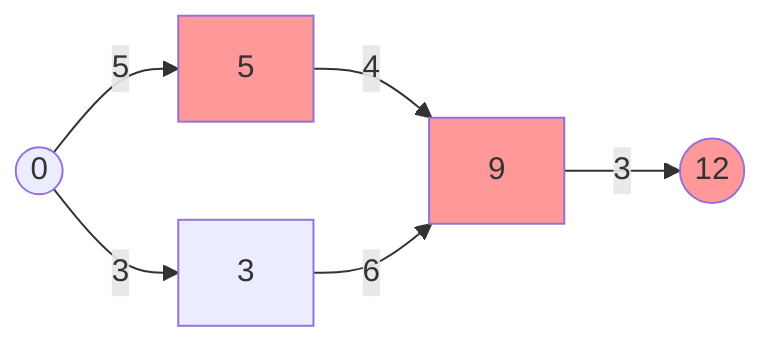
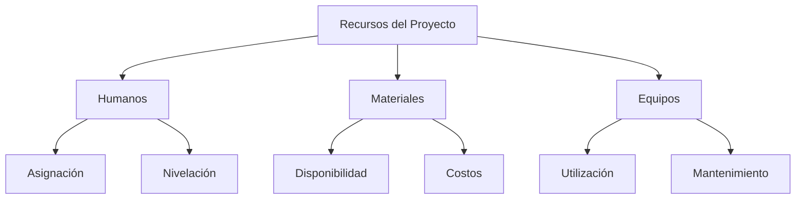
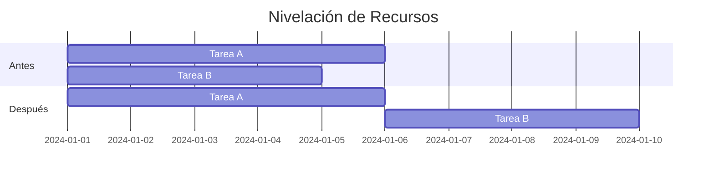

# Clase 9: Proyectos y PERT - Camino Crítico y Recursos

## 🎯 Introducción

Continuando con nuestra analogía de la orquesta sinfónica, hoy nos centraremos en identificar las "notas críticas" - aquellas que no pueden retrasarse sin afectar toda la pieza - y cómo gestionar los "músicos y sus instrumentos" - nuestros recursos. El método del camino crítico (CPM) es como identificar la secuencia más importante de notas en una sinfonía.

### ¿Qué es el Camino Crítico?

El camino crítico es la secuencia de actividades que determina la duración total del proyecto. Cualquier retraso en estas actividades resulta en un retraso del proyecto completo.

- Define la duración mínima del proyecto
- Identifica actividades sin holgura
- Permite priorizar recursos
- Facilita la toma de decisiones

> 💡 Dato importante: Las actividades en el camino crítico tienen holgura total igual a cero.

## 📊 Conceptos Principales

### Análisis del Camino Crítico

### Gestión de Recursos

### Nivelación de Recursos

## 💻 Herramientas y Recursos

- Software de análisis de redes
- Herramientas de gestión de recursos
- Calculadoras de holguras
- Sistemas de seguimiento de tiempo

## 📈 Aplicaciones Prácticas

1. Gestión de Construcción

   - Optimización de cuadrillas
   - Programación de equipos
   - Control de materiales

2. Desarrollo de Productos
   - Asignación de ingenieros
   - Gestión de laboratorios
   - Coordinación de pruebas

## 🎓 Ejercicio Práctico

### Análisis de Camino Crítico

Proyecto de Desarrollo de Software:

| Actividad | Duración | Predecesoras | ES  | EF  | LS  | LF  | Holgura |
| --------- | -------- | ------------ | --- | --- | --- | --- | ------- |
| A         | 4        | -            | 0   | 4   | 0   | 4   | 0       |
| B         | 3        | A            | 4   | 7   | 5   | 8   | 1       |
| C         | 5        | A            | 4   | 9   | 4   | 9   | 0       |
| D         | 4        | B,C          | 9   | 13  | 9   | 13  | 0       |

Camino crítico: A → C → D
Duración total: 13 días

## 🔑 Consejos Clave

1. Monitorear constantemente el camino crítico
2. Balancear recursos efectivamente
3. Mantener buffers estratégicos
4. Documentar cambios y decisiones

## 📝 Conclusión

La gestión efectiva del camino crítico y los recursos es fundamental para el éxito del proyecto, como mantener el tempo correcto y la coordinación en una orquesta. El balance entre tiempo, recursos y objetivos determina la "melodía" final del proyecto.

## 📚 Fórmulas Relevantes

### Análisis de Red

- ES (Early Start) = max(EF de predecesoras)
- EF (Early Finish) = ES + Duración
- LS (Late Start) = LF - Duración
- LF (Late Finish) = min(LS de sucesoras)

### Holguras

- Holgura Total = LS - ES = LF - EF
- Holgura Libre = ES(siguiente) - EF
- Holgura Independiente = ES(siguiente) - LF

### Recursos

- Utilización = (Tiempo Usado / Tiempo Disponible) × 100%
- Costo Total = Σ(Recursos × Tiempo × Costo Unitario)
- Eficiencia = (Valor Ganado / Costo Real) × 100%

## 🔍 Recursos Adicionales

- Guías de nivelación de recursos
- Plantillas de análisis de red
- Ejemplos de proyectos reales
- Técnicas avanzadas de optimización
