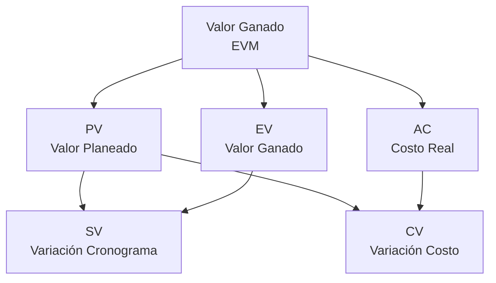
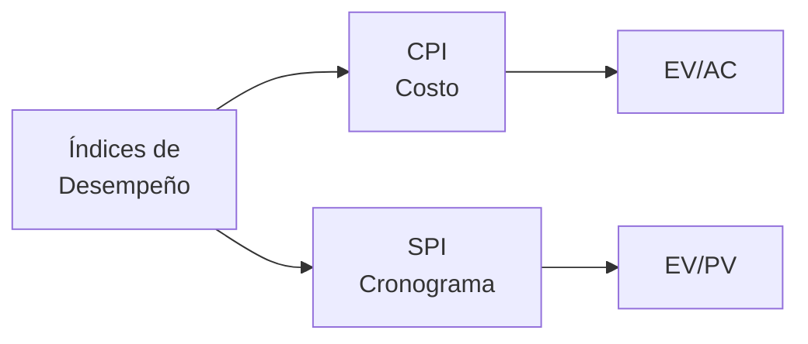
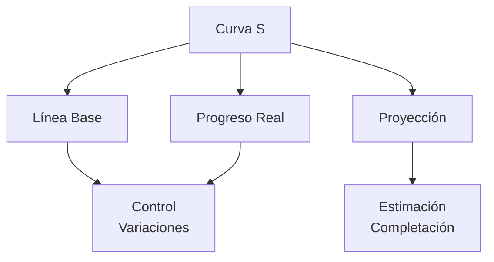

# Clase 9: Proyectos y PERT - Control y Seguimiento

## 🎯 Introducción

Siguiendo con nuestra analogía de la orquesta sinfónica, ahora nos centraremos en cómo "afinar" la ejecución del proyecto durante su desarrollo. Al igual que un director de orquesta debe monitorear constantemente el desempeño de cada sección y realizar ajustes en tiempo real, el control y seguimiento de proyectos nos permite mantener todo en armonía.

### ¿Qué es el Control de Proyectos?

El control de proyectos es el proceso de monitorear, comparar y ajustar la ejecución del proyecto para asegurar que se cumplan los objetivos establecidos.

- Monitorea el progreso real vs. planificado
- Identifica desviaciones tempranamente
- Implementa acciones correctivas
- Actualiza planes según sea necesario

> 💡 Dato importante: El método del valor ganado (EVM) es una técnica fundamental para medir el desempeño del proyecto.

## 📊 Conceptos Principales

### Valor Ganado (EVM)

### Indicadores de Desempeño

### Curva S de Seguimiento

## 💻 Herramientas y Recursos

- Software de control de proyectos
- Dashboards de seguimiento
- Herramientas de reportería
- Sistemas de gestión de cambios

## 📈 Aplicaciones Prácticas

1. Control de Proyecto de Construcción

   - Seguimiento de avance físico
   - Control de costos
   - Gestión de cronograma
   - Manejo de cambios

2. Desarrollo de Producto Nuevo
   - Control de hitos
   - Seguimiento de entregables
   - Gestión de recursos
   - Control de calidad

## 🎓 Ejercicio Práctico

### Análisis de Valor Ganado

Datos del proyecto:

- BAC (Presupuesto total): $100,000
- PV (Valor planeado): $60,000
- EV (Valor ganado): $50,000
- AC (Costo actual): $70,000

Calcular:

1. CV (Variación de costo) = EV - AC = -$20,000
2. SV (Variación de cronograma) = EV - PV = -$10,000
3. CPI (Índice de desempeño de costo) = EV/AC = 0.71
4. SPI (Índice de desempeño de cronograma) = EV/PV = 0.83
5. EAC (Estimado a la completación) = BAC/CPI = $140,845

## 🔑 Consejos Clave

1. Actualizar datos regularmente
2. Actuar proactivamente ante desviaciones
3. Mantener comunicación efectiva
4. Documentar lecciones aprendidas

## 📝 Conclusión

El control y seguimiento efectivo de proyectos es como mantener una orquesta afinada y en tiempo. Las técnicas de valor ganado y otras herramientas de control nos permiten detectar y corregir desviaciones antes de que afecten el resultado final del proyecto.

## 📚 Fórmulas Relevantes

### Valor Ganado

- CV (Variación de Costo) = EV - AC
- SV (Variación de Cronograma) = EV - PV
- CPI (Índice de Desempeño de Costo) = EV/AC
- SPI (Índice de Desempeño de Cronograma) = EV/PV

### Pronósticos

- EAC (Estimado a la Completación) = BAC/CPI
- ETC (Estimado para Completar) = EAC - AC
- VAC (Variación a la Completación) = BAC - EAC
- TCPI (Índice de Desempeño para Completar) = (BAC-EV)/(BAC-AC)

### Análisis de Varianza

- Varianza de Cronograma = SV/PV × 100%
- Varianza de Costo = CV/EV × 100%
- Índice de Desempeño de Costos a la Fecha = Σ EV / Σ AC

## 🔍 Recursos Adicionales

- Guías de implementación EVM
- Plantillas de reportes de control
- Herramientas de análisis de tendencias
- Casos de estudio de control de proyectos
