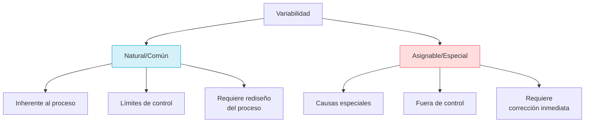
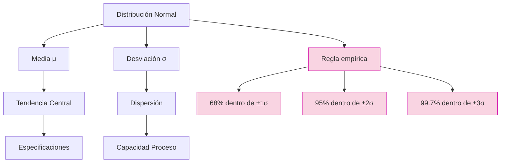
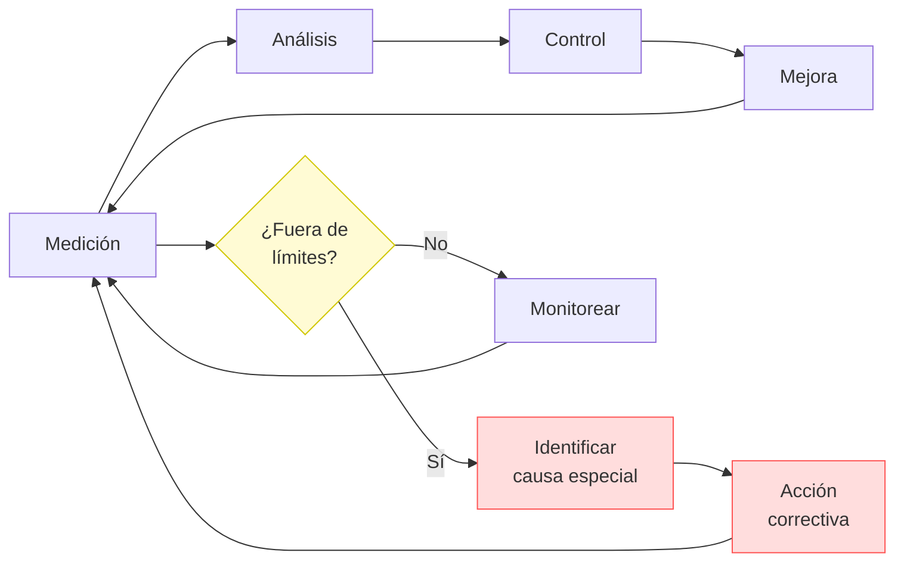

# Clase 10: Variabilidad - Conceptos Fundamentales

## 🎯 Introducción

Imagina una fábrica de chocolate como la de Willy Wonka, donde cada chocolate debe tener exactamente el mismo sabor y apariencia. Sin embargo, en el mundo real, pequeñas variaciones en temperatura, ingredientes o tiempo de procesamiento pueden afectar el resultado final. La variabilidad es como esa "danza" constante entre lo ideal y lo real en los procesos productivos.

### ¿Qué es la Variabilidad?

La variabilidad es la diferencia natural o inherente que existe entre elementos similares dentro de un proceso o sistema.

- Está presente en todo proceso productivo
- Puede ser natural o asignable
- Afecta la calidad y eficiencia
- Requiere gestión y control

> 💡 **Dato importante**: No toda variabilidad es mala; la variabilidad natural es inevitable y debe ser gestionada, mientras que la variabilidad asignable debe ser eliminada.

### Impacto en Empresas Chilenas

1. **CCU**: Mantiene estrictos controles de variabilidad en sus procesos de embotellado para garantizar el volumen exacto de líquido por botella, reduciendo pérdidas y reclamaciones.

2. **CMPC**: Aplica técnicas avanzadas de control estadístico para homogeneizar las propiedades de sus productos de papel y celulosa, logrando reducir desperdicios en un 12%.

3. **Viña Concha y Toro**: Utiliza sistemas de control de variabilidad en sus procesos de fermentación para garantizar la consistencia del sabor entre distintas cosechas de vino.

## 📊 Conceptos Principales

### Tipos de Variabilidad



### Distribución Normal



### Ciclo de Control Estadístico



### Niveles Sigma y Defectos

| Nivel Sigma | DPMO    | Rendimiento (%) | Aplicación Típica                  |
| ----------- | ------- | --------------- | ---------------------------------- |
| 2σ          | 308,537 | 69.1%           | Procesos manuales básicos          |
| 3σ          | 66,807  | 93.3%           | Industria promedio                 |
| 4σ          | 6,210   | 99.38%          | Industria competitiva              |
| 5σ          | 233     | 99.977%         | Industria de clase mundial         |
| 6σ          | 3.4     | 99.9997%        | Industrias críticas (aeroespacial) |

## 💻 Herramientas y Recursos

### Software Analítico

- **Minitab**: Análisis estadístico avanzado, ampliamente utilizado en Six Sigma
- **R con paquete qcc**: Código abierto, potente y personalizable
- **Python con statsmodels**: Ideal para integración con data science
- **Microsoft Power BI**: Visualización y dashboard de KPIs de calidad
- **JMP**: Análisis visual con énfasis en diseño de experimentos

### Métodos de Recolección

- Hojas de verificación digitales
- Sistemas IoT para captura automática
- Sistemas MES (Manufacturing Execution Systems)
- Dispositivos de medición conectados

### Visualización y Análisis

- Cartas de control dinámicas
- Análisis de capacidad automatizados
- Paneles de control en tiempo real
- Sistemas de alertas predictivas

## 📈 Aplicaciones Prácticas

### 1. Control de Calidad en Manufactura

- **Dimensiones críticas**: Tolerancias en componentes electrónicos (±0.01mm)
- **Peso de productos**: Llenado de botellas en industria de bebidas
- **Resistencia de materiales**: Ensayos destructivos en industria minera
- **Tiempo de procesamiento**: Optimización de ciclos en industria plástica
- **Caso CMPC**: Reducción de variabilidad en gramaje de papel tissue

### 2. Servicios al Cliente

- **Tiempo de espera**: Optimización en call centers chilenos
- **Duración de servicio**: Estandarización en atención bancaria
- **Satisfacción del cliente**: Control estadístico en NPS
- **Tasa de errores**: Reducción en procesamiento de pedidos e-commerce
- **Caso Falabella**: Reducción de variabilidad en tiempos de entrega

## 🎓 Ejercicio Práctico

### Análisis de Capacidad de Proceso

Datos de proceso de llenado de botellas en CCU:

- Especificación: 500ml ± 5ml
- Media del proceso: 499ml
- Desviación estándar: 1.5ml

**Paso 1: Calcular Cp (Capacidad potencial)**
$$Cp = \frac{USL - LSL}{6\sigma} = \frac{505 - 495}{6 \times 1.5} = \frac{10}{9} = 1.11$$

**Paso 2: Calcular Cpk (Capacidad real)**
$$Cpk = \min\left[\frac{USL - \mu}{3\sigma}, \frac{\mu - LSL}{3\sigma}\right]$$
$$Cpk = \min\left[\frac{505 - 499}{3 \times 1.5}, \frac{499 - 495}{3 \times 1.5}\right]$$
$$Cpk = \min\left[\frac{6}{4.5}, \frac{4}{4.5}\right] = \min[1.33, 0.89] = 0.89$$

**Paso 3: Calcular Nivel Sigma**
$$\text{Nivel Sigma} = \text{Cpk} \times 3 = 0.89 \times 3 = 2.67$$

**Paso 4: Calcular DPMO (Defectos por Millón de Oportunidades)**
Para un nivel sigma de 2.67, el DPMO aproximado es 23,000

**Paso 5: Interpretación**

- Cp > 1 indica que el proceso podría ser capaz si estuviera centrado
- Cpk < 1 indica que el proceso no es capaz actualmente
- El proceso produce aproximadamente 2.3% de producto fuera de especificación

**Paso 6: Recomendación**

- Centrar el proceso ajustando la media a 500ml
- Cpk objetivo después del ajuste: 1.11
- Reducción esperada de defectos: >90%

### Implementación en Python

```python
import numpy as np
import matplotlib.pyplot as plt
from scipy import stats

# Parámetros del proceso
mu = 499  # Media del proceso
sigma = 1.5  # Desviación estándar
lsl = 495  # Límite inferior
usl = 505  # Límite superior

# Generación de datos simulados
datos = np.random.normal(mu, sigma, 1000)

# Cálculo de índices de capacidad
cp = (usl - lsl) / (6 * sigma)
cpu = (usl - mu) / (3 * sigma)
cpl = (mu - lsl) / (3 * sigma)
cpk = min(cpu, cpl)

# Visualización
x = np.linspace(mu - 4*sigma, mu + 4*sigma, 1000)
plt.figure(figsize=(10, 6))
plt.hist(datos, bins=30, density=True, alpha=0.6, color='skyblue')
plt.plot(x, stats.norm.pdf(x, mu, sigma), 'r-', linewidth=2)
plt.axvline(lsl, color='red', linestyle='--', linewidth=1.5)
plt.axvline(usl, color='red', linestyle='--', linewidth=1.5)
plt.axvline(mu, color='green', linestyle='-', linewidth=1.5)
plt.title(f'Análisis de Capacidad: Cp={cp:.2f}, Cpk={cpk:.2f}')
plt.xlabel('Volumen (ml)')
plt.ylabel('Densidad')
plt.annotate(f'LSL={lsl}', xy=(lsl, 0), xytext=(lsl, 0.05),
            arrowprops=dict(facecolor='black', shrink=0.05))
plt.annotate(f'USL={usl}', xy=(usl, 0), xytext=(usl, 0.05),
            arrowprops=dict(facecolor='black', shrink=0.05))
plt.grid(True, alpha=0.3)
plt.show()

print(f"Cp = {cp:.2f}")
print(f"Cpk = {cpk:.2f}")
print(f"Nivel Sigma = {cpk * 3:.2f}")
```

## 🔑 Consejos Clave

1. **Medir antes de controlar**: Establece una línea base de datos antes de implementar cambios
2. **Distinguir causas especiales de comunes**: No trates de arreglar el sistema por señales aleatorias
3. **No sobrecontrolar procesos estables**: Ajustar un proceso estable introduce más variabilidad
4. **Enfocarse en prevención**: Mejor diseñar para eliminar variabilidad que inspeccionarla
5. **Cualificar sistemas de medición**: Asegura que tu variabilidad medida no viene del sistema de medición
6. **Estandarizar antes de controlar**: Procesos consistentes son prerequisito para control estadístico

## 📝 Conclusión

La variabilidad es una realidad ineludible en todo proceso, como las pequeñas diferencias entre chocolates de una misma receta. La clave no es eliminarla por completo, sino entenderla, medirla y gestionarla dentro de límites aceptables. Como nos enseña la filosofía de Deming, distinguir entre causas comunes y especiales de variación es fundamental para mejorar cualquier proceso.

Los procesos bajo control estadístico son predecibles, pero no necesariamente capaces. Para lograr la excelencia operacional, ambos aspectos deben ser abordados: estabilidad mediante la eliminación de causas especiales, y capacidad mediante la reducción de causas comunes.

## 🌐 Casos de Éxito en Chile

### CMPC: Control de Variabilidad en Gramaje de Papel

CMPC implementó un robusto sistema de control estadístico de procesos en su planta de Puente Alto, enfocado en reducir la variabilidad del gramaje del papel. Los resultados incluyeron:

- **Reducción de 25% en la variabilidad del gramaje**
- **Ahorro anual de $1.2 millones USD en materia prima**
- **Mejora en la satisfacción del cliente por consistencia de productos**

### Laboratorio Bagó: Control de Procesos Farmacéuticos

Implementaron control estadístico avanzado en sus líneas de producción:

- **Reducción de 40% en rechazos de lotes**
- **Mejora de la consistencia en la concentración de principios activos**
- **Cumplimiento de 99.9% con especificaciones regulatorias**

## 📚 Fórmulas Relevantes

### Índices de Capacidad

| Índice  | Fórmula                                                                           | Interpretación         | Valor Mínimo Recomendado |
| ------- | --------------------------------------------------------------------------------- | ---------------------- | ------------------------ |
| **Cp**  | $$\frac{USL - LSL}{6\sigma}$$                                                     | Capacidad potencial    | 1.33                     |
| **Cpk** | $$\min\left[\frac{USL - \mu}{3\sigma}, \frac{\mu - LSL}{3\sigma}\right]$$         | Capacidad real         | 1.33                     |
| **Pp**  | $$\frac{USL - LSL}{6s}$$                                                          | Desempeño potencial    | 1.33                     |
| **Ppk** | $$\min\left[\frac{USL - \overline{X}}{3s}, \frac{\overline{X} - LSL}{3s}\right]$$ | Desempeño real         | 1.33                     |
| **Cpm** | $$\frac{Cp}{\sqrt{1 + \left(\frac{\mu - T}{\sigma}\right)^2}}$$                   | Capacidad con centrado | 1.33                     |

### Análisis Estadístico

- **Media**: $$\bar{x} = \frac{\sum x_i}{n}$$
- **Desviación estándar muestral**: $$s = \sqrt{\frac{\sum(x_i-\bar{x})^2}{n-1}}$$
- **Desviación estándar poblacional**: $$\sigma = \sqrt{\frac{\sum(x_i-\mu)^2}{N}}$$
- **Rango**: $$R = X_{max} - X_{min}$$

### Límites de Control para Carta X-R

- **UCL_X**: $$\overline{\overline{X}} + A_2\overline{R}$$
- **LCL_X**: $$\overline{\overline{X}} - A_2\overline{R}$$
- **UCL_R**: $$D_4\overline{R}$$
- **LCL_R**: $$D_3\overline{R}$$

## 🔍 Recursos Adicionales

- **Libros**:

  - "Statistical Quality Control" de Douglas Montgomery
  - "The Six Sigma Handbook" de Thomas Pyzdek
  - "Understanding Statistical Process Control" de Wheeler & Chambers

- **Software y Herramientas**:

  - Minitab (prueba gratuita de 30 días)
  - R con paquete 'qcc' (gratuito)
  - Python con 'statsmodels' y 'SPC' (gratuito)
  - Excel con QI Macros (licencia pagada)

- **Recursos Online**:

  - Curso "Control Estadístico de Procesos" en Coursera
  - Tutoriales SPC en ASQ (American Society for Quality)
  - Plantillas Excel para cartas de control (disponibles en Canvas)

- **Certificaciones Valiosas**:
  - Six Sigma Green Belt y Black Belt
  - Certified Quality Engineer (CQE)
  - Statistical Process Control Specialist
