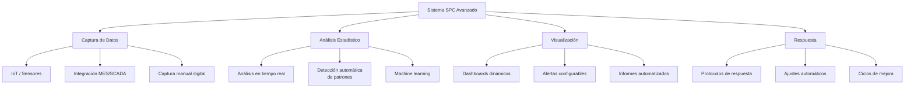
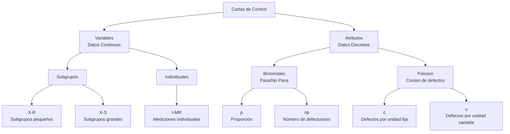
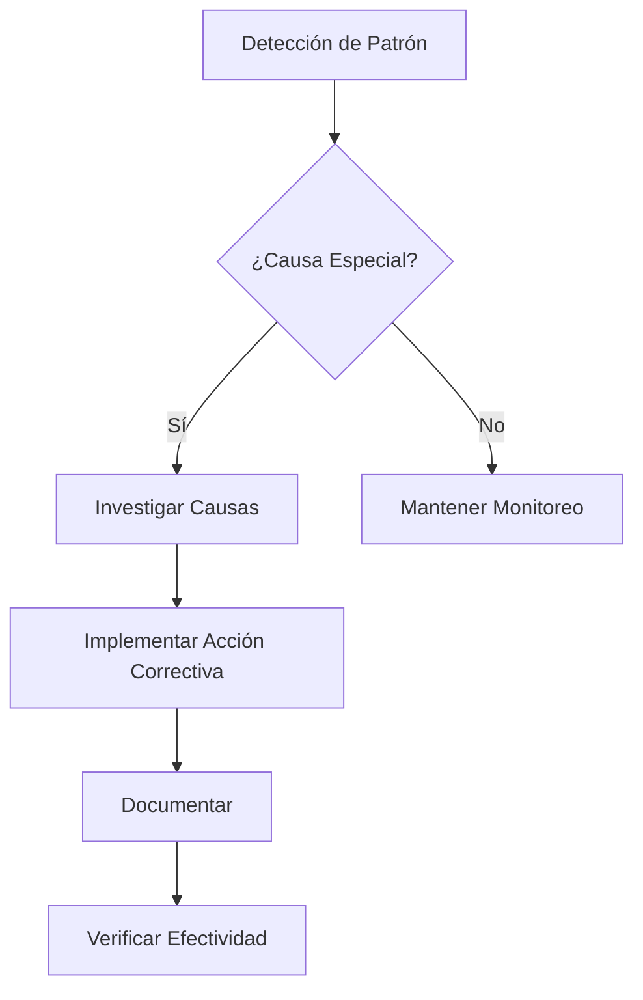

# Clase 10: Control Estadístico de Procesos (SPC) - Implementación Avanzada

## 🎯 Control Estadístico como Ventaja Competitiva

Continuando con nuestra exploración de la variabilidad, en esta segunda sesión nos centraremos en la implementación práctica del Control Estadístico de Procesos (SPC) como herramienta estratégica. Como decía Deming, "si no puedes describir lo que haces como un proceso, no sabes lo que estás haciendo". Hoy aprenderemos a implementar sistemas que transforman datos en decisiones operativas de alto impacto.

> 💡 **Dato revelador**: Un estudio de McKinsey encontró que las empresas que implementan control estadístico de procesos efectivo reducen sus costos de calidad hasta en un 30% y aumentan su productividad en un 15-20%.

### Principales Beneficios del SPC Avanzado

| Beneficio                           | Impacto Cuantificable | Ejemplo en Industria Chilena                                     |
| ----------------------------------- | --------------------- | ---------------------------------------------------------------- |
| **Reducción de desperdicios**       | 15-25%                | Viña Concha y Toro: 22% menos mermas en embotellado              |
| **Mejora de productividad**         | 10-30%                | Nestlé Chile: 18% más producción en mismas horas                 |
| **Reducción de garantías/reclamos** | 30-60%                | CSAV: 45% menos reclamos por daños de carga                      |
| **Ahorro energético**               | 5-15%                 | ENAP: 8% menor consumo energético en refinerías                  |
| **Reducción de tiempo de ciclo**    | 10-40%                | Cencosud: 25% menor tiempo de proceso en centros de distribución |

## 📊 Arquitectura de un Sistema SPC Moderno



### Modelo de Madurez SPC en Empresas Chilenas

| Nivel                   | Descripción                        | Características                                                | Empresas Ejemplo                        |
| ----------------------- | ---------------------------------- | -------------------------------------------------------------- | --------------------------------------- |
| **Nivel 1: Reactivo**   | Inspección y solución de problemas | Control de calidad mediante inspección, sin enfoque preventivo | PyMEs manufactureras                    |
| **Nivel 2: Preventivo** | Implementación básica de SPC       | Cartas de control manuales o semi-automatizadas                | Laboratorios Bagó, CCU                  |
| **Nivel 3: Predictivo** | SPC integrado con sistemas         | Análisis avanzado, predicción de tendencias                    | CMPC, Codelco                           |
| **Nivel 4: Adaptativo** | SPC con machine learning           | Sistemas auto-adaptativos, optimización continua               | Compañía Minera Doña Inés de Collahuasi |

## 🔍 Sistema de Cartas de Control

### Anatomía de una Carta de Control

```
UCL (Límite Superior) ------ ┌─────────────────────────────────┐
                             │                                 │
                             │                                 │
                             │                                 │
                             │           Zona A (+3σ)          │
                             │                                 │
                             │           Zona B (+2σ)          │
                             │                                 │
Línea Central -------------- │           Zona C (+1σ)          │
                             │                                 │
                             │           Zona C (-1σ)          │
                             │                                 │
                             │           Zona B (-2σ)          │
                             │                                 │
                             │           Zona A (-3σ)          │
                             │                                 │
LCL (Límite Inferior) ------ └─────────────────────────────────┘
                               1  2  3  4  5  6  ...  n
                                 Número de Muestra
```

### Taxonomía Completa de Cartas de Control



### Selección de la Carta Adecuada

| Tipo de Dato | Tamaño de Subgrupo | Tipo de Muestra     | Carta Recomendada |
| ------------ | ------------------ | ------------------- | ----------------- |
| **Continuo** | n = 1              | Individual          | I-MR              |
| **Continuo** | 2 ≤ n ≤ 10         | Subgrupo            | X-R               |
| **Continuo** | n > 10             | Subgrupo            | X-S               |
| **Discreto** | Variable           | Proporción          | p                 |
| **Discreto** | Constante          | Número defectuosos  | np                |
| **Discreto** | Constante          | Número defectos     | c                 |
| **Discreto** | Variable           | Defectos por unidad | u                 |

## 📏 Fórmulas Fundamentales

### 1. Cartas para Variables - X-R

$$
\begin{align*}
UCL_{\bar{X}} &= \bar{\bar{X}} + A_2\bar{R} \\
CL_{\bar{X}} &= \bar{\bar{X}} \\
LCL_{\bar{X}} &= \bar{\bar{X}} - A_2\bar{R} \\
\\
UCL_R &= D_4\bar{R} \\
CL_R &= \bar{R} \\
LCL_R &= D_3\bar{R}
\end{align*}
$$

### 2. Cartas para Variables - X-S

$$
\begin{align*}
UCL_{\bar{X}} &= \bar{\bar{X}} + A_3\bar{S} \\
CL_{\bar{X}} &= \bar{\bar{X}} \\
LCL_{\bar{X}} &= \bar{\bar{X}} - A_3\bar{S} \\
\\
UCL_S &= B_4\bar{S} \\
CL_S &= \bar{S} \\
LCL_S &= B_3\bar{S}
\end{align*}
$$

### 3. Cartas para Atributos - p

$$
\begin{align*}
UCL_p &= \bar{p} + 3\sqrt{\frac{\bar{p}(1-\bar{p})}{n}} \\
CL_p &= \bar{p} \\
LCL_p &= \bar{p} - 3\sqrt{\frac{\bar{p}(1-\bar{p})}{n}}
\end{align*}
$$

## 🧠 Reglas de Detección de Patrones

### Reglas de Western Electric

1. **Un punto fuera de los límites de control (±3σ)**
2. **Dos de tres puntos consecutivos en Zona A o más allá (±2σ)**
3. **Cuatro de cinco puntos consecutivos en Zona B o más allá (±1σ)**
4. **Ocho puntos consecutivos en el mismo lado de la línea central**

### Patrones Adicionales (Reglas de Nelson)

5. **Seis puntos consecutivos en tendencia ascendente o descendente**
6. **Quince puntos consecutivos en Zona C (±1σ)**
7. **Catorce puntos consecutivos alternando arriba/abajo**
8. **Ocho puntos consecutivos a ambos lados de la línea central pero ninguno en Zona C**



## 🏭 Casos de Aplicación Industrial Avanzada

### 1. Industria Minera - Collahuasi

**Desafío**: Optimización multiparamétrica de proceso de molienda

**Implementación**:

- SPC multivariado con análisis de componentes principales
- Integración con Digital Twin del proceso
- Algoritmos predictivos de mantenimiento basados en variabilidad

**Resultados**:

- Incremento de 4.3% en recuperación de cobre
- Reducción de 15% en consumo energético
- Aumento de 8% en throughput del proceso
- ROI del proyecto: 580% en primer año

**Tecnologías Utilizadas**:

- Sensores IoT avanzados
- Plataforma Azure IoT Edge para análisis en la nube
- Algoritmos propios de machine learning

### 2. Industria Forestal - ARAUCO

**Desafío**: Control de calidad en líneas de alto volumen

**Implementación**:

- SPC automatizado con visión artificial
- Control adaptativo de procesos
- Análisis predictivo de fallos

**Resultados**:

- Reducción de 32% en rechazos de producto
- Aumento de la velocidad de línea en 13%
- Incremento de capacidad efectiva en 9.5%
- Ahorro anual: $2.8 millones USD

## 💻 Implementación Práctica

### 1. Cálculo de Límites de Control X-R

**Datos**: Mediciones de diámetro de ejes (mm)

| Subgrupo | 1     | 2     | 3     | 4     | 5     | X̄      | R    |
| -------- | ----- | ----- | ----- | ----- | ----- | ------ | ---- |
| 1        | 10.02 | 10.05 | 9.98  | 10.01 | 10.03 | 10.018 | 0.07 |
| 2        | 10.04 | 10.07 | 10.02 | 10.03 | 10.01 | 10.034 | 0.06 |
| 3        | 9.99  | 10.02 | 10.04 | 10.02 | 10.01 | 10.016 | 0.05 |
| 4        | 10.01 | 10.03 | 10.05 | 9.99  | 10.02 | 10.020 | 0.06 |
| 5        | 10.03 | 10.02 | 10.01 | 10.00 | 10.02 | 10.016 | 0.03 |

**Paso 1**: Calcular promedios globales

$$\bar{\bar{X}} = \frac{10.018 + 10.034 + 10.016 + 10.020 + 10.016}{5} = 10.0208$$

$$\bar{R} = \frac{0.07 + 0.06 + 0.05 + 0.06 + 0.03}{5} = 0.054$$

**Paso 2**: Calcular límites (n=5, A₂=0.577, D₃=0, D₄=2.115)

$$UCL_{\bar{X}} = 10.0208 + (0.577 \times 0.054) = 10.0520$$
$$LCL_{\bar{X}} = 10.0208 - (0.577 \times 0.054) = 9.9896$$
$$UCL_{R} = 2.115 \times 0.054 = 0.1142$$
$$LCL_{R} = 0 \times 0.054 = 0$$

### 2. Interpretación de Cartas

```python
# Código Python para generar cartas de control
import numpy as np
import matplotlib.pyplot as plt
from matplotlib.pyplot import figure

# Datos de medias y rangos
medias = [10.018, 10.034, 10.016, 10.020, 10.016, 10.023, 10.015,
          10.031, 10.028, 10.020, 10.024, 10.014, 10.018, 10.031, 10.019]

# Límites calculados
ucl_x, cl_x, lcl_x = 10.052, 10.0208, 9.9896

# Crear gráfico
fig, ax = plt.subplots(figsize=(10, 6))
ax.plot(medias, marker='o', color='blue', linestyle='-')
ax.axhline(y=cl_x, color='green', linestyle='-')
ax.axhline(y=ucl_x, color='red', linestyle='--')
ax.axhline(y=lcl_x, color='red', linestyle='--')

# Etiquetas
ax.set_title('Carta de Control X', fontsize=15)
ax.set_xlabel('Número de Subgrupo', fontsize=12)
ax.set_ylabel('Media del Subgrupo', fontsize=12)

plt.show()
```

## 🔬 Capacidad de Proceso

### Índices de Capacidad

$$C_p = \frac{USL - LSL}{6\sigma}$$

$$C_{pk} = \min\left(\frac{USL - \mu}{3\sigma}, \frac{\mu - LSL}{3\sigma}\right)$$

$$P_{pm} = \frac{C_p}{\sqrt{1 + \left(\frac{\mu - T}{\sigma}\right)^2}}$$

Donde:

- USL = Límite Superior de Especificación
- LSL = Límite Inferior de Especificación
- T = Valor Objetivo

### Interpretación de Cp y Cpk

| Valor     | Interpretación       | Nivel Sigma | DPMO           |
| --------- | -------------------- | ----------- | -------------- |
| < 1.00    | Incapaz              | < 3σ        | > 66,807       |
| 1.00-1.33 | Marginalmente capaz  | 3σ - 4σ     | 66,807 - 6,210 |
| 1.33-1.67 | Capaz                | 4σ - 5σ     | 6,210 - 233    |
| 1.67-2.00 | Muy capaz            | 5σ - 6σ     | 233 - 3.4      |
| > 2.00    | Extremadamente capaz | > 6σ        | < 3.4          |

### Ejemplo de Cálculo

Para nuestro proceso de ejes con:

- LSL = 9.95 mm
- USL = 10.05 mm
- μ = 10.0208 mm
- σ = 0.015 mm

$$C_p = \frac{10.05 - 9.95}{6 \times 0.015} = \frac{0.1}{0.09} = 1.11$$

$$C_{pk} = \min\left(\frac{10.05 - 10.0208}{3 \times 0.015}, \frac{10.0208 - 9.95}{3 \times 0.015}\right) = \min(0.65, 1.57) = 0.65$$

## 📱 Herramientas de Software para SPC Avanzado

| Software           | Fortalezas                                        | Desventajas                                   | Costo Aproximado   |
| ------------------ | ------------------------------------------------- | --------------------------------------------- | ------------------ |
| **Minitab**        | Análisis estadístico completo, interfaz intuitiva | Limitado en automatización, no es tiempo real | USD 1,500/licencia |
| **JMP (SAS)**      | Visualización avanzada, diseño de experimentos    | Curva de aprendizaje elevada                  | USD 1,800/licencia |
| **InfinityQS**     | SPC en tiempo real, conectividad IoT              | Requiere infraestructura significativa        | Suscripción anual  |
| **SPC for Excel**  | Bajo costo, integración con Office                | Limitaciones en big data                      | USD 300/licencia   |
| **Python con SPC** | Gratuito, personalizable, integrable              | Requiere programación                         | Gratuito           |

### Implementación en Python: Control Multivariado

```python
import numpy as np
import pandas as pd
import matplotlib.pyplot as plt
from scipy import stats
import seaborn as sns
from sklearn.decomposition import PCA
from sklearn.preprocessing import StandardScaler

# Cargar datos multivariados (ejemplo)
datos = pd.DataFrame({
    'Temperatura': np.random.normal(85, 2, 100),
    'Presión': np.random.normal(120, 4, 100),
    'Viscosidad': np.random.normal(45, 1.5, 100),
    'Densidad': np.random.normal(1.2, 0.05, 100),
})

# Escalar datos
scaler = StandardScaler()
datos_scaled = scaler.fit_transform(datos)

# Análisis de componentes principales
pca = PCA(n_components=2)
pca_result = pca.fit_transform(datos_scaled)

# T2 de Hotelling
n = len(datos)
p = datos.shape[1]
t2_limit = ((n-1)*(n+1)*p/(n*(n-p)))*stats.f.ppf(0.99, p, n-p)
t2 = np.sum((pca_result**2)/pca.explained_variance_, axis=1)

# Visualización
plt.figure(figsize=(12, 6))
plt.subplot(1, 2, 1)
plt.plot(t2, marker='o')
plt.axhline(y=t2_limit, color='r', linestyle='--')
plt.title('T² de Hotelling')
plt.xlabel('Observación')
plt.ylabel('T²')

plt.subplot(1, 2, 2)
plt.scatter(pca_result[:, 0], pca_result[:, 1])
plt.title('PCA - Primeras 2 Componentes')
plt.xlabel('PC1')
plt.ylabel('PC2')

plt.tight_layout()
plt.show()

# Detectar puntos fuera de control
fuera_control = np.where(t2 > t2_limit)[0]
print(f"Puntos fuera de control: {fuera_control}")
if len(fuera_control) > 0:
    print("Análisis de contribución para puntos fuera de control:")
    # Calcular contribuciones
    for punto in fuera_control:
        contrib = datos_scaled[punto]**2
        print(f"Punto {punto}: {list(zip(datos.columns, contrib))}")
```

## 📋 Lista de Verificación para Implementación de SPC

### Fase de Planificación

- [ ] Identificar procesos críticos a monitorear
- [ ] Seleccionar variables clave (CTQ - Critical To Quality)
- [ ] Definir métodos de muestreo y frecuencia
- [ ] Validar sistemas de medición (MSA/GR&R)
- [ ] Establecer objetivos cuantificables

### Fase de Implementación

- [ ] Seleccionar tipos adecuados de cartas de control
- [ ] Recopilar datos históricos (mínimo 20-25 subgrupos)
- [ ] Calcular límites de control preliminares
- [ ] Eliminar causas especiales iniciales
- [ ] Recalcular límites de control

### Fase de Operación

- [ ] Implementar protocolo de respuesta
- [ ] Capacitar personal en interpretación
- [ ] Establecer reuniones de revisión de datos
- [ ] Documentar acciones correctivas
- [ ] Mantener registros de cambios en el proceso

### Fase de Mejora

- [ ] Analizar capacidad de proceso
- [ ] Implementar mejoras de reducción de variabilidad
- [ ] Recalcular límites después de mejoras
- [ ] Documentar lecciones aprendidas
- [ ] Estandarizar mejores prácticas

> 💡 **Consejo**: El SPC no debe ser una actividad independiente sino parte integral del sistema de calidad. La integración con metodologías Lean, Six Sigma y TPM potencia significativamente sus resultados.
