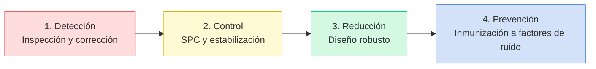
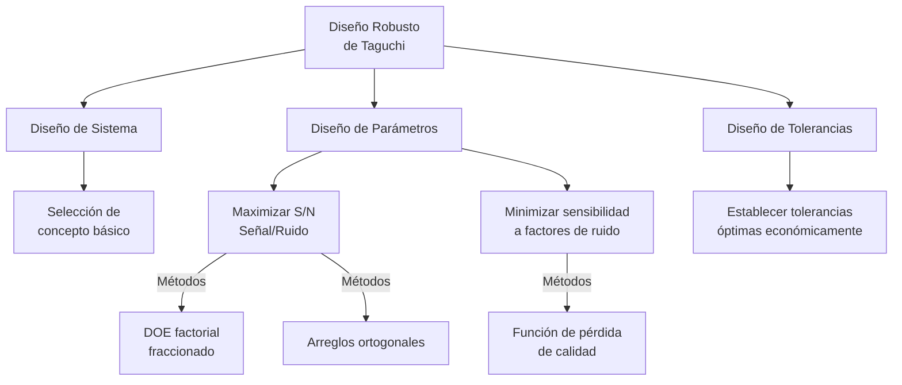

# Clase 10: Técnicas Avanzadas para Reducción de Variabilidad

## 🎯 Más Allá del Control: Reducción Sistemática de la Variabilidad

Completando nuestra serie sobre variabilidad, en esta sesión final nos concentraremos en técnicas avanzadas para reducir la variabilidad de manera proactiva. Si en las sesiones anteriores aprendimos a medir y controlar la variabilidad, ahora daremos el siguiente paso: transformar procesos para minimizar su variación inherente.

> 💡 **Dato impactante**: Según un estudio de la Sociedad Americana de Calidad (ASQ), las empresas que combinan SPC con técnicas avanzadas de diseño robusto logran una reducción de variabilidad adicional del 30-40% comparado con las que solo utilizan SPC.

### Evolución en el Abordaje de la Variabilidad



## 📊 Marcos Metodológicos para Reducción de Variabilidad

### DMAIC vs. DMADV para Variabilidad

| Aspecto                | DMAIC (Mejora)                              | DMADV (Diseño)                                         |
| ---------------------- | ------------------------------------------- | ------------------------------------------------------ |
| **Objetivo**           | Reducir variabilidad en procesos existentes | Diseñar procesos con baja variabilidad inherente       |
| **Aplicación ideal**   | Procesos estables pero con alta variación   | Nuevos procesos o rediseños completos                  |
| **Fases**              | Define, Measure, Analyze, Improve, Control  | Define, Measure, Analyze, Design, Verify               |
| **Herramientas clave** | DOE, ANOVA, MSA, SPC                        | QFD, TRIZ, Diseño Paramétrico, Análisis de Tolerancias |
| **Caso chileno**       | CMPC: Optimización de papeleras             | CSAV: Diseño de nuevo sistema logístico                |

### Diseño Robusto (Método Taguchi)



## 💻 Técnicas Avanzadas para Reducir Variabilidad

### 1. Diseño de Experimentos Avanzado

#### Ejemplo en Industria Metalúrgica Chilena (CAP)

**Problema**: Alta variabilidad en la dureza de aceros laminados.

**Enfoque**: DOE factorial fraccionado 2^5-1 con puntos centrales.

**Factores estudiados**:

- A: Temperatura de laminación (°C)
- B: Velocidad de enfriamiento (°C/s)
- C: Espesor inicial (mm)
- D: Tiempo de permanencia (s)
- E: % de aleación Mn-Cr

**Resultados**:

- Interacción BC (velocidad×espesor) - crítica
- Factor D (tiempo) - bajo impacto
- Optimización logró reducir variabilidad en 47%
- Ahorro anual estimado: $750,000 USD

**Modelo matemático obtenido**:

```
Dureza = 362.5 + 15.2A - 7.4B + 10.1C + 2.3D + 12.8E - 16.9BC + 4.2AB
```

#### Código R para DOE y Análisis

```R
# Instalación y carga de paquetes
if (!require("FrF2")) install.packages("FrF2")
if (!require("rsm")) install.packages("rsm")
library(FrF2)
library(rsm)
library(ggplot2)

# Diseñar experimento
plan <- FrF2(16, 5, generators = "E=ABCD",
             factor.names = c("Temperatura", "Velocidad", "Espesor",
                              "Tiempo", "Aleacion"))

# Agregar columna para respuesta (datos ejemplo)
plan$Dureza <- c(375, 360, 382, 358, 366, 352, 388, 369,
                  371, 356, 385, 352, 362, 349, 390, 371)

# Ajustar modelo
modelo <- lm(Dureza ~ (.)^2, data = plan)
summary(modelo)

# Análisis de efectos principales e interacciones
effects <- model.matrix(~ (.)^2 - 1, data = plan)
coefs <- coef(modelo)
effect.values <- effects %*% coefs
pareto <- sort(abs(effect.values))

# Visualización
par(mar = c(5, 8, 4, 2))
barplot(rev(pareto), horiz = TRUE, las = 1,
        main = "Diagrama de Pareto de Efectos",
        xlab = "Efecto Estandarizado")

# Análisis de varianza
anova(modelo)

# Superficie de respuesta para factores críticos
rsm_model <- rsm(Dureza ~ SO(Velocidad, Espesor), data = plan)
persp(rsm_model, ~ Velocidad + Espesor, col = "lightblue",
      zlab = "Dureza", contours = list(z = "colors", col = "red"))
```

### 2. Análisis de Componentes de Varianza

**Aplicación en Viña Concha y Toro**:

- Problema: Inconsistencias en la fermentación de vino premium
- Análisis de varianza anidado para identificar fuentes de variación
- Componentes estudiados:
  - Tanque (45% de variación)
  - Lote de uva (25%)
  - Temperatura ambiente (15%)
  - Cepa de levadura (10%)
  - Error residual (5%)
- Implementación de controles específicos por fuente
- Resultado: Reducción de variabilidad en tiempo de fermentación del 35%

### 3. Métodos Poka-Yoke Avanzados

| Tipo                        | Descripción                       | Ejemplo Chileno                                                             |
| --------------------------- | --------------------------------- | --------------------------------------------------------------------------- |
| **Prevención física**       | Diseño que imposibilita el error  | Molymet: Porta-herramientas con sensores que previenen mezcla de aleaciones |
| **Secuenciamiento forzado** | El proceso no avanza si hay error | CMPC: Sistema automático de cierre de válvulas ante secuencias incorrectas  |
| **Verificación redundante** | Múltiples métodos de detección    | Codelco: Sistema triple de verificación para manejo de ácido sulfúrico      |
| **Inteligencia artificial** | Detección de patrones anómalos    | Arauco: Visión artificial para detección de defectos en tiempo real         |

## 🔬 Herramientas Digitales para Reducción de Variabilidad

### 1. Gemelos Digitales para Simulación de Variabilidad


**Implementación en Minera Escondida**:

- Gemelo digital del proceso de flotación
- Simulación de 10,000+ escenarios de variabilidad
- Optimización de parámetros para máxima robustez
- Resultado: 18% de reducción en variabilidad de recuperación

### 2. Machine Learning para Control Adaptativo

```python
# Código Python para control adaptativo con aprendizaje automático
import numpy as np
import pandas as pd
from sklearn.ensemble import RandomForestRegressor
from sklearn.model_selection import train_test_split
from sklearn.metrics import mean_squared_error

# Cargar datos históricos del proceso
data = pd.read_csv('proceso_historico.csv')
X = data[['temp', 'presion', 'flujo', 'concentracion']]
y = data['calidad']

# Dividir en conjuntos de entrenamiento y prueba
X_train, X_test, y_train, y_test = train_test_split(X, y, test_size=0.2)

# Entrenar modelo predictivo
modelo = RandomForestRegressor(n_estimators=100)
modelo.fit(X_train, y_train)

# Evaluar precisión
y_pred = modelo.pred(X_test)
mse = mean_squared_error(y_test, y_pred)
print(f'Error cuadrático medio: {mse}')

# Análisis de importancia de variables
importancia = pd.DataFrame({
    'Variable': X.columns,
    'Importancia': modelo.feature_importances_
}).sort_values('Importancia', ascending=False)

print(importancia)

# Función para sugerir ajustes en tiempo real
def sugerir_ajustes(condiciones_actuales, objetivo_calidad=95):
    # Matriz para pruebas de sensibilidad
    pruebas = np.tile(condiciones_actuales, (100, 1))

    # Variar parámetros dentro de rangos operativos
    pruebas[:, 0] += np.random.uniform(-5, 5, 100)  # Temperatura
    pruebas[:, 1] += np.random.uniform(-0.2, 0.2, 100)  # Presión
    pruebas[:, 2] += np.random.uniform(-10, 10, 100)  # Flujo
    pruebas[:, 3] += np.random.uniform(-0.05, 0.05, 100)  # Concentración

    # Predecir calidad para todas las opciones
    calidades = modelo.predict(pruebas)

    # Encontrar configuración óptima
    mejor_idx = np.argmin(np.abs(calidades - objetivo_calidad))
    mejor_config = pruebas[mejor_idx]

    return mejor_config

# Ejemplo de uso en producción
condiciones_actuales = np.array([85.2, 2.1, 120, 0.35])
ajustes_sugeridos = sugerir_ajustes(condiciones_actuales)

print(f'Condiciones actuales: {condiciones_actuales}')
print(f'Ajustes sugeridos: {ajustes_sugeridos}')
```

## 📈 Medición del Éxito en Reducción de Variabilidad

### Métricas de Efectividad

| Métrica                              | Fórmula                                                                               | Interpretación                               | Meta |
| ------------------------------------ | ------------------------------------------------------------------------------------- | -------------------------------------------- | ---- |
| **Reducción Relativa de Varianza**   | $$RRV = \frac{\sigma^2_{antes} - \sigma^2_{después}}{\sigma^2_{antes}} \times 100\%$$ | % de varianza eliminada                      | >50% |
| **Índice de Mejora de Capacidad**    | $$IMC = \frac{C_{pk_{después}}}{C_{pk_{antes}}}$$                                     | Mejora relativa en capacidad                 | >1.5 |
| **Reducción de Sensibilidad**        | $$S = \frac{\sigma_{y}/\mu_{y}}{\sigma_{x}/\mu_{x}}$$                                 | Sensibilidad del proceso a factores externos | <0.5 |
| **ROI de Reducción de Variabilidad** | $$ROI = \frac{\text{Beneficios de reducción}}{\text{Costo de implementación}}$$       | Retorno de inversión                         | >3.0 |

## 🏭 Caso de Estudio Integral: IANSA Chile

**Desafío**: Alta variabilidad en el proceso de cristalización de azúcar

**Enfoque de reducción de variabilidad**:

1. **Análisis inicial**:

   - Cpk = 0.75
   - Alta sensibilidad a cambios en materia prima
   - Variación en tamaño de cristal: ±18%

2. **Metodología aplicada**:

   - DOE para optimización de parámetros
   - Diseño robusto para minimizar sensibilidad
   - Controles adaptativos basados en visión artificial

3. **Implementación tecnológica**:

   - Sensores IoT en puntos críticos
   - Control predictivo basado en modelos
   - Análisis en tiempo real de imágenes de cristales

4. **Resultados**:
   - Cpk final = 1.67
   - Reducción de variabilidad en tamaño de cristal: 78%
   - Mejora en rendimiento: +4.2%
   - Ahorro anual: $2.1 millones USD
   - ROI: 440% primer año

## 🔑 Estrategias para Mantener la Reducción de Variabilidad

1. **Estandarización avanzada**:

   - Documentación dinámica
   - Sistemas visuales de trabajo
   - Entrenamiento basado en realidad aumentada

2. **Mantenimiento centrado en variabilidad**:

   - Predictivo basado en patrones de variación
   - Calibración adaptativa
   - Monitoreo continuo de componentes críticos

3. **Cultura organizacional**:
   - Equipos multifuncionales de reducción de variabilidad
   - Reconocimiento basado en mejoras de Cpk
   - Compartir mejores prácticas entre plantas

> 💡 **Recordatorio clave**: La reducción de variabilidad no es un proyecto puntual sino una mentalidad y enfoque permanente. Las organizaciones más exitosas integran estos conceptos en su ADN operativo.

## 📚 Referencias Avanzadas y Herramientas

- **Literatura especializada**:

  - "Quality Engineering Using Robust Design" - Madhav Phadke
  - "Design and Analysis of Experiments" - Douglas Montgomery
  - "Understanding Industrial Designed Experiments" - Schmidt & Launsby

- **Software especializado**:

  - JMP Pro (módulo DOE y Surface Response)
  - Minitab (módulo Quality Companion)
  - R con paquetes DoE.base, rsm y qcc
  - Python con pyDOE, scipy.stats y scikit-learn

- **Recursos organizacionales**:
  - Instituto Chileno de Administración Racional de Empresas (ICARE)
  - Centro Nacional de Productividad y Calidad (ChileCalidad)
  - American Society for Quality - Sección Chile
