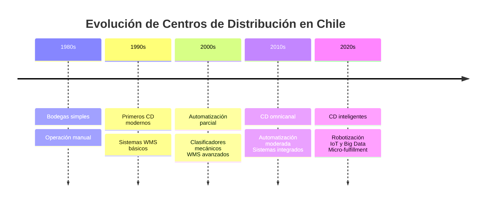
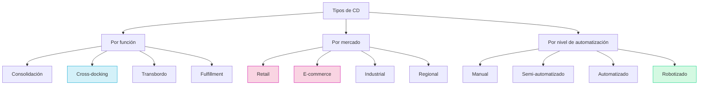
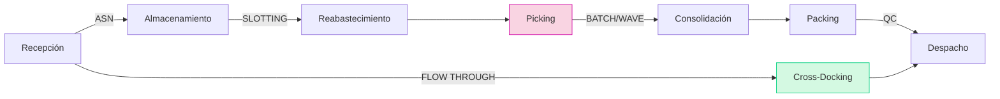
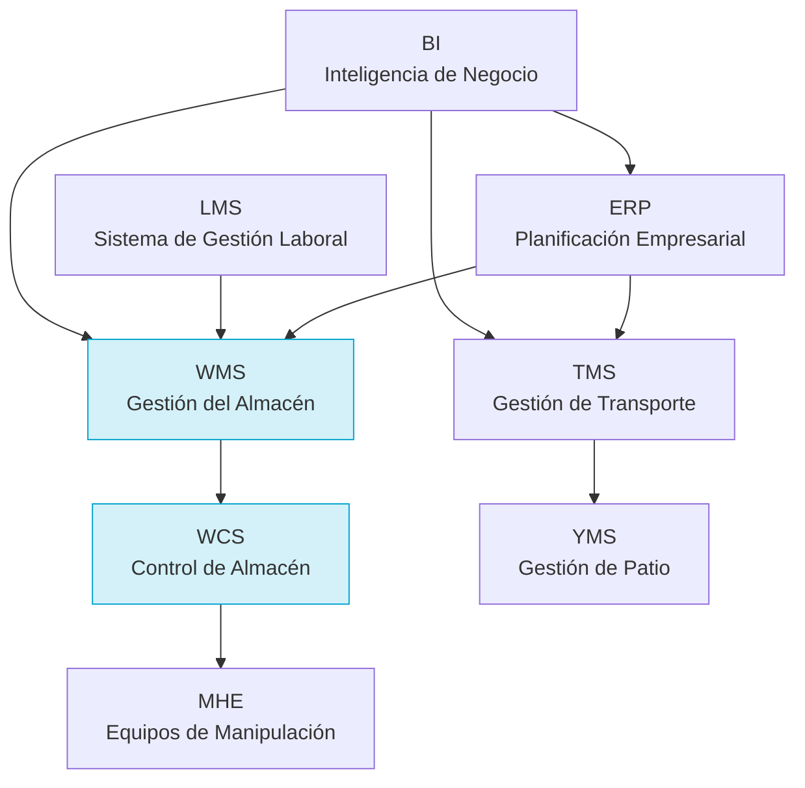
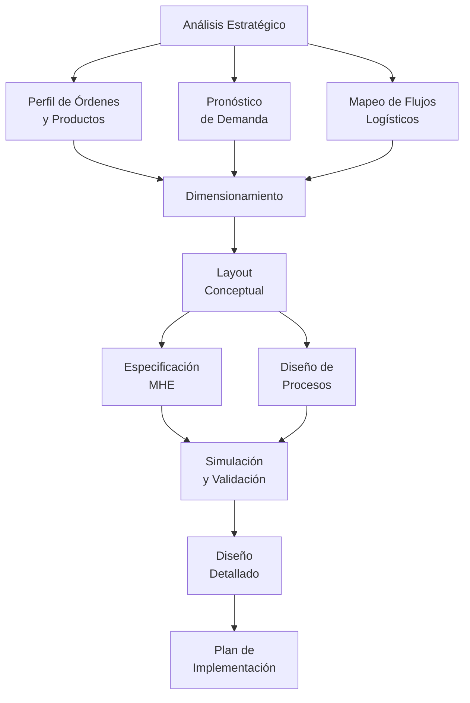
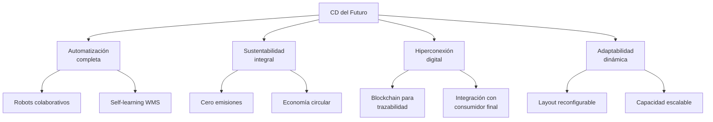

# Clase 11: Centros de Distribución - Estrategias y Tecnologías Avanzadas

## 🎯 Introducción

Imagina una biblioteca central que sirve a múltiples sucursales. Los libros deben ser recibidos, clasificados, almacenados y distribuidos eficientemente a cada sucursal según su demanda. Un Centro de Distribución (CD) funciona de manera similar: es el punto neurálgico donde los productos se reciben, procesan y envían a sus destinos finales de manera organizada y eficiente.

### ¿Qué son los Centros de Distribución?

Los Centros de Distribución son instalaciones logísticas especializadas que:

- Reciben productos de múltiples proveedores
- Procesan y almacenan inventario
- Preparan y envían pedidos
- Optimizan la distribución

> 💡 **Dato importante**: Un CD bien diseñado puede reducir hasta un 30% los costos logísticos mediante la optimización de operaciones y flujos.

### Evolución de los CD en Chile



## 📊 Conceptos Principales

### Tipología de Centros de Distribución



### Procesos en un CD Moderno



### 1. Procesos Críticos en Detalle

#### Recepción

- **ASN (Advanced Shipping Notice)**: Notificación anticipada
- Verificación de cantidades y calidad
- Control de lotes y fechas
- Etiquetado para trazabilidad
- Registro en WMS

#### Almacenamiento Estratégico

- **Slotting**: Ubicación óptima basada en:
  - Rotación (ABC/XYZ)
  - Afinidad de picking
  - Restricciones físicas
  - Compatibilidad de productos

#### Picking Avanzado

- **Batch picking**: Multiple pedidos simultáneos
- **Zone picking**: Asignación por zonas
- **Wave picking**: Programación por oleadas
- **Pick-to-light/Voice picking**: Tecnologías asistivas

## 💻 Tecnologías y Automatización

### Espectro de Automatización en CDs

| Nivel                 | Descripción                         | Tecnologías                                         | Ejemplo en Chile          |
| --------------------- | ----------------------------------- | --------------------------------------------------- | ------------------------- |
| **Manual**            | Operaciones principalmente manuales | WMS básico, RF, códigos de barras                   | PyMEs, CDs locales        |
| **Semi-automatizado** | Combinación hombre-máquina          | Transportadores, clasificadores, pick-to-light      | Falabella CD Pudahuel     |
| **Automatizado**      | Sistemas mecánicos dominantes       | AS/RS, mini-loads, clasificadores de alta velocidad | Cencosud CD Lo Aguirre    |
| **Robotizado**        | Robots y sistemas inteligentes      | AMR, cobots, clasificadores autónomos, drones       | Mercado Libre CD Rancagua |

### Sistemas de Gestión Integrados



### Tecnologías Emergentes en CDs Chilenos

1. **Automatización Robótica**

   - AMR (Robots Móviles Autónomos)
   - Brazos robóticos para picking
   - Sistemas Goods-to-Person
   - Casos: Walmart Chile, Mercado Libre

2. **IoT y Analítica Avanzada**

   - Sensores en tiempo real
   - Digital twins
   - Predictive analytics
   - Casos: Cencosud, Falabella

3. **Tecnologías de Picking**
   - Pick-to-light
   - Voice picking
   - Vision picking (AR)
   - Casos: CCU, SMU

## 📈 Casos de Implementación en Chile

### 1. Cencosud: CD Omnicanal Lo Aguirre

**Características**:

- 180.000 m² de superficie
- Sistema AS/RS con 30.000 posiciones
- 18 km de transportadores automáticos
- Clasificadores de alta velocidad (35.000 paquetes/hora)
- WMS integrado con e-commerce

**Resultados**:

- Reducción de 45% en tiempo de procesamiento
- Mejora de precisión de inventario al 99.8%
- Capacidad de despacho de 600.000 unidades/día
- ROI aproximado de 4 años

### 2. Mercado Libre: CD Robotizado Rancagua

**Tecnologías implementadas**:

- Sistema Robotizado Goods-to-Person
- 300+ robots AMR
- Algoritmos de optimización de rutas
- Sistema de empaque semi-automatizado
- IA para previsión de demanda

**Impacto**:

- Reducción de 70% en tiempos de picking
- Aumento de densidad de almacenamiento en 45%
- Procesamiento de 180.000 pedidos/día
- Reducción de 60% en devoluciones por error

## 🎓 Diseño y Planificación de CDs

### Framework de Diseño Basado en Datos



### Caso Práctico: Rediseño CD para E-commerce

**Datos**:

- CD actual: 15.000 m²
- SKUs: 25.000
- Pedidos diarios: 5.000 actuales → 12.000 proyectados
- Líneas por pedido: 2.3
- Tiempo de entrega objetivo: 24 horas en región metropolitana

**Solución**:

1. **Zonificación mejorada**:

   - Zona de alta rotación: 15% del área, 80% de picks
   - Sistema Goods-to-Person para artículos B/C
   - Forward picking + bulk storage

2. **Tecnología de Picking**:

   - Pick-to-light para zona A
   - Put-to-light para consolidación
   - Voice picking para zonas B/C

3. **Layout optimizado**:

   ```
   ┌───────────────────────────────────────┐
   │           RECEPCIÓN (20%)             │
   ├───────────┬───────────────┬───────────┤
   │           │               │           │
   │ ALMACÉN   │  PICKING      │ G-T-P     │
   │  BULK     │    ZONE       │ SYSTEM    │
   │  (30%)    │    (25%)      │ (15%)     │
   │           │               │           │
   ├───────────┴───────┬───────┴───────────┤
   │ CONSOLIDACIÓN (5%)│  PACKING (5%)     │
   ├───────────────────┼───────────────────┤
   │        DESPACHO Y CARGA (10%)         │
   └───────────────────────────────────────┘
   ```

4. **Indicadores proyectados**:
   | Métrica | Actual | Proyectado | Mejora |
   |---------|--------|------------|--------|
   | Picks/hora | 80 | 220 | +175% |
   | Exactitud inventario | 96.5% | 99.7% | +3.2% |
   | Capacidad procesamiento | 5,000 pedidos | 15,000 pedidos | +200% |
   | Densidad almacenamiento | 1.3 SKUs/m³ | 3.8 SKUs/m³ | +192% |

## 🔢 Modelamiento y Optimización

### Dimensionamiento de Operaciones

#### Cálculo de Personal de Picking

$$\text{Operarios picking} = \frac{\text{Líneas diarias} \times \text{Tiempo picking por línea}}{\text{Horas efectivas} \times \text{Eficiencia} \times 3600}$$

#### Cálculo de Posiciones para Almacenamiento

$$\text{Posiciones} = \text{Inventario promedio} \times \text{Factor de pico} \times \frac{1}{\text{Ocupación objetivo}} \times \frac{1}{\text{Unidades/posición}}$$

#### Cálculo de Muelles de Recepción

$$\text{Muelles recepción} = \frac{\text{Camiones/día} \times \text{Tiempo promedio descarga}}{\text{Horas operación} \times 60 \times \text{Utilización objetivo}}$$

### Optimización con Python

```python
# Optimización de slotting para un CD
import numpy as np
import pandas as pd
from scipy.optimize import linear_sum_assignment

# Datos de ejemplo
productos = pd.DataFrame({
    'sku': ['A001', 'A002', 'B001', 'C001', 'D001'],
    'picks_diarios': [120, 85, 45, 20, 10],
    'volumen': [0.01, 0.02, 0.05, 0.15, 0.25],
    'peso': [0.1, 0.2, 1.5, 3.0, 5.0]
})

ubicaciones = pd.DataFrame({
    'ubicacion': ['Z1-01', 'Z1-02', 'Z2-01', 'Z2-02', 'Z3-01'],
    'distancia_picking': [5, 8, 15, 18, 25],
    'capacidad_volumen': [0.02, 0.03, 0.1, 0.2, 0.3],
    'capacidad_peso': [1.0, 1.0, 3.0, 5.0, 8.0]
})

# Matriz de costo (tiempo de viaje * picks)
n_productos = len(productos)
n_ubicaciones = len(ubicaciones)
costo = np.zeros((n_productos, n_ubicaciones))

for i in range(n_productos):
    for j in range(n_ubicaciones):
        # Penalización por capacidad insuficiente
        if (productos.loc[i, 'volumen'] > ubicaciones.loc[j, 'capacidad_volumen'] or
            productos.loc[i, 'peso'] > ubicaciones.loc[j, 'capacidad_peso']):
            costo[i, j] = 999999  # Valor muy alto para evitar esta asignación
        else:
            # Costo = distancia * picks diarios
            costo[i, j] = ubicaciones.loc[j, 'distancia_picking'] * productos.loc[i, 'picks_diarios']

# Resolver problema de asignación
filas, columnas = linear_sum_assignment(costo)

# Mostrar resultados
print("Asignación óptima de productos a ubicaciones:")
for i, j in zip(filas, columnas):
    if costo[i, j] < 999999:  # Comprobar que es una asignación válida
        print(f"Producto {productos.loc[i, 'sku']} → Ubicación {ubicaciones.loc[j, 'ubicacion']}")
        print(f"  Picks: {productos.loc[i, 'picks_diarios']}, Distancia: {ubicaciones.loc[j, 'distancia_picking']}")

# Calcular ahorro vs asignación aleatoria
ahorro = np.sum(costo[np.random.permutation(filas), columnas]) - np.sum(costo[filas, columnas])
print(f"Ahorro estimado en distancia recorrida: {ahorro:.2f} metros por día")
```

## 🔍 Tendencias y Futuro de los CDs

### Tendencias Emergentes en Chile

1. **Micro-fulfillment Centers (MFC)**

   - CD urbanos de pequeño tamaño (500-1,000 m²)
   - Alta automatización en espacio compacto
   - Orientados a entregas ultra-rápidas
   - Ejemplos: Dark Stores de Cornershop, MFCs de Falabella

2. **Sostenibilidad Logística**

   - Edificaciones LEED
   - Flotas eléctricas
   - Optimización de embalajes
   - Energías renovables
   - Ejemplos: CD Lo Aguirre (Cencosud), CD Walmart Quilicura

3. **CD Colaborativos**
   - Infraestructura compartida
   - Pooling logístico
   - Consolidación de cargas
   - Ejemplos: Ransa, Consorcio Logístico Chile

### El CD del Futuro (2030)



## 📚 Recursos Ampliados

### Libros y Referencias

- "Warehouse Management" - Gwynne Richards (2ª edición)
- "Design and Control of Warehousing Systems" - John J. Bartholdi
- "The Definitive Guide to Warehousing" - CSCMP
- "Logistics & Supply Chain Management" - Martin Christopher

### Recursos Online

- CSCMP (Council of Supply Chain Management Professionals)
- WERC (Warehousing Education and Research Council)
- Instituto Tecnológico de Logística (ITLog Chile)
- GS1 Chile - Estándares para la Cadena de Suministro

### Software y Herramientas

- WMS: SAP EWM, Manhattan, HighJump, Oracle WMS
- Simulación: Simio, FlexSim, AnyLogic
- Layout: AutoCAD, SketchUp, Visio
- Optimización: Python con SciPy, CPLEX, Gurobi

> 💡 **Reflexión final**: "Un Centro de Distribución moderno es mucho más que un lugar donde se almacenan productos; es un nodo estratégico que orquesta flujos, optimiza inventarios, y crea valor a través de la sincronización perfecta entre información, materiales y tiempo."
