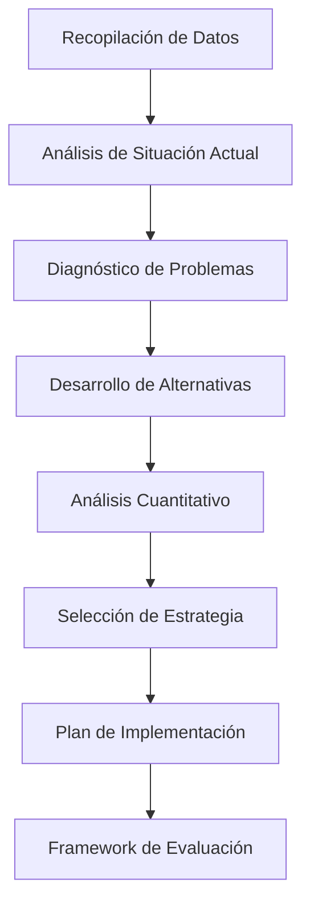

# Tarea 2: Optimización de Cadena de Suministro - Guía Detallada

## 📋 Descripción General

Esta tarea consiste en analizar y optimizar la cadena de suministro de una empresa utilizando los conceptos y herramientas aprendidos en el curso. El objetivo principal es desarrollar un plan integral que equilibre costos, nivel de servicio y sostenibilidad.

## 🎯 Objetivos de Aprendizaje

- Aplicar modelos cuantitativos para la toma de decisiones en operaciones
- Desarrollar estrategias de gestión de inventarios bajo incertidumbre
- Optimizar redes de distribución considerando múltiples variables
- Integrar consideraciones de sostenibilidad en la planificación operativa
- Analizar el impacto financiero de las decisiones de operaciones

## 🧩 Estructura y Componentes

La tarea se divide en cuatro secciones principales:

### 1. Análisis de la Situación Actual

**Entregables:**

- Mapa detallado de la cadena de suministro actual
- Análisis de cuellos de botella y puntos críticos
- Identificación de KPIs operacionales y sus valores actuales
- Análisis FODA desde perspectiva operacional

**Herramientas sugeridas:**

- Diagramación de procesos (BPMN, VSM)
- Análisis de datos históricos
- Matrices de evaluación

### 2. Modelamiento Cuantitativo

**Entregables:**

- Modelo de pronóstico para productos clave
- Análisis de niveles óptimos de inventario
- Optimización de red de distribución
- Análisis de sensibilidad para variables críticas

**Herramientas sugeridas:**

- Modelos de pronóstico (series temporales, regresión)
- Modelos EOQ/EPQ con extensiones
- Programación lineal para optimización de red
- Simulación Monte Carlo para análisis de riesgos

### 3. Desarrollo de Estrategia

**Entregables:**

- Plan de implementación por fases
- Estrategias de mitigación de riesgos
- Análisis de recursos necesarios
- Cronograma de implementación

**Herramientas sugeridas:**

- Roadmaps estratégicos
- Matriz de riesgos
- Diagramas de Gantt
- Análisis de escenarios

### 4. Evaluación de Impacto

**Entregables:**

- Análisis financiero (ROI, payback, VAN)
- Impacto en indicadores operacionales
- Consideraciones de sostenibilidad
- Recomendaciones finales

**Herramientas sugeridas:**

- Modelos financieros
- Balanced scorecard
- Métricas de sostenibilidad
- Dashboards de KPIs

## 📊 Metodología Sugerida



## 🛠️ Frameworks Analíticos Recomendados

### 1. Modelo de Segmentación ABC-XYZ

Clasifique los productos según:

- **A, B, C**: Valor del producto (Pareto)
- **X, Y, Z**: Predictibilidad de demanda (CV)

```
| Segmento | Estrategia Sugerida |
|----------|---------------------|
| AX | Just-In-Time, bajo inventario |
| AY | Buffer estratégico, revisión frecuente |
| AZ | Safety stock alto, monitoreo continuo |
| BX | Reposición regular, automatizada |
| BY | Revisión periódica |
| BZ | Estrategia de riesgo compartido |
| CX | Outsourcing posible |
| CY | Pedidos consolidados |
| CZ | Evaluar discontinuación |
```

### 2. Modelo de Distribución Multi-Echelon

Considere una estructura de inventario jerárquica:

- Centro de distribución principal
- Almacenes regionales
- Puntos de venta/entrega

Utilice optimización para determinar:

- Ubicación óptima de inventarios
- Política de reabastecimiento por nivel
- Balance centralización vs. descentralización

### 3. Framework de Resilencia de Cadena de Suministro

Evalúe y desarrolle estrategias para:

- **Redundancia**: Proveedores alternativos, rutas múltiples
- **Flexibilidad**: Capacidad de redirigir recursos
- **Visibilidad**: Sistemas de monitoreo en tiempo real
- **Colaboración**: Integración con proveedores y clientes

## 📈 Criterios de Evaluación

| Criterio                      | Ponderación | Aspectos evaluados                                       |
| ----------------------------- | ----------- | -------------------------------------------------------- |
| **Análisis Situacional**      | 20%         | Profundidad, precisión, uso de datos                     |
| **Modelamiento Cuantitativo** | 30%         | Rigor matemático, justificación de supuestos, validación |
| **Estrategia y Plan**         | 25%         | Coherencia, viabilidad, alineación con objetivos         |
| **Impacto y Evaluación**      | 15%         | Criterios de medición, proyecciones realistas            |
| **Presentación y Estructura** | 10%         | Claridad, profesionalismo, visualización de datos        |

## 🗓️ Fechas Importantes

- **Entrega de propuesta preliminar**: 31 de mayo, 2025
- **Sesión de retroalimentación**: 5 de junio, 2025
- **Entrega final**: 15 de junio, 2025
- **Presentaciones**: 18-20 de junio, 2025

## 📚 Recursos Recomendados

### Bibliografía Fundamental

- "Supply Chain Management: Strategy, Planning, and Operation" - Chopra & Meindl
- "Designing and Managing the Supply Chain" - Simchi-Levi et al.
- "Inventory Management and Production Planning and Scheduling" - Silver, Pyke & Peterson

### Herramientas y Software

- Excel con Solver para optimización
- Python/R para análisis estadístico
- Cualquier software de simulación (Arena, Simio, AnyLogic)
- Visualización (Power BI, Tableau)

### Datasets y Recursos Online

- SCM Globe: Simulador de cadena de suministro
- MIT OpenCourseWare: Materiales de Supply Chain Management
- Kaggle: Datasets de cadena de suministro para benchmarking

## ❓ Preguntas Frecuentes

**P: ¿Se puede trabajar con datos propios de una empresa real?**
R: Sí, es altamente recomendable. Si existe preocupación por confidencialidad, consultar con el profesor para anonimizar datos.

**P: ¿Qué extensión debe tener el trabajo?**
R: Se sugiere un máximo de 20 páginas para el informe principal, excluyendo anexos y material complementario.

**P: ¿Qué nivel de detalle matemático se espera?**
R: Los modelos deben estar claramente explicados y justificados. Las fórmulas principales deben presentarse con sus parámetros definidos.

**P: ¿Se puede enfocar la tarea en un aspecto específico de la cadena de suministro?**
R: Sí, pero debe justificarse la relevancia y el impacto del aspecto seleccionado en el desempeño global.

## 🔍 Ejemplo de Aplicación: Mini-Caso

**TechDistrib SpA** es un distribuidor chileno de productos electrónicos que enfrenta desafíos en su cadena de suministro:

- Inventarios excesivos de algunos productos
- Frecuentes quiebres de stock en productos populares
- Altos costos logísticos
- Largos tiempos de respuesta a cambios en demanda

Aplicando las metodologías de esta tarea:

1. **Análisis**: Clasificación ABC-XYZ de inventario, mapeo de procesos, análisis de lead times.
2. **Modelamiento**: Pronóstico por segmento, optimización de inventarios por tipo de producto.
3. **Estrategia**: Implementación de sistema pull para productos A, estrategia híbrida para B, push para C.
4. **Evaluación**: Reducción proyectada de 35% en inventario, mejora de 22% en nivel de servicio, payback de 8 meses.

## 🤝 Política de Colaboración

- Se puede trabajar en grupos de 2-3 estudiantes
- Cada miembro debe tener un rol definido y documentado
- Las consultas al profesor se pueden realizar en horario de oficina o vía email
- Se incentiva la discusión entre grupos, pero cada entrega debe ser original

## 🔗 Enlaces Importantes

- [Plantilla de Informe (Doc)](https://canvas.uc.cl/path/to/template)
- [Datasets de Ejemplo](https://canvas.uc.cl/path/to/datasets)
- [Rúbrica Detallada](https://canvas.uc.cl/path/to/rubric)

> 💡 **Consejo Final**: Enfóquese en un problema específico y bien definido. Es preferible un análisis profundo de un aspecto acotado que un tratamiento superficial de toda la cadena de suministro.
